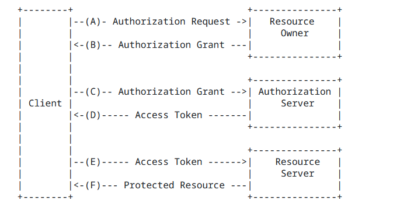
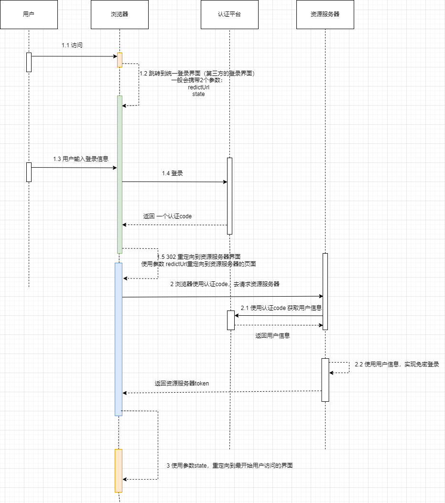

OAuth 2.0（Open Authorization 2.0）是一种授权框架，用于授权第三方应用程序访问用户在另一个服务提供商上的资源，而无需共享用户的凭据（例如用户名和密码）。该协议允许用户授权第三方应用程序访问其在另一个服务提供商上的受保护资源，而不必透露其凭据给第三方应用程序。

## 角色
- Resource Owner(资源所有者): 通常是用户，拥有受保护资源的所有权。
- Client (客户端) ： 要访问受保护资源的第三方应用程序。
- Authorization Server(授权服务器): 负责验证用户身份并授予客户端访问令牌（Access Token）的服务器。
- Resource Server (资源服务器) : 存储受保护资源的服务器，需要使用访问令牌来访问资源。

## 流程

- a 用户打开客户端以后，客户端要求用户给予授权
- b 用户同意给予客户端授权
- c 客户端使用上一步获得的授权，向认证服务器申请令牌
- d 认证服务器对客户端进行认证以后，确认无误，同意发放令牌
- e 客户端使用令牌，向资源服务器申请获取资源
- f 资源服务器确认令牌无误，同意向客户端开放资源

## 模式

oauth2.0 有4种模式： 这个地方就讲***授权码模式***，因为这个模式使用最广泛和安全。

### 实战流程

### 步骤讲解

-  1.1 用户去访问***资源服务器的页面***（页面A）
-  1.2 浏览器发现用户没有登录 ，就自行跳转***统一认证的登录界面***（界面B），这个地方可以前端自行跳转，也可以访问资源服务器去请求获取***界面B***
        注意：一般界面A跳转界面B的时候会携带2个参数 ，一个  redirectUrl（一般会携带一个页面C的地址）  state （页面A的地址）,后面会用到。
-  1.3 用户在***页面B***输入登录信息
-  1.4 浏览器携带登录信息请求***认证平台***， 认证平台通过认证过后会返回一个authenticationCode
-  1.5 页面B 登录成功后就会使用参数 redirectUrl ，跳转到 页面C  （这个页面属于资源服务器的前端页面），并将参数 state 原封不懂的返回。
-  2 页面C 使用 authenticationCode 去请求资源服务器
-  2.1  资源服务器拿到了 authenticationCode 去请求 认证平台获取用户的信息（authenticationToken）
-  2.2  资源服务器使用authenticationToken在自己内部免密登录，返回资源服务器的token
-  3  页面C 使用参数 state  跳转到 页面A，应该页面C和页面A 是同一个域，token共享，至此就完成了登录了。