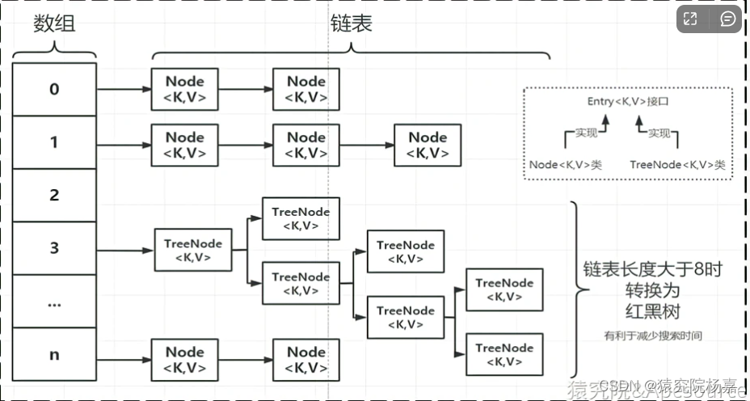

# HashMap内部结构

数组 + 链表 + 红黑树



## 数组
```

transient Node<K,V>[] table;

```

## 链表
```
static class Node<K,V> implements Map.Entry<K,V> {
        final int hash;
        final K key;
        V value;
        Node<K,V> next;
}
```

## 红黑树
```
    static final class TreeNode<K,V> extends LinkedHashMap.Entry<K,V> {
        TreeNode<K,V> parent;  // red-black tree links
        TreeNode<K,V> left;
        TreeNode<K,V> right;
        TreeNode<K,V> prev;  
}
```

# HashMap 允许key有一个空值，多个key为null会覆盖

```
        Map<String, String> map = new HashMap<>();
        map.put(null, "ss");
        System.out.println (map);
        System.out.println(map.get(null));
```


https://www.cnblogs.com/java1024/p/13488714.html