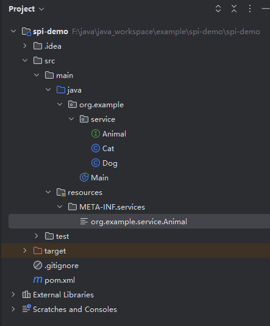
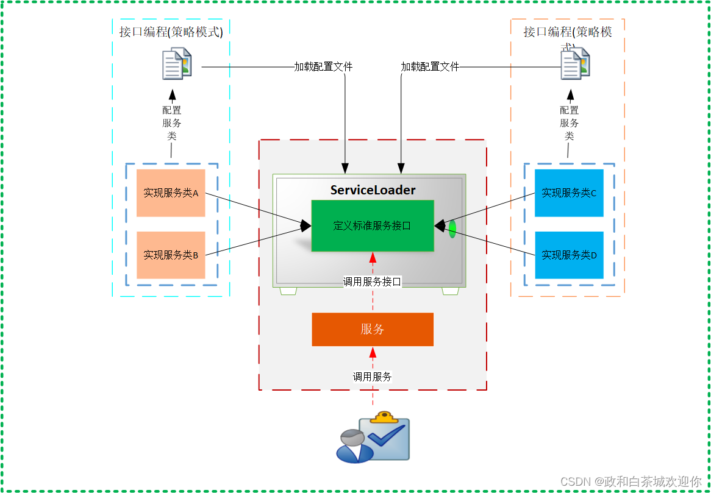
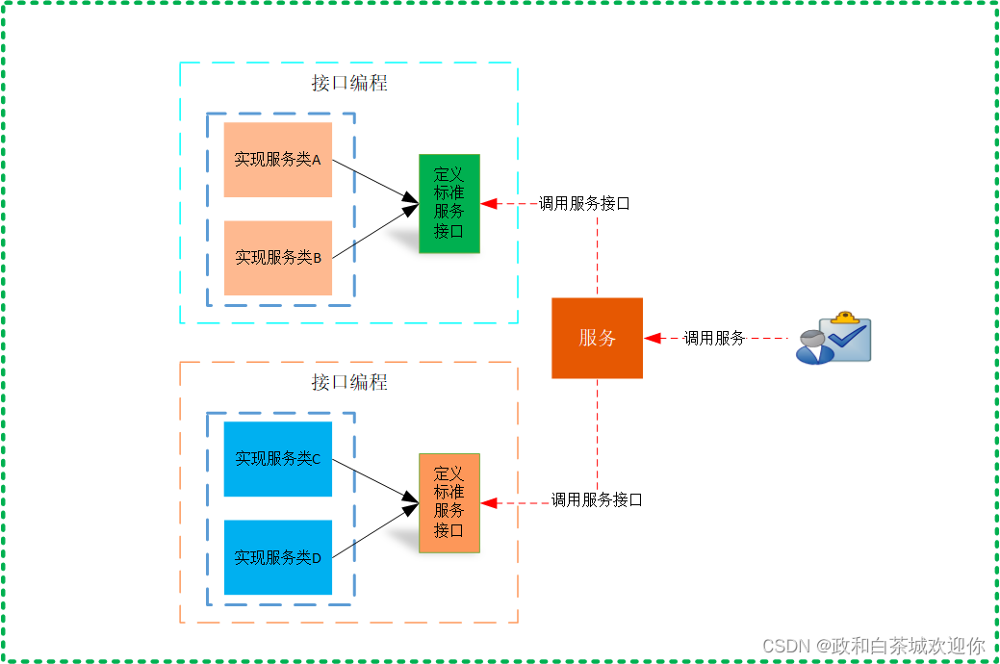

# 概念
SPI的全称是Service Provider Interface，中文名为服务提供者接口，
是一种服务发现机制，基于JDK内置的动态加载实现扩展点的机制（通过在 ClassPath 路径下的 META-INF/services 文件夹查找文件，自动加载文件里所定义的类），
这一机制使得框架扩展和替换组件变得容易。

# 术语
SPI由三个组件构成：Service、Service Provider、ServiceLoader
- Service：  公开的接口或抽象类，定义了一个抽象的功能模块
- Service Provider： service的实现类
- ServiceLoader：是SPI机制中的核心组件，负责运行时发现并加载Service Provider

# 简单实现

```java

public interface Animal {

    void makeSound();

}

public class Cat implements Animal{

    @Override
    public void makeSound() {
        System.out.println("Meow");
    }
}


public class Dog implements Animal{


    @Override
    public void makeSound() {
        System.out.println("Woof");
    }
}

public class Main {
    public static void main(String[] args) {
        ServiceLoader<Animal> serviceLoader = ServiceLoader.load(Animal.class);
        for (Animal animal : serviceLoader) {
            animal.makeSound();
        }
    }
}

```
文件： src/main/resources/META-INF/services/org.example.service.Animal

```
org.example.service.Cat
org.example.service.Dog

```




# SPI框架和API框架的区别 

## SPI

SPI框架的思想，是提供一个接口定义，有第三方去实现，通过读取第三方配置文件
来加载接口的实现类。主要是用于拓展使用。
spring starter 就是借鉴SPI思想。




## API

API框架的思想，是提供一个接口定义，并实现接口，可以直接提供给调用方使用。


