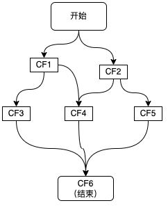

# CompletableFuture

CompletableFuture是由Java 8引入的,是用来解决`回调地狱`。
如果存在情况：有3个step，step3的执行依赖与step1和step2的执行结果。

如果用``ListenableFuture``来实现，那就是回调中还会有回调。
CompletableFuture可以简单的实现
```java
public static void test2(){
    ExecutorService executor = Executors.newFixedThreadPool(4);
    CompletableFuture<String> cf1 = CompletableFuture.supplyAsync(() -> {
        System.out.println("执行step 1");
        return "step1 result";
    }, executor);

    CompletableFuture<String> cf2 = CompletableFuture.supplyAsync(() -> {
        System.out.println("执行step 2");
        return "step2 result";
    });

    cf1.thenCombine(cf2, (result1, result2) -> {
        System.out.println(result1 + " , " + result2);
        System.out.println("执行step 3");
        return "step3 result";
    }).thenAccept(System.out::println);


} 

```

## CompletableFuture 方法

thenAccept方法入参是一个Consumer，是用来消费CompletableFuture的返回值的。

```java
   public CompletableFuture<Void> thenAccept(Consumer<? super T> action) {
        return uniAcceptStage(null, action);
    }
    

```
thenApply方法入参是一个Function，是用来消费CompletableFuture的返回值的，并且返回一个新的CompletableFuture。

```java

    public <U> CompletableFuture<U> thenApply(
        Function<? super T,? extends U> fn) {
        return uniApplyStage(null, fn);
    }

```


## CompletableFuture的使用




```java


public static void test3() {
        ExecutorService executor = Executors.newFixedThreadPool(4);
        CompletableFuture<String> cf1 = CompletableFuture.supplyAsync(() -> {
            System.out.println("result1" + " " + Thread.currentThread().getName());
            return "result1";
        },executor);
        CompletableFuture<String> cf2 = CompletableFuture.supplyAsync(() -> {
            try {
                Thread.sleep(2*1000);
            } catch (InterruptedException e) {
                throw new RuntimeException(e);
            }
            System.out.println("result2" + " " + Thread.currentThread().getName());
            return "result2";
        },executor);
        CompletableFuture<String> cf3 = cf1.thenApply(result -> {
            System.out.println("result3" + " " + Thread.currentThread().getName());
            return "result3";
        });

        CompletableFuture<String> cf5 = cf2.thenApply(result -> {
            System.out.println("result5" + " " + Thread.currentThread().getName());
            return "result5";
        });

        CompletableFuture<String> cf4 = cf1.thenCombine(cf2, (result1, result2) -> {
            System.out.println("result4" + " " + Thread.currentThread().getName());
            return "result4";
        });

        CompletableFuture<Void> cf6 = CompletableFuture.allOf(cf3, cf4, cf5);
        cf6.thenApply(v -> {
            String result3 = cf3.join();
            String result4 = cf4.join();
            String result5 = cf5.join();
            return "result6 = " + result3 + result4 + result5  + " " + Thread.currentThread().getName();
        }).thenAccept(System.out::println);

    }

```


