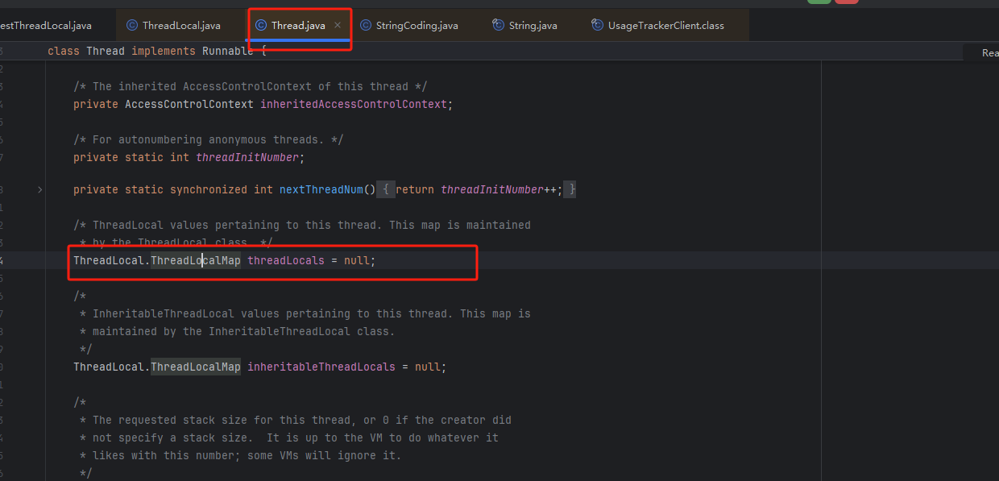

# 定义
ThreadLocal是java的一个常用的类，叫做线程变量。该变量是线程隔离的，ThreadLocal为变量在每个线程中都创建了一个副本，
那么每个线程都可以访问自己内部的副本变量。


# 常用方法

```

public class ThreadLocal<T> {

    public T get() {
        Thread t = Thread.currentThread();
        ThreadLocalMap map = getMap(t);
        if (map != null) {
            ThreadLocalMap.Entry e = map.getEntry(this);
            if (e != null) {
                @SuppressWarnings("unchecked")
                T result = (T)e.value;
                return result;
            }
        }
        return setInitialValue();
    }
    
   public void set(T value) {
        Thread t = Thread.currentThread();
        ThreadLocalMap map = getMap(t);
        if (map != null) {
            map.set(this, value);
        } else {
            createMap(t, value);
        }
    }
    
    public void remove() {
         ThreadLocalMap m = getMap(Thread.currentThread());
         if (m != null) {
             m.remove(this);
         }
     }


}

```

# 使用

```java

private static final ThreadLocal<Integer> threadLocal = new ThreadLocal<>();


    public static void main(String[] args) {
        threadLocal.set(2);
        test();
        test1();
    }

    public static void test() {
        Integer value = threadLocal.get();
        System.out.println("test() -----" + value);
    }

    public static void test1() {
        Thread thread = new Thread(new Runnable() {

            @Override
            public void run() {
                Integer value = threadLocal.get();
                System.out.println("test1() -----"+value);
            }
        });
        thread.start();
    }

```

在上面代码中初始化了一个ThreadLocal,在test中获取值为2，因为test和main是属于一个线程
但是在test1方法获取值就是null因为，test1中调用的时候重启了一个线程。


# 源码 


Thread 里面有一个ThreadLocalMap变量，这个变量的作用
就是存储多个ThreadLocal，一个线程里面可以创建多个ThreadLocal，这些都在
Thread中的ThreadLocalMap中存储。


ThreadLocal中的set(T value),
首先获取到当前线程，然后获取到ThreadLocalMap,把
this作为key，然后把value存储起来。


ThreadLocal总get()同set方法，
显示获取当前Thread然后获取ThreadLocalMap
this作为key，获取value。


remove(),就是在map中删除key是当前ThreadLocal中的数据。


