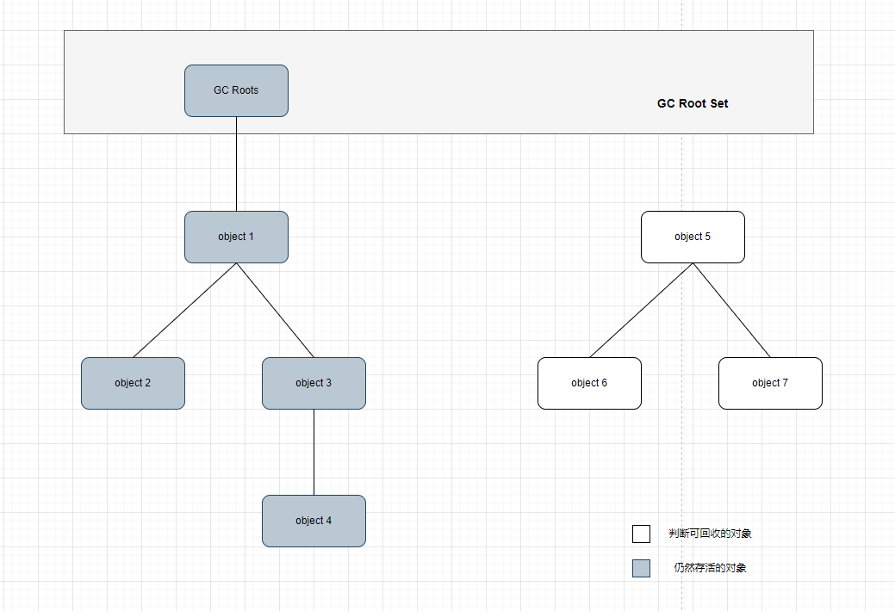

# 判断对象是否死亡

## 1. 引用计数式法（Reference Counting）

在对象中添加一个引用计数器，每当有一个地方
引用它时，计数器值就加一；当引用失效时，计数器值就减一；任何时刻计数器为零的对象就是不可
能再被使用的。

这个看似简单
的算法有很多例外情况要考虑，必须要配合大量额外处理才能保证正确地工作，譬如单纯的引用计数
就很难解决对象之间相互循环引用的问题

## 2. 可达性分析算法（Reachability Analysis）

这个算法的基本思路就是通过
一系列称为“GC Roots”的根对象作为起始节点集，从这些节点开始，根据引用关系向下搜索，搜索过
程所走过的路径称为“引用链”（Reference Chain），如果某个对象到GC Roots间没有任何引用链相连，
或者用图论的话来说就是从GC Roots到这个对象不可达时，则证明此对象是不可能再被使用的。

java现在判断对象是否死亡就是用的 可达性分析算法




# 生存还是死亡

在可达性分析算法中判定为不可达的对象，并不会真正的被销毁，还需要对对象进行一次筛选，
筛选的条件是此对象是否有必要执行finalize()方法。当对象没有覆盖finalize()方法或者finalize()方法已经被虚拟机调用过，虚拟机将这两种情况视为没有必要执行。
没有执行的必要，对象就会被销毁。

有执行的必要被放置在一个名为F-Queue的
队列之中，并在稍后由一条由虚拟机自动建立的、低调度优先级的Finalizer线程去执行它们的finalize()
方法。

只要重新与引用链上的任何一个对象建立关联即可，譬如把自己
（this关键字）赋值给某个类变量或者对象的成员变量，那在第二次标记时它将被移出“即将回收”的集
合。 但是finalize()只会被执行一次。

```java
public class FinalizeEscapeGC {

    public static FinalizeEscapeGC SAVE_HOOK = null;


    public void isAlive() {
        System.out.println("Yes, I am still alive!");
    }

    @Override
    protected void finalize() throws Throwable {
        super.finalize();
        System.out.println("finalize method executed!");
        FinalizeEscapeGC.SAVE_HOOK = this;
    }

    public static void main(String[] args) throws InterruptedException {
        SAVE_HOOK = new FinalizeEscapeGC();

        //对象第一次成功拯救自己
        SAVE_HOOK = null;
        System.gc();
        //Finalizer方法优先级很低，暂停0.5秒，以等待它
        Thread.sleep(500);
        if (SAVE_HOOK != null) {
            SAVE_HOOK.isAlive();
        } else {
            System.out.println("No, I am dead!");
        }
        //对象第二次拯救自己失败
        SAVE_HOOK = null;
        System.gc();
        //Finalizer方法优先级很低，暂停0.5秒，以等待它
        Thread.sleep(500);
        if (SAVE_HOOK != null) {
            SAVE_HOOK.isAlive();
        } else {
            System.out.println("No, I am dead!");
        }
    }
}

```