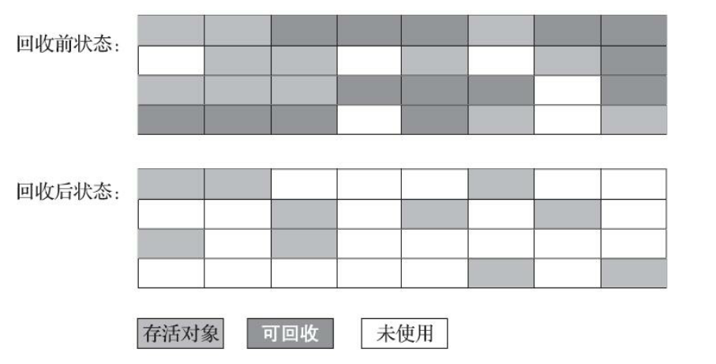
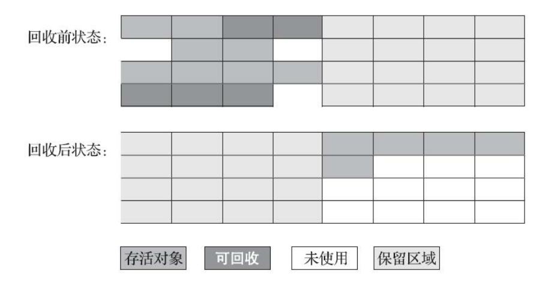
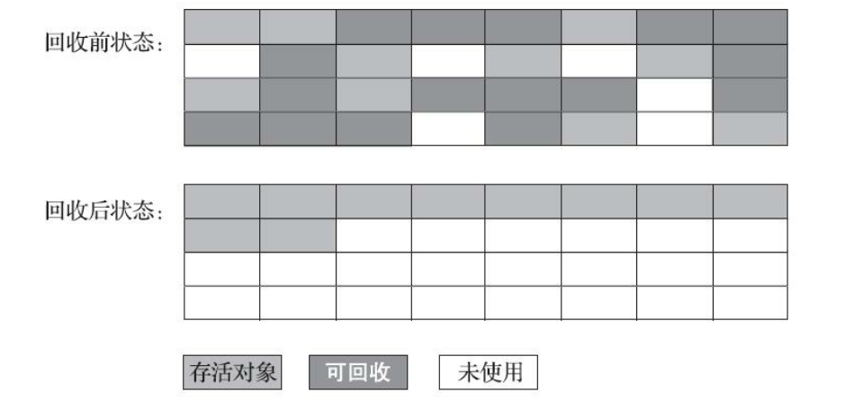
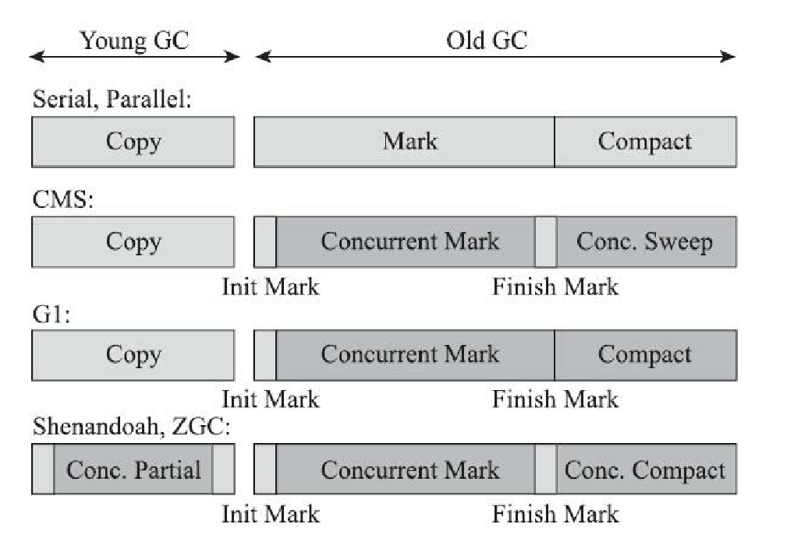

# 分代收集理论

当前商业虚拟机的垃圾收集器，大多数都遵循了“分代收集”（Generational Collection）的理论进
行设计，分代收集名为理论，实质是一套符合大多数程序运行实际情况的经验法则，它建立在两个分
代假说之上：

- 弱分代假说（Weak Generational Hypothesis）：绝大多数对象都是朝生夕灭的。
- 强分代假说（Strong Generational Hypothesis）：熬过越多次垃圾收集过程的对象就越难以消
  亡。
对于弱分代假说的对象，只需要关注如何保留少量存活的而不去标记大量将要被回收的对象。
对于强分代假说的对象，因为都是难以消亡的对象，虚拟机可以适用较低的频率来回收这个区域。

收集器将java堆划分不同的区域，然后将回收对象依据其年龄分配到不同的区域之中存储。在java虚拟机里面
具体一般分为新生代和老年代，对于新生代的对象每次回收存活的对象，将会逐步升到老年代中。

# 标记-清除算法

算法分为“标记”和“清楚”两个阶段，这个是最基础的算法，后续的收集算法都是以标记-清除算法为基础，对其
缺点进行改进而得到的。

缺点： 
1. 效率不稳定，标记和清除过程的执行效率随对象数量增长而降低
2. 空间碎片化严重

# 标记-复制算法
把内存按照容量大小分为2块，每次只使用一块，当这块内存用完了，就将还存活着的对象复制到另外一块的上面，
然后再把已使用过的内存空间一次清理掉。

缺点：这种复制回收算法的代价是将可用内存缩小为了原来的一半，空间浪费未免太多了一
点。
这个算法一般用在新生代，新生代中的对象有98%熬不过第一轮收集。因此
并不需要按照1∶1的比例来划分新生代的内存空间。可以在分配内存的时候做适当的调整。

# 标记-整理算法
针对老年代对象的存亡特征，不适用“标记-复制算法”，老年代的对象都是难以消亡的对象，内存划分的时候就需要
对比划分，复制的时候也是一个负担操作。

“标记-整理算法”就是针对老年代的存亡设计。

其实移动存活对象，是一种极为负重的操作，但是如果不移动存储的碎片化问题很严重，基于以上两点，是否移动对象都存在弊端，移动则内存回收时会更复杂，不移动则内存分配时会
更复杂。但是从整 个程序的吞吐量来看，移动对象会更划算。

# 经典垃圾收集器

## G1收集器（新生代和老年代收集器）
Garbage First（简称G1）收集器是垃圾收集器技术发展历史上的里程碑式的成果，它开创了收集
器面向局部收集的设计思路和基于Region的内存布局形式。

# 低延迟垃圾收集器

衡量垃圾收集器的三项最重要的指标是：内存占用、吞吐量和延迟。
在内存占用、吞吐量和延迟这三项指标里，延迟的重要性日益凸显，越发备受关注。其原因是随
着计算机硬件的发展、性能的提升，我们越来越能容忍收集器多占用一点点内存；硬件性能增长，对
软件系统的处理能力是有直接助益的，硬件的规格和性能越高，也有助于降低收集器运行时对应用程
序的影响，换句话说，吞吐量会更高。但对延迟则不是这样，硬件规格提升，准确地说是内存的扩
大，对延迟反而会带来负面的效果，这点也是很符合直观思维的：虚拟机要回收完整的1TB的堆内
存，毫无疑问要比回收1GB的堆内存耗费更多时间。由此，我们就不难理解为何延迟会成为垃圾收集
器最被重视的性能指标了。

浅色阶段表示必须挂起用户线程，深色表示收集器线程与用户线程是并发工作的。

## Shenandoah收集器

最初Shenandoah是由RedHat公司独立发展的新型收集器项目，在2014年RedHat把Shenandoah贡献
给了OpenJDK，并推动它成为OpenJDK 12的正式特性之一。

Oracle仍明确拒绝在OracleJDK 12中支持Shenandoah收集器，并执意在打包
OracleJDK时通过条件编译完全排除掉了Shenandoah的代码，换句话说，Shenandoah是一款只有
OpenJDK才会包含，而OracleJDK里反而不存在的收集器。

