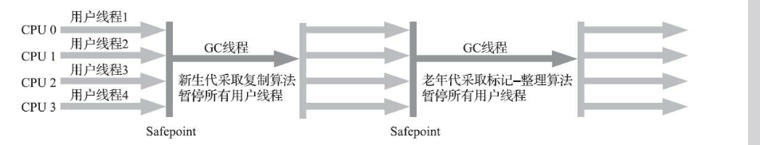
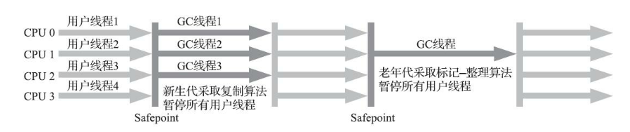
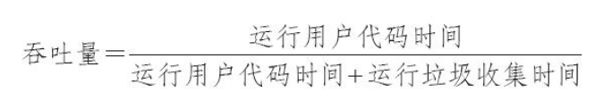
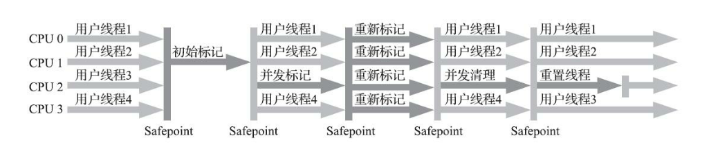
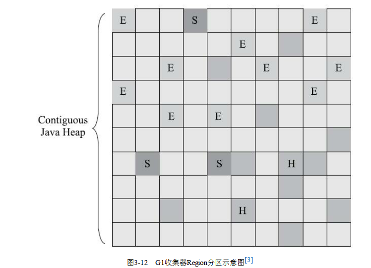

# 经典垃圾回收器

## 1. Serial收集器（新生代收集器）

这个收集器是一个单线程工作的收集器，但它的“单线
程”的意义并不仅仅是说明它只会使用一个处理器或一条收集线程去完成垃圾收集工作，更重要的是强
调在它进行垃圾收集时，必须暂停其他所有工作线程，直到它收集结束。

对于单核处理 器或处理器核心数较少的环境来说，Serial收集器由于没有线程交互的开销，专心做垃圾收集自然可以
获得最高的单线程收集效率。

## 2. ParNew收集器（新生代收集器）

ParNew收集器实质上是Serial收集器的多线程并行版本。ParNew收集器在单核心处理器的环境中绝对不会有比Serial收集器更好的效果。
ParNew可以说是HotSpot虚拟机中第一款退出历史舞台的垃圾收集器。

## 3. Parallel Scavenge （新生代收集器）

Parallel Scavenge收集器也是一款新生代收集器，它同样是基于标记-复制算法实现的收集器，也是
能够并行收集的多线程收集器……Parallel Scavenge的诸多特性从表面上看和ParNew非常相似，那它有
什么特别之处呢？
Parallel Scavenge收集器的特点是它的关注点与其他收集器不同，CMS等收集器的关注点是尽可能
地缩短垃圾收集时用户线程的停顿时间，而Parallel Scavenge收集器的目标则是达到一个可控制的吞吐
量（Throughput）。

如果虚拟机完成某个任务，用户代码加上垃圾收集总共耗费了100分钟，其中垃圾收集花掉1分
钟，那吞吐量就是99%。停顿时间越短就越适合需要与用户交互或需要保证服务响应质量的程序，良
好的响应速度能提升用户体验；而高吞吐量则可以最高效率地利用处理器资源，尽快完成程序的运算
任务，主要适合在后台运算而不需要太多交互的分析任务。
Parallel Scavenge收集器提供了两个参数用于精确控制吞吐量，分别是控制最大垃圾收集停顿时间
的-XX：M axGCPauseM illis参数以及直接设置吞吐量大小的-XX：GCTimeRatio参数。
-XX：M axGCPauseM illis参数允许的值是一个大于0的毫秒数，收集器将尽力保证内存回收花费的
时间不超过用户设定值。不过大家不要异想天开地认为如果把这个参数的值设置得更小一点就能使得
系统的垃圾收集速度变得更快，垃圾收集停顿时间缩短是以牺牲吞吐量和新生代空间为代价换取的：
系统把新生代调得小一些，收集300M B新生代肯定比收集500M B快，但这也直接导致垃圾收集发生得
更频繁，原来10秒收集一次、每次停顿100毫秒，现在变成5秒收集一次、每次停顿70毫秒。停顿时间
的确在下降，但吞吐量也降下来了。

## 4. Serial Old收集器（老年代收集器）

Serial Old是Serial收集器的老年代版本，它同样是一个单线程收集器，使用标记-整理算法。

## 5. Parallel Old收集器（老年代收集器）

Parallel Old是Parallel Scavenge收集器的老年代版本，支持多线程并发收集，基于标记-整理算法实
现。

## 6. CMS收集器（老年代收集器）

CMS（Concurrent M ark Sweep）收集器是一种以获取最短回收停顿时间为目标的收集器。目前很
大一部分的Java应用集中在互联网网站或者基于浏览器的B/S系统的服务端上，这类应用通常都会较为
关注服务的响应速度，希望系统停顿时间尽可能短，以给用户带来良好的交互体验。CMS收集器就非
常符合这类应用的需求。

CMS收集器是基于标记-清除算法实现的，它的运作过程相对前面几种收集器来说要复杂一些，整个过程
分为4个步骤，包括：

1. 初始标记（CMS initial mark）
2. 并发标记（CMS concurrent mark）
3. 重新标记（CMS remark）
4. 并发清除（CMS concurrent sweep）

其中初始标记、重新标记这两个步骤仍然需要“Stop The World”。初始标记仅仅只是标记一下GC
Roots能直接关联到的对象，速度很快；并发标记阶段就是从GC Roots的直接关联对象开始遍历整个对
象图的过程，这个过程耗时较长但是不需要停顿用户线程，可以与垃圾收集线程一起并发运行；而重
新标记阶段则是为了修正并发标记期间，因用户程序继续运作而导致标记产生变动的那一部分对象的
标记记录（详见3.4.6节中关于增量更新的讲解），这个阶段的停顿时间通常会比初始标记阶段稍长一
些，但也远比并发标记阶段的时间短；最后是并发清除阶段，清理删除掉标记阶段判断的已经死亡的
对象，由于不需要移动存活对象，所以这个阶段也是可以与用户线程同时并发的。

## G1收集器（新生代和老年代收集器）
Garbage First（简称G1）收集器是垃圾收集器技术发展历史上的里程碑式的成果，它开创了收集
器面向局部收集的设计思路和基于``Region的内存布局形式``。

在G1收集器出现之前的所有
其他收集器，包括CM S在内，垃圾收集的目标范围要么是整个新生代（M inor GC），要么就是整个老年代（Major GC），再要么就是整个Java堆（Full GC）。而G1跳出了这个樊笼，它可以面向堆存任何部分来组成回收集（Collection Set，一般简称CSet）进行回收，衡量标准不再是它属于哪个分代，而是哪块内存中存放的垃圾数量最多，回收收益最大，这就是G1收集器的M ixed GC模式。
G1开创的基于Region的堆内存布局是它能够实现这个目标的关键。虽然G1也仍是遵循分代收集理
论设计的，但其堆内存的布局与其他收集器有非常明显的差异：G1不再坚持固定大小以及固定数量的
分代区域划分，而是把连续的Java堆划分为多个大小相等的独立区域（Region），每一个Region都可以
根据需要，扮演新生代的Eden空间、Survivor空间，或者老年代空间。

根据需要，扮演新生代的Eden空间、Survivor空间，或者老年代空间。收集器能够对扮演不同角色的
Region采用不同的策略去处理，这样无论是新创建的对象还是已经存活了一段时间、熬过多次收集的
旧对象都能获取很好的收集效果。
Region中还有一类特殊的Humongous区域，专门用来存储大对象。G1认为只要大小超过了一个
Region容量一半的对象即可判定为大对象。每个Region的大小可以通过参数-XX：G1HeapRegionSize设定，取值范围为1M B～32M B，且应为2的N次幂。而对于那些超过了整个Region容量的超级大对象，将会被存放在N个连续的Humongous Region之中，G1的大多数行为都把Humongous Region作为老年代的一部分来进行看待

   

# 低延迟垃圾回收器

## Shenandoah收集器

在本书所出现的众多垃圾收集器里，Shenandoah大概是最“孤独”的一个。现代社会竞争激烈，连
一个公司里不同团队之间都存在“部门墙”，那Shenandoah作为第一款不由Oracle（包括以前的Sun）公司的虚拟机团队所领导开发的HotSpot垃圾收集器，不可避免地会受到一些来自“官方”的排挤。在笔者
撰写这部分内容时[1]，Oracle仍明确拒绝在OracleJDK 12中支持Shenandoah收集器，并执意在打包
OracleJDK时通过条件编译完全排除掉了Shenandoah的代码，换句话说，Shenandoah是一款只有
OpenJDK才会包含，而OracleJDK里反而不存在的收集器，“免费开源版”比“收费商业版”功能更多，这
是相对罕见的状况[2]。如果读者的项目要求用到Oracle商业支持的话，就不得不把Shenandoah排除在选
择范围之外了。

## ZGC收集器

ZGC（“Z”并非什么专业名词的缩写，这款收集器的名字就叫作Z Garbage Collector）是一款在
JDK 11中新加入的具有实验性质[1]的低延迟垃圾收集器，是由Oracle公司研发的。2018年Oracle创建了
JEP 333将ZGC提交给OpenJDK，推动其进入OpenJDK 11的发布清单之中。
ZGC和Shenandoah的目标是高度相似的，都希望在尽可能对吞吐量影响不太大的前提下[2]，实现
在任意堆内存大小下都可以把垃圾收集的停顿时间限制在十毫秒以内的低延迟。

## 收集器的权衡

我们应该如何选择一款适合自己应用的收集器呢？这个问题的答案主要受以下三
个因素影响：
- 应用程序的主要关注点是什么？如果是数据分析、科学计算类的任务，目标是能尽快算出结果，
那吞吐量就是主要关注点；如果是SLA应用，那停顿时间直接影响服务质量，严重的甚至会导致事务
超时，这样延迟就是主要关注点；而如果是客户端应用或者嵌入式应用，那垃圾收集的内存占用则是
不可忽视的。
- 运行应用的基础设施如何？譬如硬件规格，要涉及的系统架构是x86-32/64、SPARC还是
ARM /Aarch64；处理器的数量多少，分配内存的大小；选择的操作系统是Linux、Solaris还是Windows
等。
- 使用JDK的发行商是什么？版本号是多少？是ZingJDK/Zulu、OracleJDK、Open-JDK、OpenJ9抑
或是其他公司的发行版？该JDK对应了《Java虚拟机规范》的哪个版本？