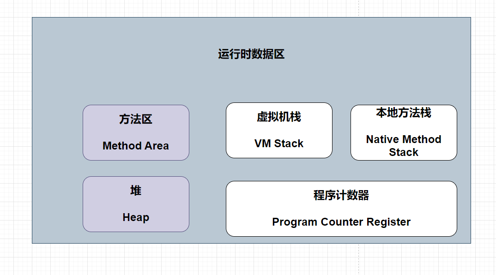

- 深色：所有线程共享的数据区
- 白色：线程隔离的数据区

# 运行时数据区域

## 1 程序计数器

程序计数器（Program Counter Register）是一块较小的内存空间，
它可以看作是当前线程所执行的字节码的行号指示器。

## 2 虚拟机栈（Java Virtual Machine Stack）

虚拟机栈描述的是Java方法执行的线程内存模型：每个方法被执行的时候，Java虚拟机都
会同步创建一个栈帧[1]（Stack Frame）用于存储``局部变量表``、操作数栈、动态连接、方法出口等信
息。每一个方法被调用直至执行完毕的过程，就对应着一个栈帧在虚拟机栈中从入栈到出栈的过程

## 3 本地方法栈（Native Method Stack）

与虚拟机栈所发挥的作用是非常相似的，其区别只是虚拟机
栈为虚拟机执行Java方法（也就是字节码）服务，而本地方法栈则是为虚拟机使用到的本地（Native）
方法服务。

## 4 Java堆（Java Heap）

对于Java应用程序来说，Java堆（Java Heap）是虚拟机所管理的内存中最大的一块。Java堆是被所
有线程共享的一块内存区域，在虚拟机启动时创建。此内存区域的唯一目的就是存放``对象实例``，Java
世界里“几乎”所有的对象实例都在这里分配内存。

## 5 方法区（Method Area）

方法区（M ethod Area）与Java堆一样，是各个线程共享的内存区域，它用于存储已被虚拟机加载
的类型信息、常量、``静态变量``、即时编译器编译后的代码缓存等数据。

### 5.1 运行时常量池（Runtime Constant Pool）

Class文件中除了有类的版本、字
段、方法、接口等描述信息外，还有一项信息是常量池表（Constant Pool Table），用于存放编译期生
成的各种字面量与符号引用，这部分内容将在类加载后存放到方法区的运行时常量池中。

## Java变量存储位置：

- 局部变量：
  如果局部变量是基本类型就存储在`栈`中，如果是引用类型就存储在`栈`中，引用所指向的对象实例存储在`堆`中。
- 实例变量： 不管对象类型都是存储在`堆`中。
- 静态变量：引用类型引用在`方法区`,存储在`堆`， 基本类型在`方法区`