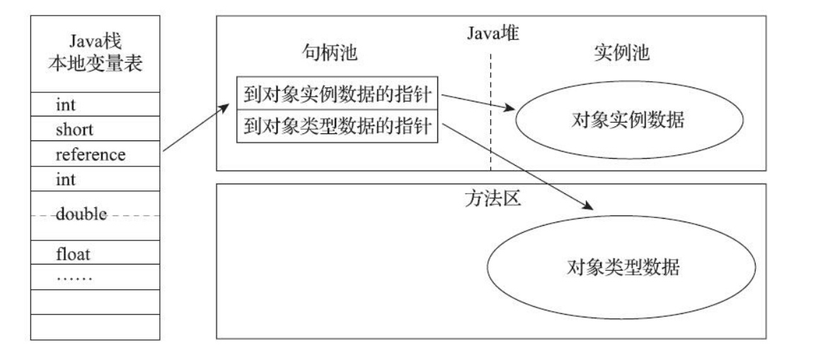
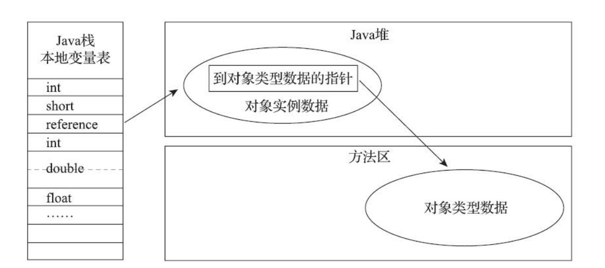

# 对象的创建

分配方式：

- 指针碰撞

假设Java堆中内存是绝对规整的，所有被使用过的内存都被放在一
边，空闲的内存被放在另一边，中间放着一个指针作为分界点的指示器，那所分配内存就仅仅是把那
个指针向空闲空间方向挪动一段与对象大小相等的距离，这种分配方式称为“指针碰撞”（Bump The
Pointer）。

- 空闲列表

但如果Java堆中的内存并不是规整的，已被使用的内存和空闲的内存相互交错在一起，那
就没有办法简单地进行指针碰撞了，虚拟机就必须维护一个列表，记录上哪些内存块是可用的，在分
配的时候从列表中找到一块足够大的空间划分给对象实例，并更新列表上的记录，这种分配方式称
为“空闲列表”（Free List）。

使用那种分配方式是有java堆是否工整决定的，java堆是否工整是由GC决定的。

# 对象的内存布局

## 对象头（Header）：

HotSpot虚拟机对象的对象头部分包括两类信息。第一类是用于存储对象自身的运行时数据，如哈
希码（HashCode）、GC分代年龄、锁状态标志、线程持有的锁、偏向线程ID、偏向时间戳等。

对象头的另外一部分是类型指针，即对象指向它的类型元数据的指针，Java虚拟机通过这个指针
来确定该对象是哪个类的实例。

## 实例数据（Instance Data）

实例数据部分是对象真正存储的有效信息，即我们在程序代码里面所定义的各种类型的字
段内容，无论是从父类继承下来的，还是在子类中定义的字段都必须记录起来。

## 对齐填充（Padding）

对象的第三部分是对齐填充，这并不是必然存在的，也没有特别的含义，它仅仅起着占位符的作
用。由于HotSpot虚拟机的自动内存管理系统要求对象起始地址必须是8字节的整数倍，换句话说就是
任何对象的大小都必须是8字节的整数倍。对象头部分已经被精心设计成正好是8字节的倍数（1倍或者
2倍），因此，如果对象实例数据部分没有对齐的话，就需要通过对齐填充来补全。

# 对象的访问定位

## 句柄访问

Java堆中将可能会划分出一块内存来作为句柄池，reference中存储的就
是对象的句柄地址，而句柄中包含了对象实例数据与类型数据各自具体的地址信息

## 直接指针访问

Java堆中对象的内存布局就必须考虑如何放置访问类型数据的相关
信息，reference中存储的直接就是对象地址，如果只是访问对象本身的话，就不需要多一次间接访问
的开销

