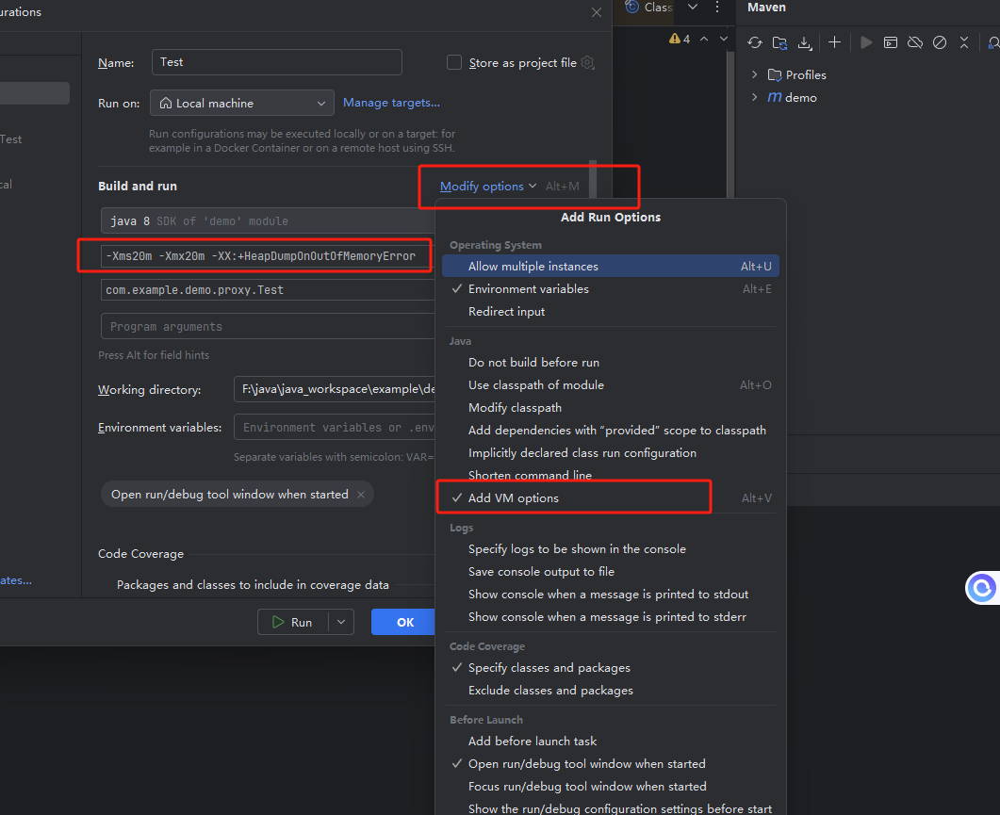
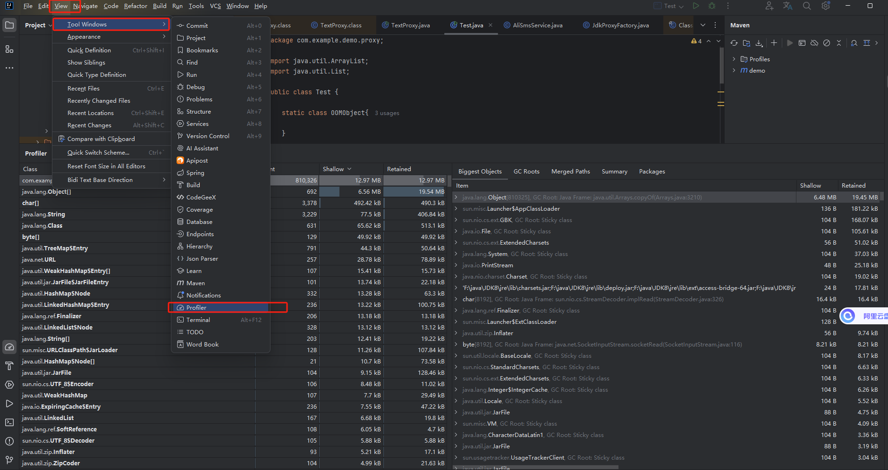
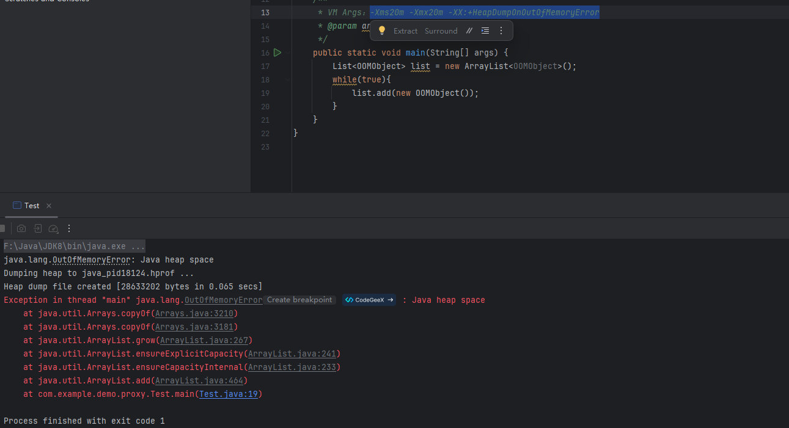

# idea工具使用

设置vm参数 



工具Profiler




# Java堆溢出

```java
static class OOMObject{

    }

    /**
     * VM Args：-Xms20m -Xmx20m -XX:+HeapDumpOnOutOfMemoryError
     * @param args
     */
    public static void main(String[] args) {
        List<OOMObject> list = new ArrayList<OOMObject>();
        while(true){
            list.add(new OOMObject());
        }
    }


```



# 虚拟机栈和本地方法栈溢出