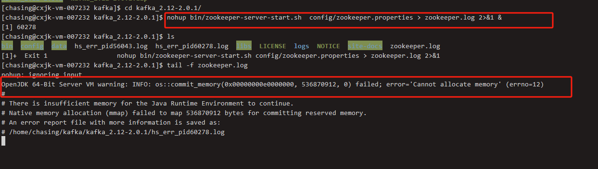
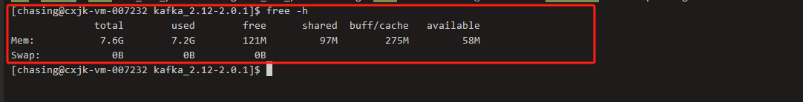
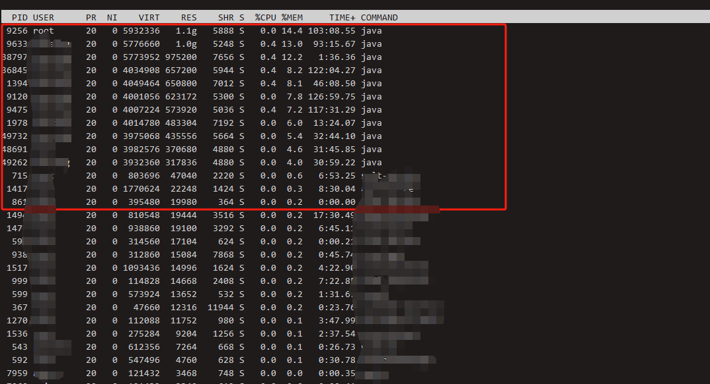
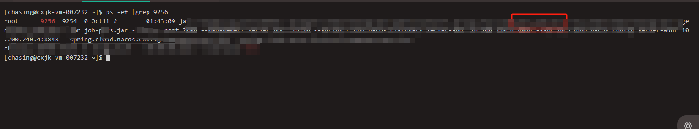
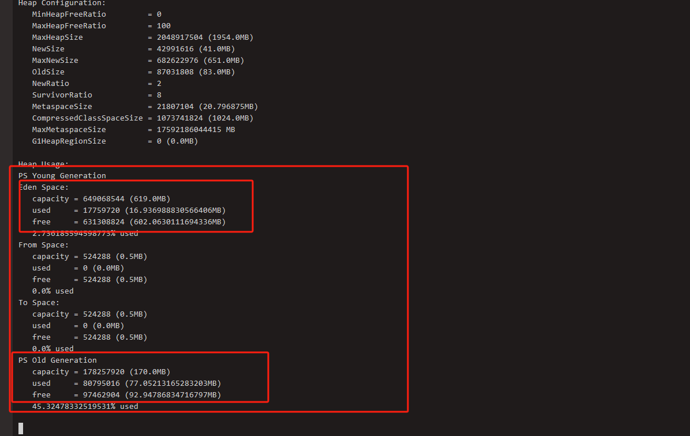

# 场景
服务器需要使用启动kafka



发现启动zookeeper失败，是内存分配失败


# 1. 查看服务器内存

```
free -h 

```


发现内存总共7.6使用了7.2

# 2. 查看进程使用内存情况

```
top

然后按下M
```



第一个和第二个项目使用了内存1个G

# 3. 查看第一个项目 

```
ps -ef | grep  [pid]

```



发现第一个项目是一个定时任务 ， 定时任务不可能会使用到一个1个G的内存 


分析项目内存使用情况 

```
sudo  jmap -heap  [pid]

```



查看堆中年轻代（eden + from apce+to space ）有600M都是空闲的 。

至此问题排查完成，在项目启动的时候对job设置一个合理的heap大小。


