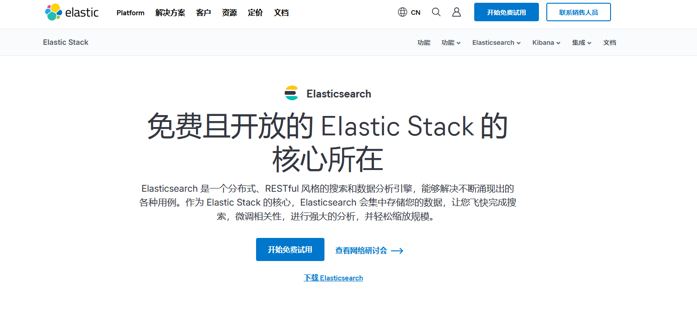
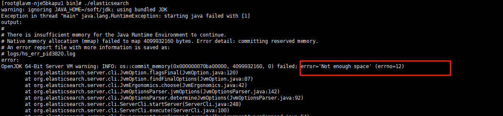
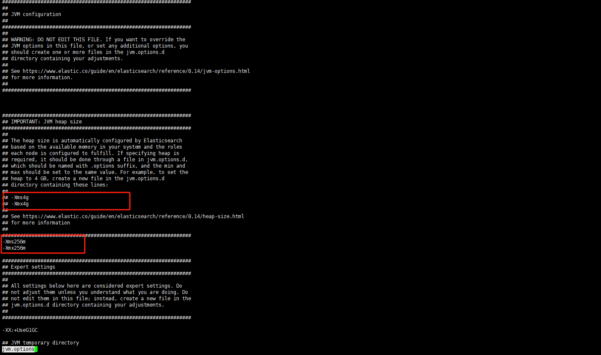
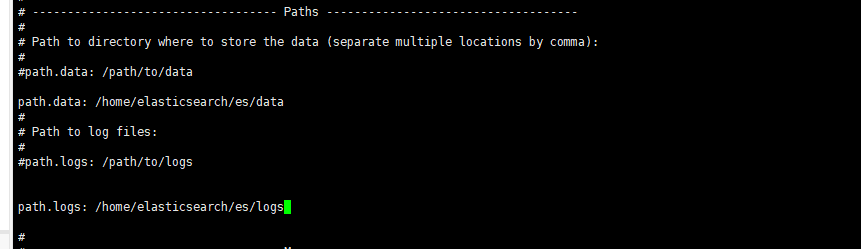
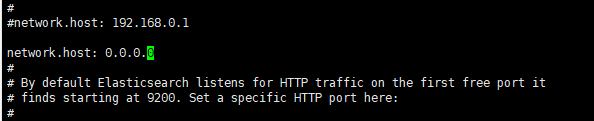
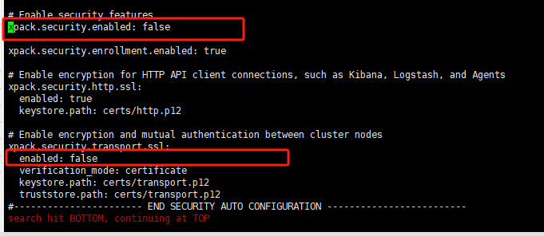
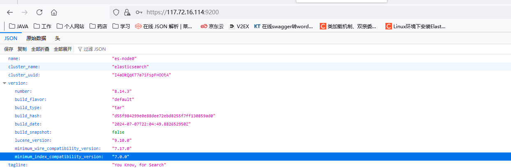

# Linux安装Elasticsearch




[Elasticsearch官网](https://www.elastic.co/cn/elasticsearch)


## 下载解压

```
wget https://artifacts.elastic.co/downloads/elasticsearch/elasticsearch-8.14.3-linux-x86_64.tar.gz

tar -zxvf elasticsearch-8.14.3-linux-aarch64.tar.gz

```
## 常见配置

### 1 创建es用户
因为es是不能通过root用户直接启动的，所以需要创建专用的用户
```
adduser es
chown -R es /soft/elasticsearch
su user es
```

### 2 配置内存大小
es的默认配置太大，如果直接启动可能会出现以下的错误

需要修改配置文件 config/jvm.options


### 3 修改日志和数据存储路径
config/elasticsearch.yml


### 4 修改运行访问的IP
config/elasticsearch.yml


### 5 关闭ssl认证
config/elasticsearch.yml


### 6 初始化节点名称
bin/elasticsearch.yml
```
cluster.name: elasticsearch 
node.name: es-node0
cluster.initial_master_nodes: ["es-node0"]
```

## 启动命令

- 前台启动  
```
./bin/elasticsearch
```
- 后台启动
```
./bin/elasticsearch -d
```

## 可能遇见的问题


### 1 vm.max_map_count [65530] is too low问题

```
su root
vi /etc/sysctl.conf

```
在文件中添加下面内容
```
vm.max_map_count=262144

```
退出保存，刷新配置文件
```
sysctl -p

```

###  2 max file descriptors [4096]问题

```
[1]: max file descriptors [4096] for elasticsearch process is too low

```
切换到root用户

```
vi /etc/security/limits.conf
```
添加如下内容

```
* soft nofile 65536
* hard nofile 131072
* soft nproc 2048
* hard nproc 4096

```


## 验证是否启动成功



