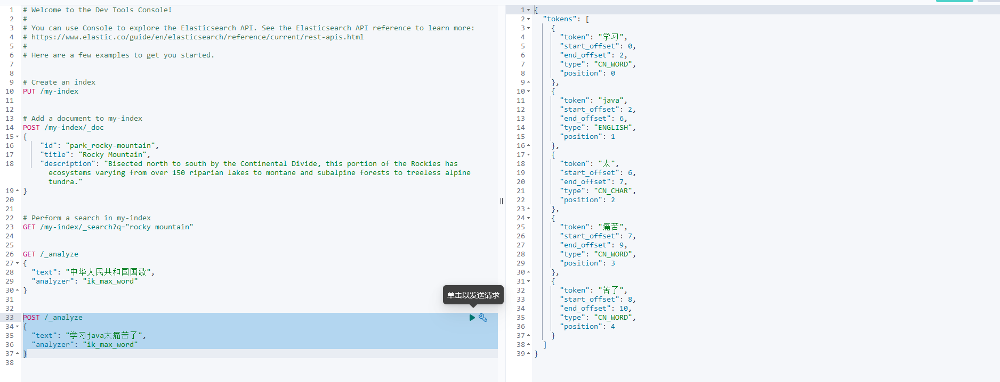
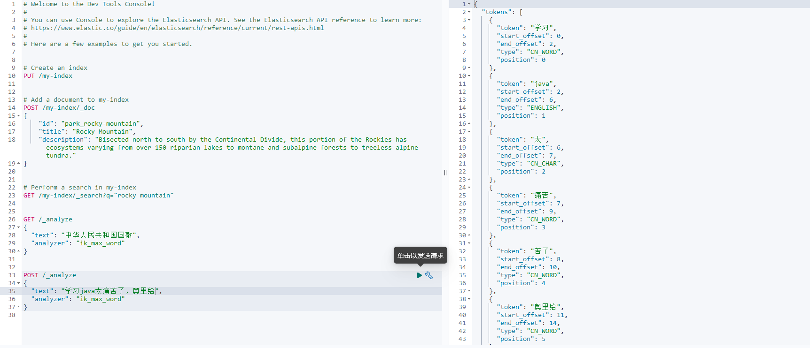

# 了解

注意 ***ik分词器和elasticsearch版本对应关系***，  
一般工作中**分词器**只会区分到词，比如ik分词器会对下面的话  
学习java太痛苦了，奥里给  分词：学习，但是并不会分出：学，习，学习。这个时候就需要使用多个分词器来组合使用。

## ik地址
[ik分词器官方发行版](https://github.com/infinilabs/analysis-ik/releases)

## 安装
ik分词器下载好以后需要在es中的plugs目录下面解压   
步骤如下： 

### 1. 进入es的plugins目录
```
cd /soft/elasticsearch-8.12.2/plugins

```

### 2. 创建ik目录
```
mkdir ik
```
### 3. 进入ik目录，下载ik，解压ik

```
cd ik
wget https://github.com/infinilabs/analysis-ik/releases/download/v8.12.2/elasticsearch-analysis-ik-8.12.2.zip
unzip elasticsearch-analysis-ik-8.12.2.zip
```

### 4. 重启es


## 分词器的使用
analyzer

- ik_max_word 会将文本做最细粒度的拆分
 
  比如会将「中华人民共和国国歌」拆分为：中华人民共和国、中华人民、中华、华人、人民共和国、人民、人、民、共和国、共和、和、国国、国歌，会穷尽各种可能的组合；  


- ik_smart 会做最粗粒度的拆分 

  比如会将「中华人民共和国国歌」拆分为：中华人民共和国、国歌。

## 验证是否安装成功

安装完成后，就可以在kibana上面验证



## 拓展词典

在目录ik/config/IKAnalyzer.cfg.xml下面添加配置

```
<properties>
        <comment>IK Analyzer 扩展配置</comment>
        <!--用户可以在这里配置远程扩展字典 -->
        <!-- <entry key="remote_ext_dict">words_location</entry> -->
        <!--用户可以在这里配置远程扩展停止词字典-->
        <!-- <entry key="remote_ext_stopwords">words_location</entry> -->

        <!--用户可以在这里配置自己的扩展字典 -->
        <entry key="ext_dict">ext.dic</entry>
        <!--用户可以在这里配置自己的扩展停止词字典-->
        <entry key="ext_stopwords">stopword.dic</entry>
</properties>

```
然后创建文件ext.dic，并且重启需要重启es  
```
vi ext.dic

奥里给
```

效果如下


