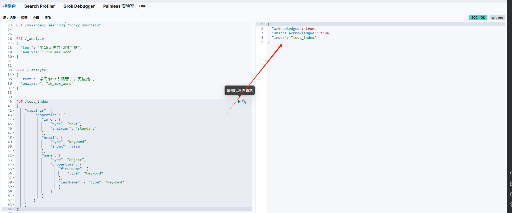
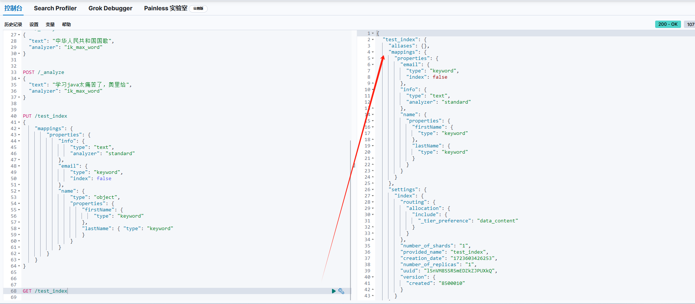

# 定义,mapping(索引库)
mapping在Elasticsearch中相当于数据库中的schema定义，用于定义索引中的字段名称、字段类型以及字段的属性。mapping定义了索引的结构和字段类型，从而使得Elasticsearch能够正确地解析和索引数据。

# mapping映射属性

* type: 字段数据类型，常见的简单类型有：
  * 字符串： text(可分词的文本)， keyword(精确值，不支持搜索部分内容)
  * 数值： long, integer, short, byte, double, float
  * 布尔： boolean
  * 日期： date
  * 对象： object
  * 其他的类型： geo_point(地理位置)， geo_shape(地理形状)， ip(IP地址) 都可以在es的官方文档中找到
* index: 是否创建索引，默认为true
* analyzer: 分词器，用于对文本字段进行分词
* properties: 子字段，用于定义嵌套对象

# mapping索引库的CRUD

## 创建

现在有一个数据的内容如下
```
{
    "age":21,
    "weignt": 52.1,
    "isMarried":false,
    "info": "咆哮",
    "email": "zy@itesss.cn",
    "name": {
        "firstName": "jack",
        "lastName": "chen"
    }
}
```

创建mapping的语句如下（只创建了部分）：
```
PUT /test_index
{
    "mappings": {
        "properties": {
            "info": {
                "type": "text",
                "analyzer": "standard"
            },
            "email": {
                "type": "keyword",
                "index": false
            },
            "name": {
                "type": "object",
                "properties": {
                    "firstName": {
                        "type": "keyword"
                    },
                    "lastName": { "type": "keyword"
                    }
                }
            }
        }
    }
}

```




## 查询

```
GET /test_index

```


## 删除
```
DELETE /test_index
```

## 修改

索引库一旦创建，就不能修改mapping，但是可以添加新的字段，语法如下：
```
PUT /test_index/_mapping
{
    "properties": {
        "age": {
            "type": "integer"
        }
    }
}

```
