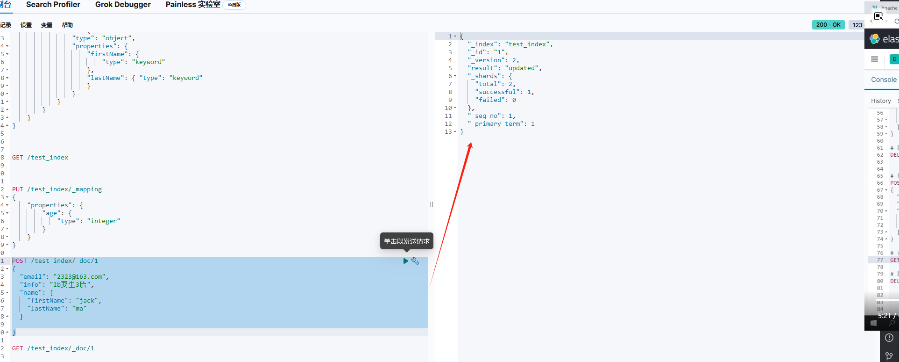

# 添加文档
```
POST /索引库名/_doc/文档id
{
  "字段1":"值1",
  "字段2":"值2",
  "字段3":{
    "子属性1"： "值3",
    "子属性2"： "值4"
  }
}

```


返回的结果解析：

```
{
  "_index": "test_index",
  "_id": "1",
  "_version": 4,
  "result": "created",
  "_shards": {
    "total": 2,
    "successful": 1,
    "failed": 0
  },
  "_seq_no": 3,
  "_primary_term": 1
}

```
- _index：索引库
- _id：文档id
- _version：版本号
- result：操作类型，created表示创建，update表示更新

# 查询
```
GET /test_index/_doc/1
```

返回结果解析

```
{
  "_index": "test_index",
  "_id": "1",
  "_version": 4,
  "_seq_no": 3,
  "_primary_term": 1,
  "found": true,
  "_source": {
    "email": "2323@163.com",
    "info": "lb要生3胎",
    "name": {
      "firstName": "jack",
      "lastName": "ma"
    }
  }
}

```
- _index：索引库
- _id：文档id
- _version：版本号
- source：文档内容
- found：是否查询到结果

## 删除

```

DELETE /test_index/_doc/1


GET /test_index/_doc/1
```
删除以后查询
found为false

## 修改文档

### 方式一： 全量修改，会删除旧文档，添加新的文档
如果id存在，就会删除以前id的文档，再添加新的文档，版本号会加1，如果不存在就直接新增
```
PUT /索引库名/_doc/文档id
{
   "字段1":"值1",
   "字段2":"值2"
}

```

```
PUT /test_index/_doc/1
{
  "email": "2323@163.com",
  "info": "lb要生6胎",
  "name": {
    "firstName": "jack",
    "lastName": "mahah"
  }
  
}

GET /test_index/_doc/1
```
### 方式二：部分修改，会修改旧文档，不会删除旧文档，旧文档的版本号会加1
```
POST /索引库名/_update/文档id 
{
    "doc":{
        "字段名":"新的值"
    }
}

```

```
POST /test_index/_update/1
{
  "doc":{
    "info": "lb要生7胎"
    }
}
```


