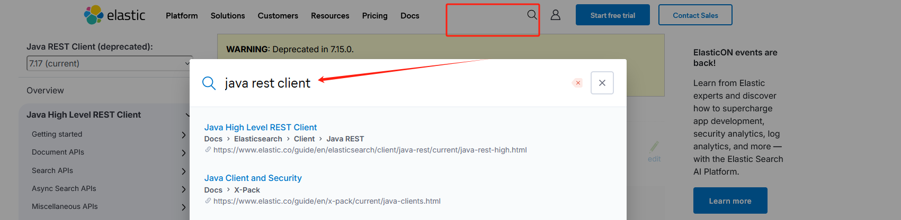
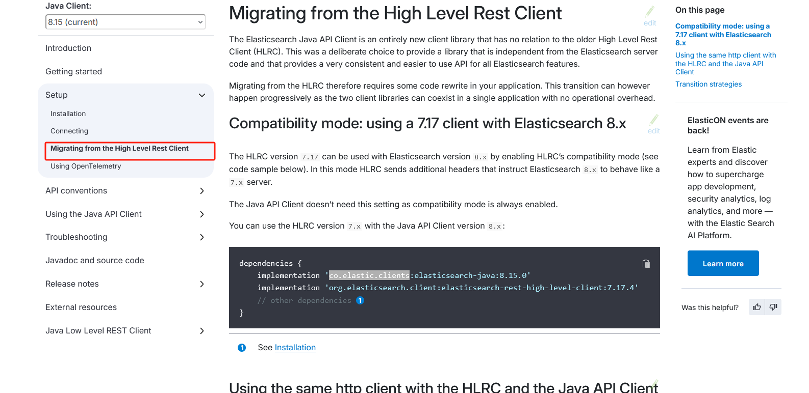

# 什么是RestClient

RestClient是Elasticsearch提供的Java API，用于与Elasticsearch进行交互。它提供了一种简单、灵活的方式来执行各种操作，例如创建、读取、更新和删除索引中的文档，执行搜索查询等。



# 案例实操

1. 导入课前资料demo
2. 分析数据结构，定义mapping属性
3. 初始化JavaRestClient
4. 利用JavaRestClient创建索引库
5. 利用JavaRestClient删除索引库
6. 利用JavaRestClient判断索引库是否存在

## 1 导入资料

### 导入sql

[SQL文件](static/tb_hotel.sql)

### 导入Java的demo

[hotel-demo](static/hotel-demo)

## 2分析数据结构

mapping要考虑的问题：
字段名、数据类型、是否参与搜索、是否分词、如果分词、分词器是什么？

```sql
CREATE TABLE `tb_hotel`
(
    `id`        bigint                                                        NOT NULL COMMENT '酒店id',
    `name`      varchar(255) CHARACTER SET utf8mb4 COLLATE utf8mb4_general_ci NOT NULL COMMENT '酒店名称',
    `address`   varchar(255) CHARACTER SET utf8mb4 COLLATE utf8mb4_general_ci NOT NULL COMMENT '酒店地址',
    `price`     int                                                           NOT NULL COMMENT '酒店价格',
    `score`     int                                                           NOT NULL COMMENT '酒店评分',
    `brand`     varchar(32) CHARACTER SET utf8mb4 COLLATE utf8mb4_general_ci  NOT NULL COMMENT '酒店品牌',
    `city`      varchar(32) CHARACTER SET utf8mb4 COLLATE utf8mb4_general_ci  NOT NULL COMMENT '所在城市',
    `star_name` varchar(16) CHARACTER SET utf8mb4 COLLATE utf8mb4_general_ci  DEFAULT NULL COMMENT '酒店星级，1星到5星，1钻到5钻',
    `business`  varchar(255) CHARACTER SET utf8mb4 COLLATE utf8mb4_general_ci DEFAULT NULL COMMENT '商圈',
    `latitude`  varchar(32) CHARACTER SET utf8mb4 COLLATE utf8mb4_general_ci  NOT NULL COMMENT '纬度',
    `longitude` varchar(32) CHARACTER SET utf8mb4 COLLATE utf8mb4_general_ci  NOT NULL COMMENT '经度',
    `pic`       varchar(255) CHARACTER SET utf8mb4 COLLATE utf8mb4_general_ci DEFAULT NULL COMMENT '酒店图片',
    PRIMARY KEY (`id`) USING BTREE
) ENGINE=InnoDB DEFAULT CHARSET=utf8mb4 COLLATE=utf8mb4_general_ci ROW_FORMAT=COMPACT;

```

问题：

* 地理坐标怎么表示， "type": "geo_point" 表示地理坐标上的一个点，详细参看mapping文档中的类型。
* 怎么搜索多个条件（字段拷贝可以使用copy_to属性讲当前字段拷贝到指定字段）实列
    ```
    "all":{
        "type": "text",
        "analyzer": "ik_max_word"
    },
    "brand":{
        "type":"keyword",
        "copy_to": "all"
    }
    
    ```

mapping设计如下：

```
{
    "mapping": {
        "properties": {
            "id": {
                "type": "keyword"
            },
            "name": {
                "type": "text",
                "analyzer": "ik_max_word",
                "copy_to": "all"
            },
            "address": {
                "type": "keyword",
                "index": false
            },
            "price": {
                "type": "integer"
            },
            "score": {
                "type": "integer"
            },
            "brand": {
                "type": "keyword",
                "copy_to": "all"
            },
            "city": {
                "type": "keyword"
            },
            "starName": {
                "type": "keyword"
            },
            "business": {
                "type": "keyword",
                "copy_to": "all"
            },
            "location": {
                "type": "geo_point"
            },
            "pic": {
                "type": "keyword",
                "index": false
            },
            "all": {
                "type": "text",
                "analyzer": "ik_max_word"
            }
        }
    }
}


```

## 3 初始化JavaRestClient

对于elasticsearch7.0和8.0来说，这2个JavaRestClient是有挺大的区别的，
但是官方也给出了在高版本8.0如果使用HighLevelRestClient



### 下面依赖是7.0版本的依赖
* 引入es的RestHighLevelClient依赖：

```
<dependency>
    <groupId>org.elasticsearch.client</groupId>
    <artifactId>elasticsearch-rest-high-level-client</artifactId>
</dependency>
```

* 根据自己es的版本覆盖掉SpringBoot默认的es版本
```
<properties>
  <elasticsearch.version>7.12.1</elasticsearch.version>
</properties>

```

### 我是8.0版本的，依赖如下
```

  <dependency>
      <groupId>co.elastic.clients</groupId>
      <artifactId>elasticsearch-java</artifactId>
      <version>8.12.2</version>
  </dependency>

  <dependency>
      <groupId>org.elasticsearch.client</groupId>
      <artifactId>elasticsearch-rest-high-level-client</artifactId>
      <version>7.17.4</version>
  </dependency>

```

```
<properties>
  <elasticsearch.version>7.12.1</elasticsearch.version>
</properties>

```

测试代码

```

    public RestHighLevelClient client;

    @Test
    void testInit(){
        System.out.println(client);
    }


    @BeforeEach
    void setUp(){
        this.client = new RestHighLevelClient(RestClient.builder(
                HttpHost.create("http://127.72.162.114:9200")
        ));
    }

    @AfterEach
    void teardown() throws IOException {
        this.client.close();
    }


```