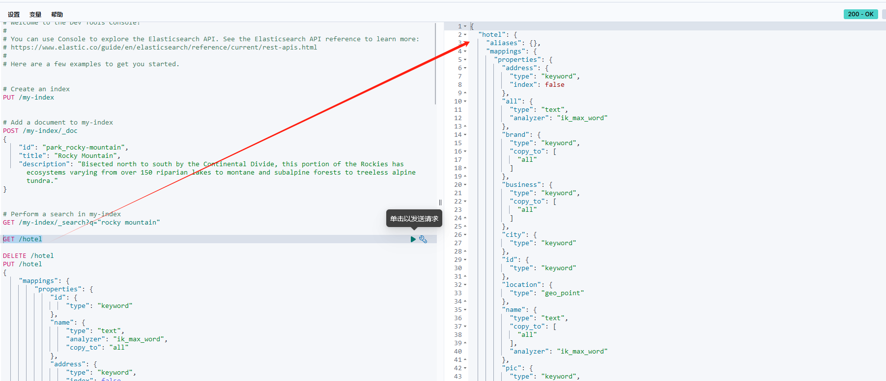

# 1 创建索引库
代码如下
```java
    @Test
    void testCreateHotelIndex() throws IOException {
        //1.创建Request对象
        CreateIndexRequest request = new CreateIndexRequest("hotel");
        //2.准备请求的参数：DSL语句
        request.mapping(HotelConstants.MAPPING_TEMPLATE, XContentType.JSON);
        //不推荐下面这种写法，如果有语法错误，在CreateIndexResponse中不能暴露出来
        //request.source(HotelConstants.MAPPING_TEMPLATE, XContentType.JSON);
        //3.发送请求
        CreateIndexResponse createIndexResponse = this.client.indices().create(request, RequestOptions.DEFAULT);
        //4.处理响应结果
        System.out.println(createIndexResponse.isAcknowledged());
    }


```
效果如下：

