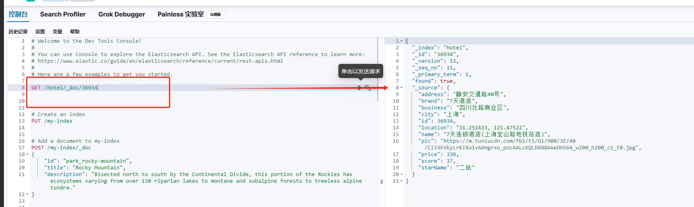

# 创建

```java

@Test
void testCreateDoc() throws IOException {
    Hotel hotel = hotelService.getById("36934");
    HotelDoc hotelDoc = new HotelDoc(hotel);
    //1.准备Request对象
    IndexRequest request = new IndexRequest("hotel").id(hotel.getId().toString());
    //2.准备JSON文档
    request.source(JSON.toJSONString(hotelDoc), XContentType.JSON);
    //3.发送请求
    IndexResponse index = client.index(request, RequestOptions.DEFAULT);
}

```



# 查询

```java


@Test
void testGetDocumentById() throws IOException {
    //1.准备Request对象
    GetRequest request = new GetRequest("hotel", "36934");
    //2.发送请求，得到响应
    GetResponse response = client.get(request, RequestOptions.DEFAULT);
    //3. 解析响应结果
    String json = response.getSourceAsString();
    HotelDoc hotelDoc = JSON.parseObject(json, HotelDoc.class);
    System.out.println(hotelDoc);
}

```

# 更新

修改文档数据有两种方式：
方式一： 全量更新，再次写入id一样的文档，就会删除旧文档，添加新文档
方式二： 局部更新。只更新部分字段
POST /USERS/_update/1

```java 

@Test
void testUpdateDocById() throws IOException {
    UpdateRequest updateRequest = new UpdateRequest("hotel", "36934");
    updateRequest.doc("age", 18, "name", "Rose");
    client.update(updateRequest, RequestOptions.DEFAULT);
}


```

# 删除

```java

@Test
void testDeleteDocById() throws IOException {
    DeleteRequest deleteRequest = new DeleteRequest("hotel", "36934");
    client.delete(deleteRequest, RequestOptions.DEFAULT);

}

```