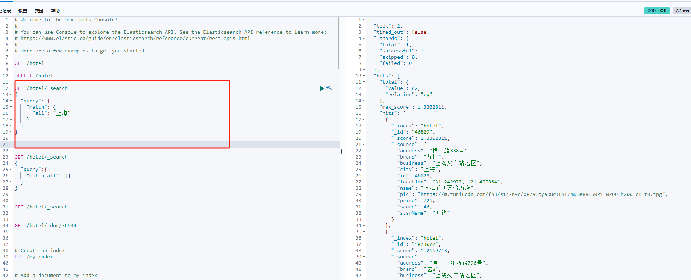
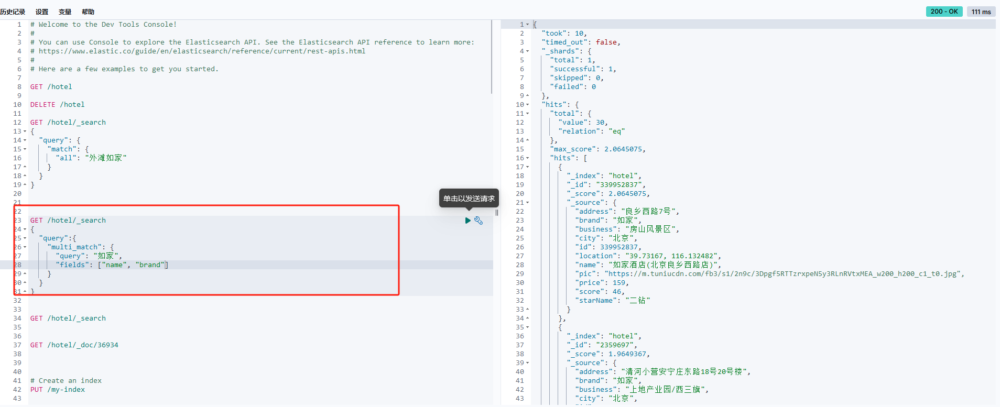
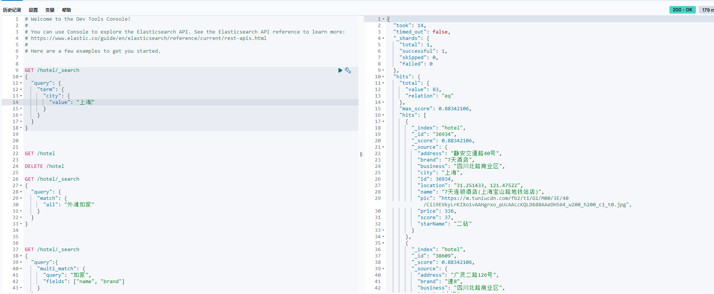
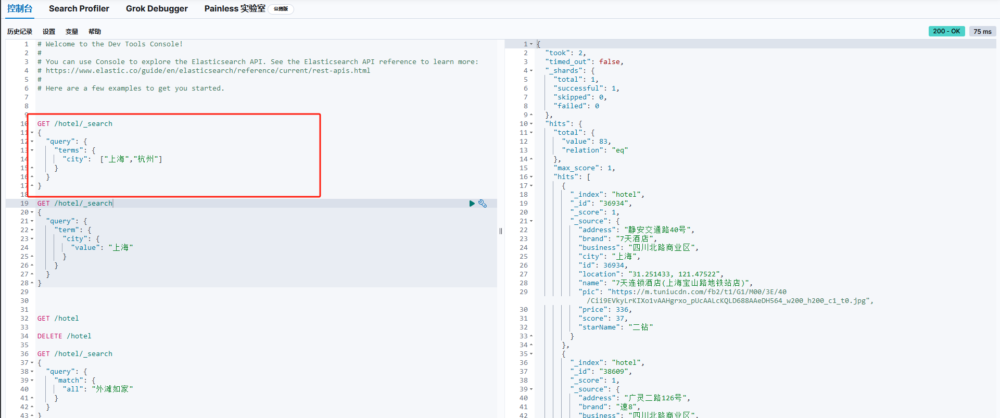
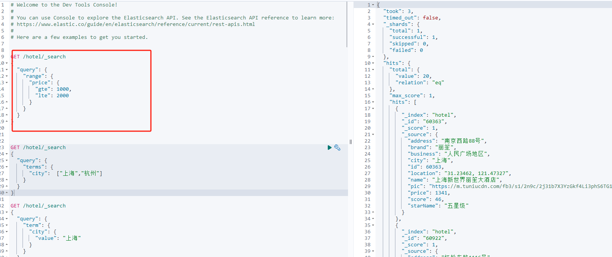
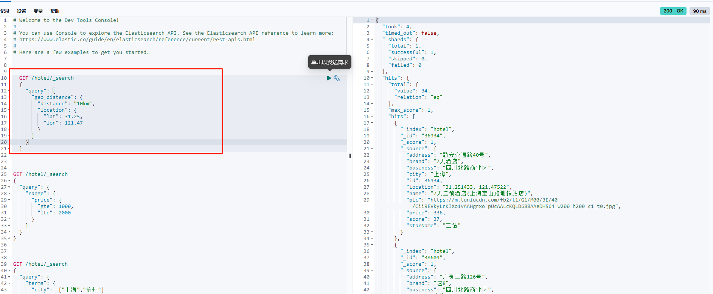
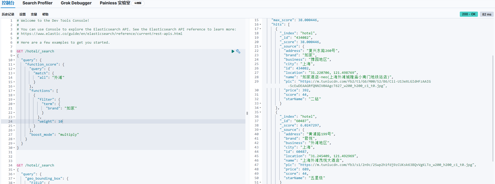

# DSL查询语法

## DSL Query的分类
[官方文档](https://www.elastic.co/guide/en/elasticsearch/reference/current/query-dsl.html)

Elasticsearch提供了丰富的查询语法，根据查询语法的不同，可以分为以下几类：

- 查询所有： 查询出所有数据，一般测试用。例如：match_all
- 全文解索（full text）查询： 利用分析器对用户输入内容分词，然后去倒排索引库中匹配。列如：
  - match_query
  - multi_match_query
- 精确查询： 根据精确词条值查找数据，一般是查找keyword、数值、日期、boolean等类型字段。
  - term
  - ids
  - range
- 地理（geo）查询：根据经纬度查询。例如：
    - geo_distance
    - geo_bounding_box
- 复合（compound）查询： 复合查询可以将上上述各种查询条件组合起来，合并查询条件。例如：
    - bool
    - function_score
## DSL查询语法结构
Elasticsearch的查询语法非常灵活，支持以JSON为载体，构建查询语句。基本的结构如下：
```
GET /indexName/_search
{
  "query": {
    "查询类型": {
            "查询条件"： "查询条件值"
     }
  }
}
```


## 全文解索查询
全文检索查询，会对用户输入内容分词，常用于搜索框：

match查询： 全文检索查询的一种，会对用户输入内容分词，然后去倒排索引库检索，语法：
```
GET /indexName/_search
{
  "query": {
    "match": {
      "FIELD": "TEXT"
    }
  }
}
```



multi_match查询： multi_match查询和match查询类似，但可以指定多个字段，语法：
```
GET /indexName/_search
{
  "query": {
    "multi_match": {
      "query": "TEXT",
      "fields": ["FIELD1", "FIELD2"]
    }
  }
}
```



总结：
- match:根据一个字段查询
- multi_match:根据多个字段查询,参与查询字段越多，性能越差，建议使用copy_to将多个字段合并一个字段，然后根据一个字段查询。


## 精确查询
精确查询，查询条件是一个确定的值，一般是查找keyword、数值、日期、boolean等类型字段。

term查询： term查询是Elasticsearch中最基本的查询，它接受一个字段名和一个字段的值，然后返回包含该值的文档。例如：
```DSL
GET /indexName/_search
{
  "query": {
    "term": {
      "FIELD": "TEXT"
    }
  }
}
```


terms查询： terms查询和term查询类似，但可以指定多个值，只要文档中的字段值在指定的多个值中，就可以匹配。例如：
```DSL
GET /indexName/_search
{
  "query": {
    "terms": {
      "FIELD": ["TEXT1", "TEXT2"]
    }
  }
}
```


range查询： range查询用于查找
指定范围内的文档，可以用于数值、日期、ip等类型字段。例如：
```
GET /hotel/_search
{
  "query": {
    "range": {
      "price": {
        "gte": 1000,
        "lte": 2000
      }
    }
  }
}


```



## 地理查询
- geo_bounding_box： 范围查询，查询某个经纬度范围内的文档。
```
GET /indexName/_search
{
  "query": {
    "geo_bounding_box": {
      "FIELD": {
        "top_left": {
          "lat": 40.73,
          "lon": -74.1
        },
        "bottom_right": {
          "lat": 40.01,
          "lon": -71.12
        }
      }
    }
  }
}
```

- geo_distance： 距离查询，查询某个中心点指定距离内的文档。 
```
GET /indexName/_search
{
  "query": {
    "geo_distance": {
      "distance": "100km",
      "FIELD": {
        "lat": 40,
        "lon": -70
      }
    }
  }
}
```


## 复合查询  function_score
复合查询可以将其他简单查询组合起来，实现更复杂的查询逻辑。

### 相关性算法
TF-IDF = TF * IDF
- TF(词条频率) = 词条在文档中出现的次数 / 文档中词条的总数
- IDF(逆文档频率) = log(文档总数 / 包含词条的文档数)

BM25： BM25查询是一种基于TF-IDF的查询算法，它对TF进行了平滑处理，避免了TF过大导致的查询结果不准确的问题。例如：

在es5.0之前，使用的是TF-IDF，会随着词频增加而越来越大
在es5.0之后，使用的BM25，会随着词频增加而增大，但增长曲线会趋于水平
   


- function_score： function_score查询可以给查询结果添加一个或多个函数，根据函数的返回值对查询结果进行排序。例如：
  query: 原始查询条件，搜索文档并根据相关性打分（query score）
- functions: 函数列表，每个函数可以指定一个filter、weight、boost_mode等参数，用于指定如何计算函数的返回值。
  filter: 过滤条件，对query score进行过滤
  weight: 权重，对query score进行加权,有weight、random_score、field_value_factor、script_score等选项，用于指定如何计算函数的返回值。
  boost_mode: 加权方式，有multiply、sum、replace、avg、max、min等选项，用于指定如何将函数的返回值与query score进行合并。
```
GET /hotel/_search
{
  "query": {
    "function_score": {
      "query": {
        "match": {
          "all": "外滩"
        }
      },
      "functions": [
        {
          "filter": {
            "term": {
              "id": "1"
            }
          },
          "weight": 1
        }
      ],
      "boost_mode": "multiply"
    }
  }
}
```


### 案例：
给“如家”这个品牌的酒店排名靠前一些
  1. 哪些文档需要算分加权
  2. 算分函数是什么？
  3. 加权方式是什么？




##  复合查询 boolean query
- must: 必须匹配每个子句， 类似“与”
- should: 选择性匹配子查询，类似“或”
- must_not: 必须不匹配每个子句， 类似“非”
- filter: 必须匹配每个子句，不计算权重

bool查询： bool查询由一个或多个子句组成，每个子句都可以指定查询类型，例如must（必须匹配）、must_not（必须不匹配）、should（选择性匹配）。例如：
```
GET /indexName/_search
{
  "query": {
    "bool
```