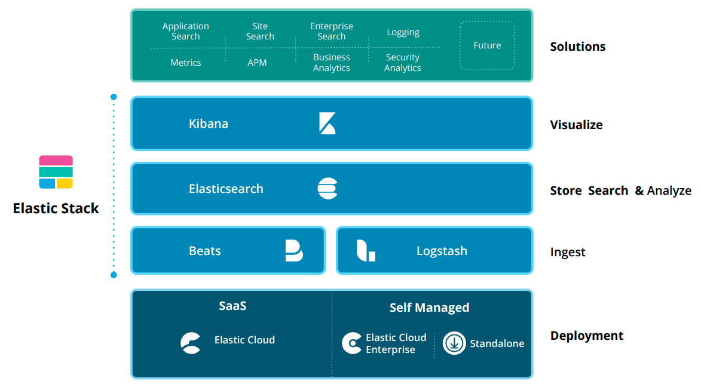
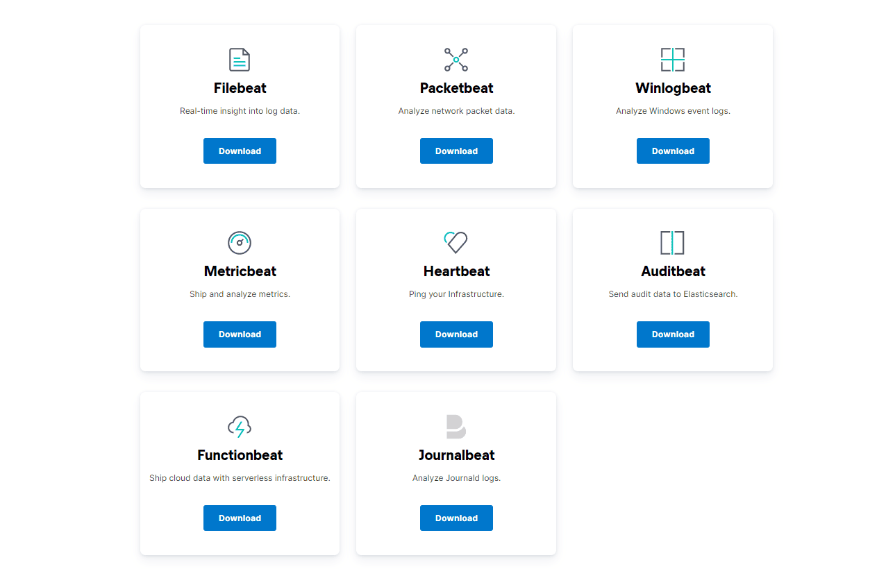
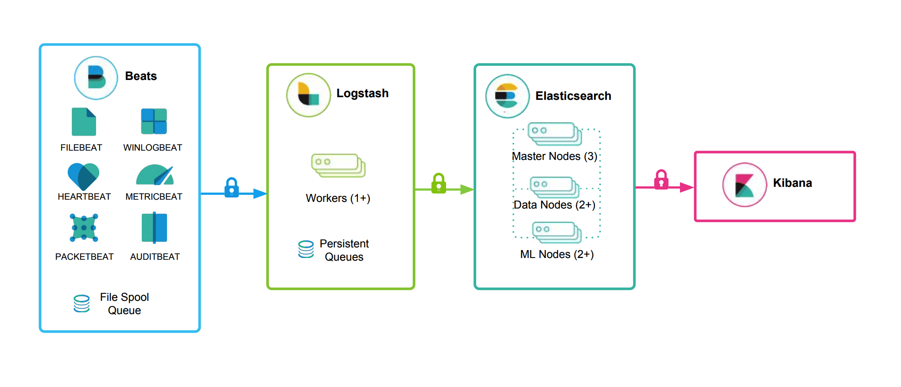
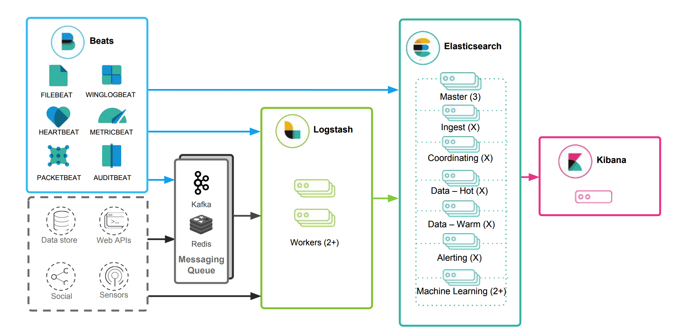

# Elastic Stack生态

    Beats + Logstash + ElasticSearch + Kibana

## Beats 
Beats是一个面向轻量型采集器的平台，这些采集器可以从边缘机器向Logstash、ElasticSearch发送数据，它是由Go语言进行开发的，运行效率方面比较快。从下图中可以看出，不同Beats的套件是针对不同的数据源

## Logstash

Logstash是动态数据收集管道，拥有可扩展的插件生态系统，支持从不同来源采集数据，转换数据，并将数据发送到不同的存储库中。

## ElasticSearch

ElasticSearch对数据进行搜索、分析和存储，其是基于JSON的分布式搜索和分析引擎，专门为实现水平可扩展性、高可靠性和管理便捷性而设计的。

## Kibana

Kibana实现数据可视化，其作用就是在ElasticSearch中进行民航。Kibana能够以图表的形式呈现数据，并且具有可扩展的用户界面，可以全方位的配置和管理ElasticSearch。

# Elastic Stack实践

## 日志收集系统

增加数据源，使用MQ

# 参考文章

- https://pdai.tech/md/db/nosql-es/elasticsearch-x-introduce-2.html