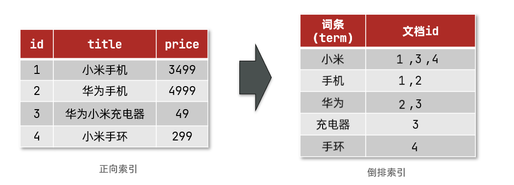
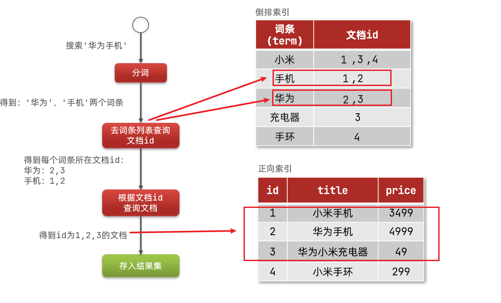

# Elasticsearch

ElasticSearch是一个集数据存储、数据搜索和数据分析为一体的系统。它是分布式的，所以能利用分布式来提高其处理能力，具有高可用性和高伸缩性。如果你需要一个能够提供高性能的搜索服务的系统，那么它或许是一个好的选择。

## 核心能力

    ElasticSearch是一个搜索系统，搜索就是从数据集合中搜索出我们想要的数据，例如从大量的商品数据中搜索出我们想要的某类商品。
    　　现在提一个需求，例如我有一个“文章”的表，我想搜索文章表中字段content中包含有'java'的数据。
    如果你不使用ES，那么从开发角度来说，平常我们都是使用关系型数据库系统来存储数据，然后使用类似select name,age,address from student where name like '%李%'的语句通过模糊匹配来搜索符合指定条件的数据的。（对应到上面的需求应该是select name,author,content from article where content like '%java%'）

    　但其实上面这种基于模糊匹配的搜索方式的效率是比较低的，因为数据库系统的搜索通常是逐一扫描的，也就是从头到尾的来尝试匹配，某个字段的数据越多，可能需要尝试匹配的次数就会越多（试想一下从4000字的文章中从上到下只为找到一个字），这种查找就好像最低级的遍历查找（当然并不是真的就是傻傻的遍历了，各个数据库系统都会采用各种算法来优化）。
    　
    　而ElasticSearch由于其内部建立了每个词的索引表，当搜索某个词时，可以根据这个词从索引表中找到匹配的记录，所以效率比较高（就好像记录了某个词的坐标，有了坐标，就能根据坐标非常快地找到那个词）。
    （这里举个类似的栗子：相信大家都用过字典，那么普通的数据库搜索就好像从第一页到最后一页找一个词，而ElasticSearch根据这个词的部首结构从“部首-字的对应表”中直接查找到那个字的页数，这个效率直接就是天差地别了！）

    　另外，数据库的搜索是根据指定词直接查找的，它是很笨的！它不能查找到某些意义上“类似”的结果，比如我搜索“mother”，但如果某个记录中包含“mom”这个词，那这条记录也应该被展示出来，而数据库的普通搜索做不到。
    　而这个操作ElasticSearch就可以做到，由于它内部有分词器，在建立索引的过程中，分词器可以把数据中的某些词都认为是指定的某一个词（比如把mother,mom通通都使用mom作为索引词），再用这个词来建立索引，然后在进行搜索的时候，将输入的词也进行同样的转化，再根据这个词从索引表中查找到符合的记录结果，这样就可以把那些意义相近的结果也搜索出来。

    所以说，ElasticSearch解决了普通全文搜索的搜索效率低下和搜索不智能的问题。

## ES的基本概念

### 倒排索引
- 文档（document）： 用来搜索的数据，其中的每一条数据就是一个文档。例如一个网页、商品信息。
- 词条（term）：对文档数据或用户搜索数据，利用某种算法分词，得到的具备含义的词语就是词条。例如：我是中国人，就可以分为：我、是、中国人、中国、国人这样的几个词条。

### 创建倒排索引的过程

- 将文档分词，得到词条。
- 创建索引表，存储词条和词条所在文档的映射关系。
- 因为词条唯一性，可以给词条创建索引，例如hash表结构索引

如图：

### 搜索流程
1) 用户输入条件``华为手机``进行搜索。
2) 对用户输入的内容分词，得到词条：``华为``、``手机``。
3) 拿着词条在倒排索引中查找，可以得到包含词条的文档id：1、2、3。
4) 拿着文档id到正向索引中查找具体文档。

### 正向和倒排的对比

参考：

https://pdai.tech/md/db/nosql-es/elasticsearch-x-usage.html

https://www.cnblogs.com/progor/p/11543146.html

https://www.cnblogs.com/buchizicai/p/17093719.html