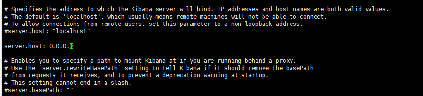

# 介绍
Kibana 是elstic下面的产品，Elaticsearch是负责搜索，
Kibana是让数据可视化。

# 安装

找到kibana下载解压就可以了

# 运行

```
#前台运行

bin/kibana

# 后台运行

nohup bin/kibana &

```

# 配置 kibana.yml

##  外网可以访问




## 配置elasticsearch地址

```
elasticsearch.hosts: ["http://localhost:9200"] #对应的es服务器的ip地址
i18n.locale: "zh-CN" #将kibana操作界面设置成中文，也可以不设置
```

