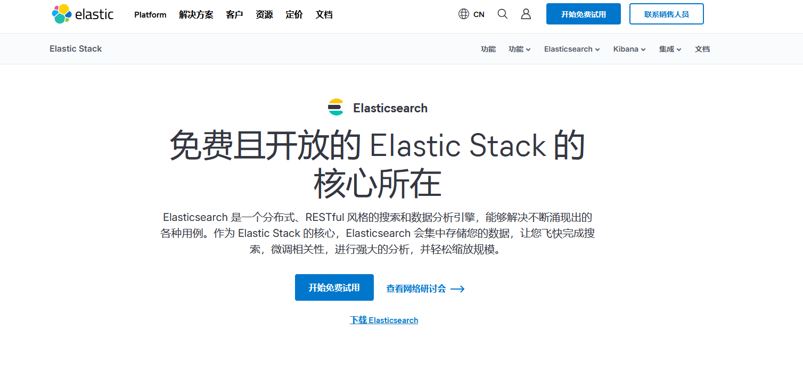
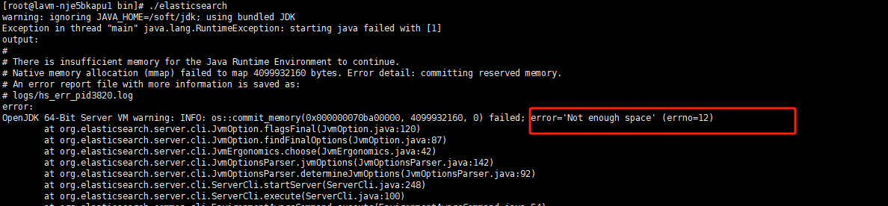
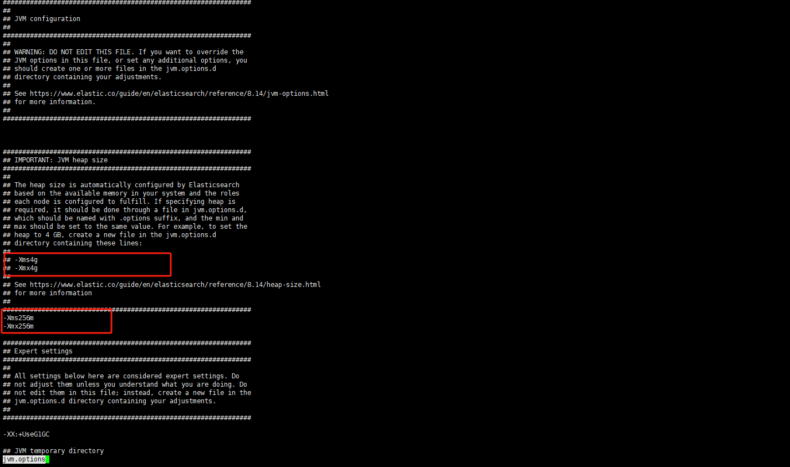
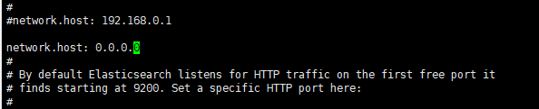

# 目录


 
# 1.Linux安装ElasticSearch


官网地址 https://www.elastic.co/cn/elasticsearch



## 1.1 下载解压

```
wget https://artifacts.elastic.co/downloads/elasticsearch/elasticsearch-8.14.3-linux-x86_64.tar.gz

tar -zxvf elasticsearch-8.14.3-linux-aarch64.tar.gz

```

## 1.2 解决内存问题

直接启动会出现下面得问题差点



可以设置 config/jvm.options,这样就可以了



## 1.3 创建es专用用户

```
adduser es
chown -R es /soft/elasticsearch
su user es

```

## 1.4 修改es核心配置

vi /soft/elasticsearch/config/elasticsearch.yml

- 数据和日志


- 修改绑定得ip允许远程访问



- 初始化节点名称
```
cluster.name: elasticsearch 
node.name: es-node0
cluster.initial_master_nodes: ["es-node0"]

```

## 1.5 vm.max_map_count [65530] is too low问题

```
su root
vi /etc/sysctl.conf

```
在文件中添加下面内容
```
vm.max_map_count=262144

```
退出保存，刷新配置文件
```
sysctl -p

```