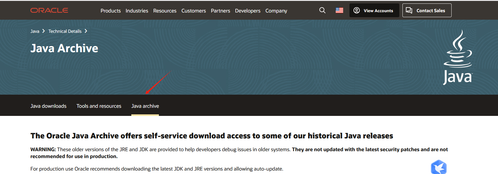

# 检查是否安装JDK
```
java -version

```

# 在oracle官网找到JDK历史版本




# 解压


# 配置环境变量
```

vi /etc/profile


export JAVA_HOME=/soft/jdk-18.0.2
export PATH=${JAVA_HOME}/bin:$PATH

source /etc/profile

java 


javac

java -version


```

