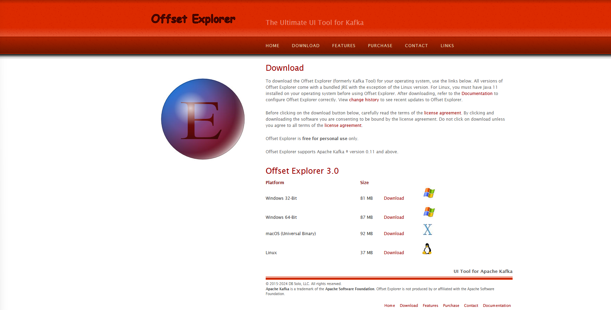
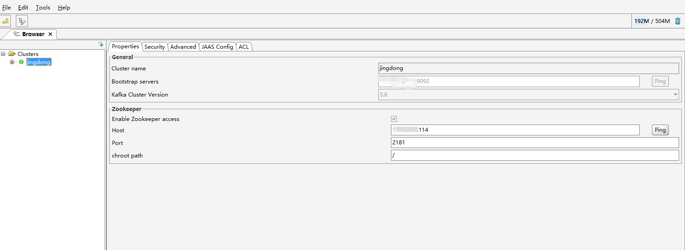
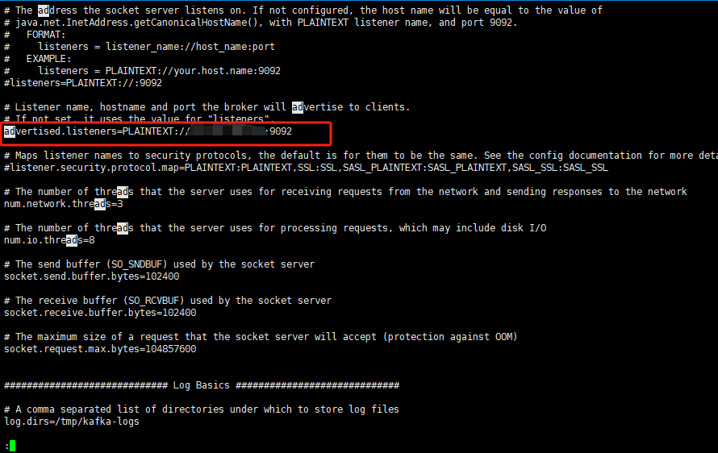
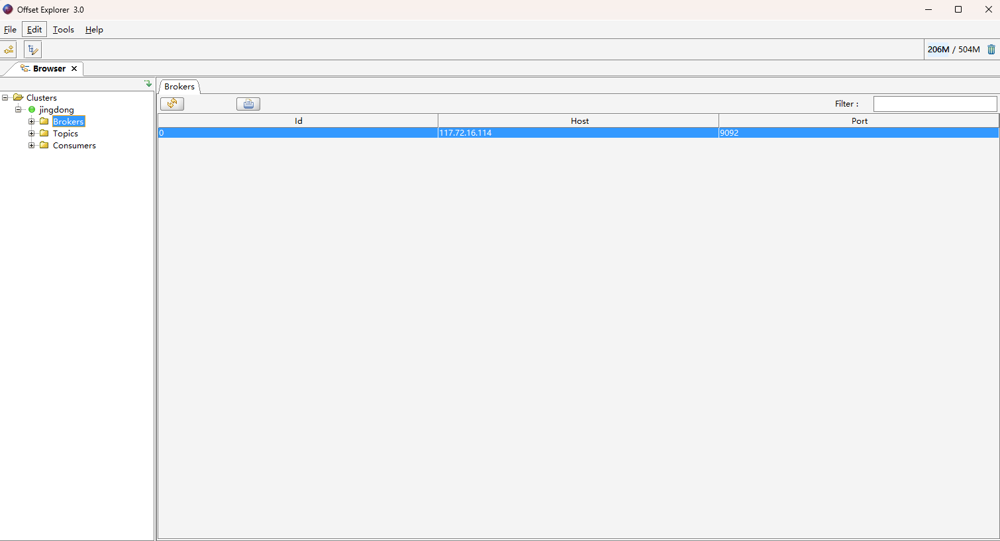
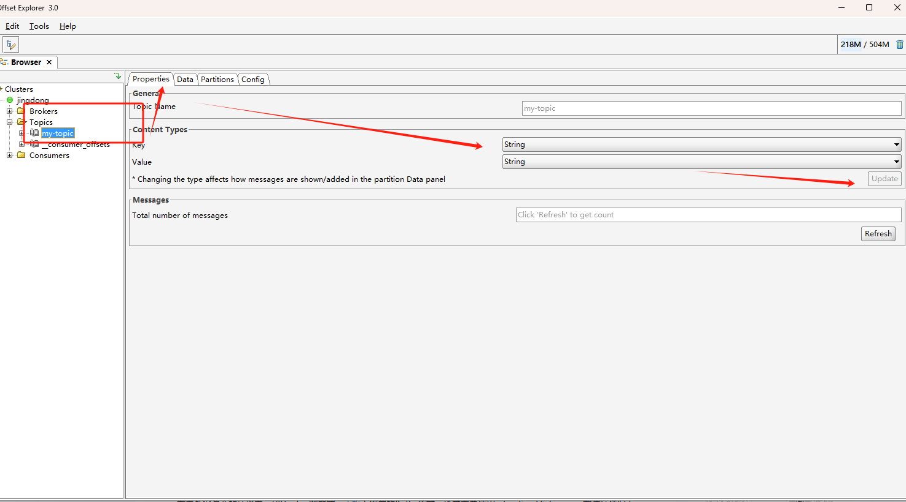

# kafka tool
kafka tool 是kafka的一个可视化工具

官网地址：http://www.kafkatool.com/download.html

# 链接

Cluster name : 集群的名字

Bootstrap servers: 这个地方对应的ip和地址，需要在kafka中config下
server.properties中去配置

listeners和advertised listeners 区别：

listeners：定义 Kafka 服务器监听的地址和端口，用于接受客户端的连接。可以设置为一个或多个地址。

advertised listeners ： 定义 Kafka 服务器向外部客户端通告的地址和端口。这个配置用于让客户端知道如何连接到 Kafka 代理，尤其是在代理有多个网络接口或在集群环境中。

# 使用 

解决乱码

