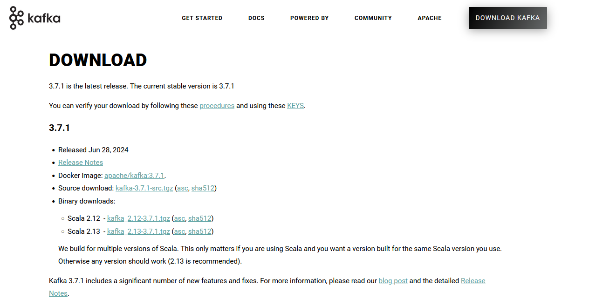

- 从官网下载安装包

- 解压安装包
```
tar -xzf kafka-xxxx.tgz
```
- 启动zookeeper

去到解压过后的kafka文件中，使用命令行启动zookeeper
```
nohup bin/zookeeper-server-start.sh  config/zookeeper.properties > zookeeper.log 2>&1 &

```
nohup 和  &： 后台允许并忽略终端挂断的影响

&gt; zookeeper.log : 将日志输出到 zookeeper.log日志中


2 &gt;&amp;1：用于重定向标准错误输出（stderr）到标准输出（stdout）

是否启动成功可以查看日志zookeeper.log

- 启动kafka
```
nohup  bin/kafka-server-start.sh  config/server.properties > kafka.log  2>&1 &
```
是否启动成功可以查看日志kafka.log