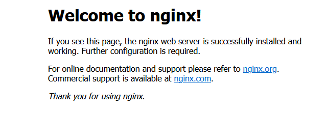

# Nginx
Nginx是一款高性能的http 服务器/反向代理服务器及电子邮件（IMAP/POP3）代理服务器。

# 安装环境配置

- gcc
```
yum install gcc-c++

```
- pere

```

yum install -y pcre pcre-devel

```

- zlib
```

yum install -y zlib zlib-devel

```

- openssl
```
yum install -y openssl openssl-devel

```


# 获取下载链接

http://nginx.org/en/download.html

>  ## Nginx提供了3个版本选择
> 
> - Mainline version：Mainline 是 Nginx 目前主力在做的版本，可以说是开发版
> 
> 
> - Stable version：最新稳定版，生产环境上建议使用的版本
> 
> 
> - Legacy versions：遗留的老版本的稳定版


# 安装

1. 解压


2. 执行文件  configure

```
./configure

```

3. make 

```
make

make install

```

# 启动Nginx

1.  找到安装过后的nginx

```
whereis nginx

cd /usr/local/nginx   


```

2. 配置nginx

```

cd conf

vi nginx.cong

```

3. 启动nginx，进入sbin目录下面执行命令

```
./nginx  -c  /usr/local/nginx/conf/nginx.conf


```

# 启动成功界面
nginx 默认端口是80，访问IP:80 出现下面系界面代码nginx安装成功。

