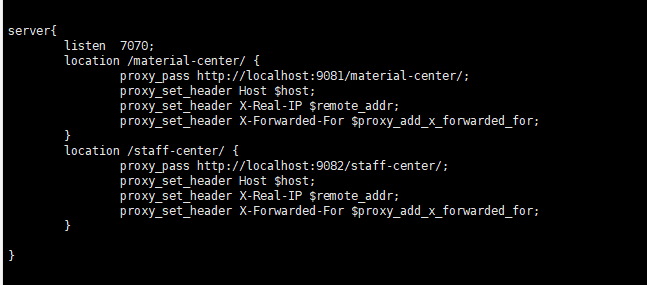

首先nginx的配置文件nginx.conf可以引入.conf文件


# 同一个端口不同路径转发

1. 创建需要引入的配置

```
vi material.conf

```


2. 在nginx.conf 引入配置


```
http {
    # 其他配置项...
    
    # 引入额外的配置文件
    include /path/to/extra_config.conf;
}


```
3. 重启nginx

```
ps -ef | grep nginx  

kill -9  23904


cd /usr/local/nginx/sbin

./nginx -c  /usr/local/nginx/conf/nginx.conf

```

