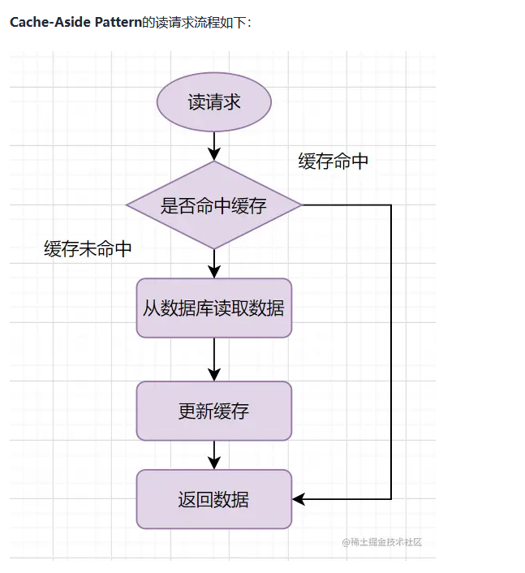
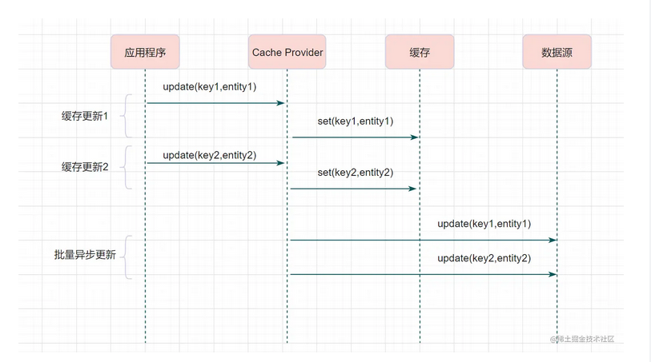

 

 # 一致性
 - 强一致性：这种一致性级别是最符合用户直觉的，它要求系统写入什么，读出来的也会是什么，用户体验好，但实现起来往往对系统的性能影响大
 - 弱一致性：这种一致性级别约束了系统在写入成功后，不承诺立即可以读到写入的值，也不承诺多久之后数据能够达到一致，但会尽可能地保证到某个时间级别（比如秒级别）后，数据能够达到一致状态
 - 最终一致性：最终一致性是弱一致性的一个特例，系统会保证在一定时间内，能够达到一个数据一致的状态。这里之所以将最终一致性单独提出来，是因为它是弱一致性中非常推崇的一种一致性模型，也是业界在大型分布式系统的数据一致性上比较推崇的模型

 # 三个经典的缓存模式

 ## Cache-Aside Pattern（旁路缓存模式）

### 读的流程
 

 ### 写的流程

 

 ## Read-Through/Write-Through（读写穿透）
 
 ### 读的流程

 

 ### 写的流程

 

## Write behind （异步缓存写入）

Write behind跟Read-Through/Write-Through有相似的地方，都是由Cache Provider来负责缓存和数据库的读写。它两又有个很大的不同：Read/Write Through是同步更新缓存和数据的，Write Behind则是只更新缓存，不直接更新数据库，通过批量异步的方式来更新数据库。

 

这种方式下，缓存和数据库的一致性不强，对一致性要求高的系统要谨慎使用。但是它适合频繁写的场景，MySQL的InnoDB Buffer Pool机制就使用到这种模式。

# 更新缓存还是删除缓存（并发写如的时候可能造成问题）

一般来说会删除缓存，考虑有2点：
- 如果写多读少的情况，浪费太多的资源去更新
- 同时写的的情况并发如下图
线程A更新了DB，因为网络的原因，导致B线程可能已经更新了DB和缓存，然后A再去更新缓存，这样就会有脏数据。
 

 # 先操作数据库还是先操作缓存（读写并发的时候）

如果先操作缓存，可能导致缓存的数据没有办法更新。

 

# 先操作数据库然后更新缓存

一般来说这样可以避免很多情况导致数据的不一致，但是也会存在以下的情况：

 

 面对这种情况，概率是很低的，因为 （更新数据+ 删除缓存） > （读数据库 + 写入缓存），

 这个地方还有一个问题，如果删除缓存失败，那就会导致脏数据还是存在。

 #  删除缓存重试机制

 

这种处理思想是没有问题的，但是业务会造成业务代码入侵。
解决的思路是数据库的binlog来异步淘汰key。

 