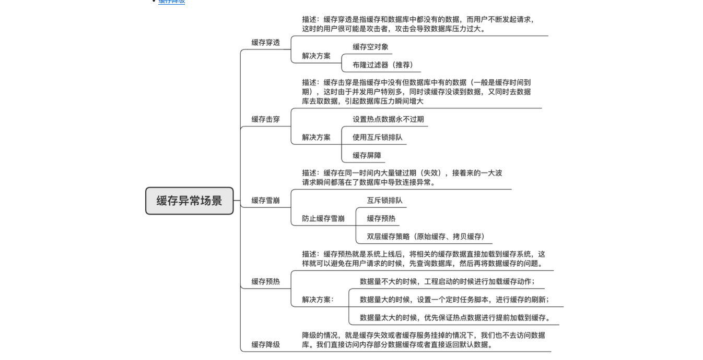
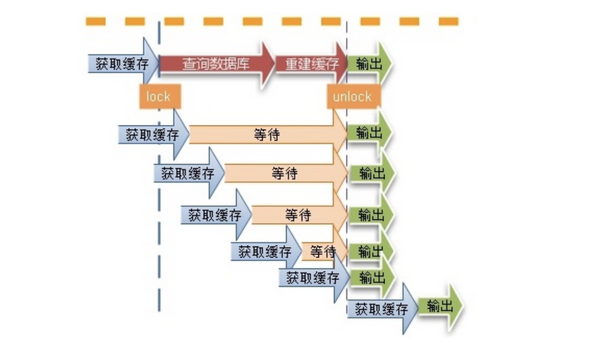

# 缓存穿透

缓存穿透是指用户请求的数据在缓存中不存在即没有命中，同时在数据库中也不存在，导致用户每次请求该数据都要去数据库中查询一遍，然后返回空。

## 缓存穿透常用的解决方案

1. 布隆过滤器（推荐）
布隆过滤器由一个长度为m比特的位数组（bit array）与k个哈希函数（hash function）组成的数据结构。位数组初始化均为0，所有的哈希函数都可以分别把输入数据尽量均匀地散列。

2. 返回空值

当缓存未命中，查询持久层也为空，可以将返回的空对象写到缓存中，这样下次请求该key时直接从缓存中查询返回空对象，请求不会落到持久层数据库。为了避免存储过多空对象，通常会给空对象设置一个过期时间。

- 如果有大量的key穿透，缓存空对象会占用宝贵的内存空间。
- 空对象的key设置了过期时间，在这段时间可能会存在缓存和持久层数据不一致的场景。

# 缓存击穿
缓存击穿，是指一个key非常热点，在不停的扛着大并发，大并发集中对这一个点进行访问，当这个key在失效的瞬间，持续的大并发就穿破缓存，直接请求数据库，就像在一个屏障上凿开了一个洞。

1. 使用互斥锁

这种思路比较简单，就是让一个线程回写缓存，其他线程等待回写缓存线程执行完，重新读缓存即可。

同一时间只有一个线程读数据库然后回写缓存，其他线程都处于阻塞状态。如果是高并发场景，大量线程阻塞势必会降低吞吐量。这种情况如何解决？大家可以在留言区讨论。

如果是分布式应用就需要使用分布式锁。

2. 热点数据永不过期

- 物理不过期，针对热点key不设置过期时间
- 逻辑过期，把过期时间存在key对应的value里，如果发现要过期了，通过一个后台的异步线程进行缓存的构建

# 缓存雪崩

缓存雪崩是指缓存中数据大批量到过期时间，而查询数据量巨大，请求直接落到数据库上，引起数据库压力过大甚至宕机。和缓存击穿不同的是，缓存击穿指并发查同一条数据，缓存雪崩是不同数据都过期了，很多数据都查不到从而查数据库。

- 均匀过期 ： 
设置不同的过期时间，让缓存失效的时间点尽量均匀。通常可以为有效期增加随机值或者统一规划有效期。

- 加互斥锁
跟缓存击穿解决思路一致，同一时间只让一个线程构建缓存，其他线程阻塞排队。

- 缓存永不过期
跟缓存击穿解决思路一致，缓存在物理上永远不过期，用一个异步的线程更新缓存。

- 双层缓存策略

使用主备两层缓存：

主缓存：有效期按照经验值设置，设置为主读取的缓存，主缓存失效后从数据库加载最新值。

备份缓存：有效期长，获取锁失败时读取的缓存，主缓存更新时需要同步更新备份缓存。

# 缓存预热

缓存预热就是系统上线后，将相关的缓存数据直接加载到缓存系统，这样就可以避免在用户请求的时候，先查询数据库，然后再将数据回写到缓存。

如果不进行预热， 那么 Redis 初始状态数据为空，系统上线初期，对于高并发的流量，都会访问到数据库中， 对数据库造成流量的压力。

# 缓存降级

缓存降级是指缓存失效或缓存服务器挂掉的情况下，不去访问数据库，直接返回默认数据或访问服务的内存数据。

在项目实战中通常会将部分热点数据缓存到服务的内存中，这样一旦缓存出现异常，可以直接使用服务的内存数据，从而避免数据库遭受巨大压力。

降级一般是有损的操作，所以尽量减少降级对于业务的影响程度。

