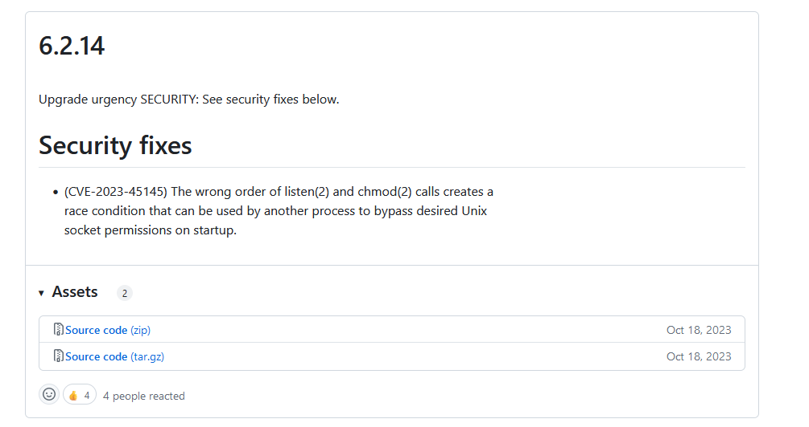
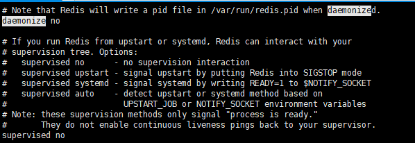
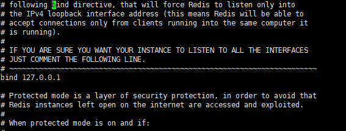
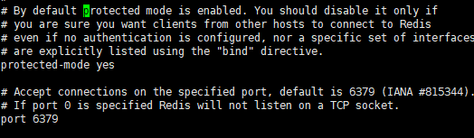
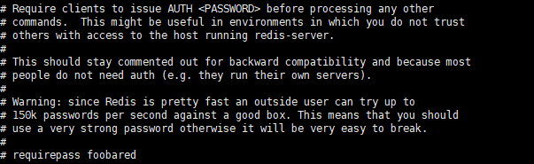

# 下载gcc
```

yum install -y gcc

```

# 获取redis下载地址




# 使用wget下载redis


```
wget http://download.redis.io/releases/redis-5.0.3.tar.gz
    

```

# 解压安装

```

tar -zxvf redis-5.0.3.tar.gz

cd redis-5.0.3

make

```
# 配置redis

1. redis后台启动需要编辑redis.conf

守护进程：daemonize no -> daemonize yes



2. redis默认配置只能本机访问

注释配置： bind 127.0.0.1




3. redis保护模式

redis.config 里面有一个参数   protected-mode yes, 表示redis启用保护模式，在保护模式下redis只允许系统使用回环地址访问（localhost）。
如果关闭保护模式，就需要对redis设置密码。



4. redis设置密码

设置密码需要修改参数：requirepass




# 启动redis


```
cd redis/src

./redis.server ../redis.conf

```