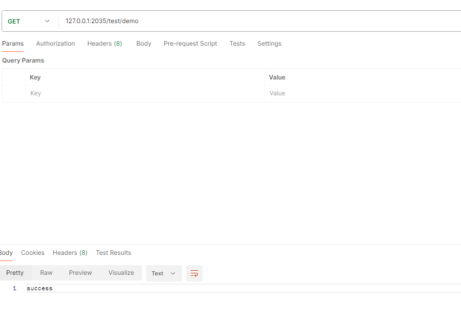
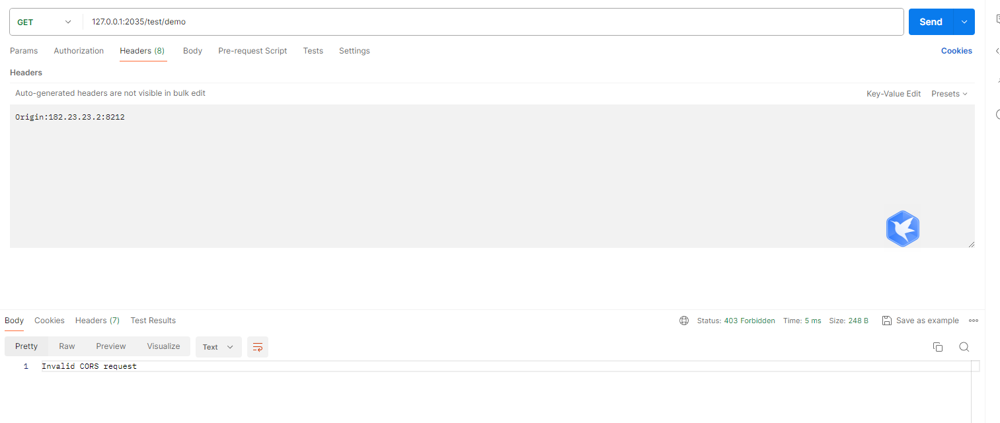

# springboot 默认对跨域的设置

springboot使用的框架是Spring Framework 的默认行为，而 Spring Framework 在默认情况下对跨域请求没有任何限制。

## 对spring配置跨域

```
@Configuration
public class WebConfig implements WebMvcConfigurer {


    @Override
    public void addCorsMappings(CorsRegistry registry) {
        registry.addMapping("/**")
                .allowedOrigins("http://example.com")
                .allowedMethods("GET", "POST");
    }

}

```

## 使用postman请求



直接请求是可以请求的


## 使用postman模拟一个跨域请求
在head里面添加一个跨域的head

```
Origin:182.23.23.2:8212

```



配置过后的请求，就是一个跨域请求，因为代码中允许跨域的网址是 “http://example.com”和请求中的网址不是同一个域，所以请求失败。


## 修改springboot配置

```
@Configuration
public class WebConfig implements WebMvcConfigurer {


    @Override
    public void addCorsMappings(CorsRegistry registry) {
        registry.addMapping("/**")
                .allowedOrigins("182.23.23.2:8212")  //配置修改支持 182.23.23.2:8212 的请求跨域访问
                .allowedMethods("GET", "POST");
    }

}

```


