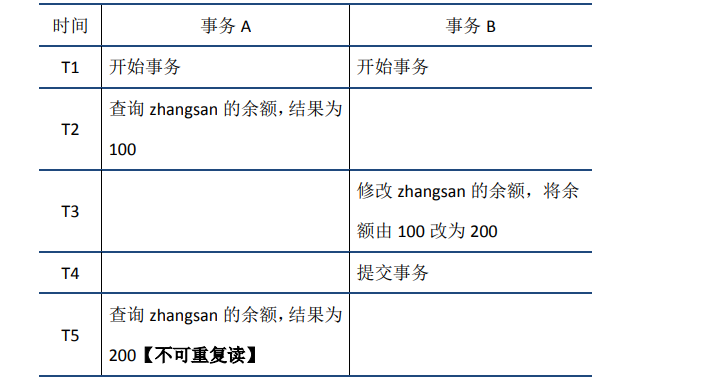

# Mysql数据库的事务是怎么实现的
再事务的实现机制上，Mysql采用的WAL：write-ahead logging, 预写日志。

## redo log

redo log叫做重做日志，是用来实现事务的持久性。该日志文件由两部分组成：
- 重做日志缓冲（redo log buffer）
- 重做日志文件（redo log）

前者是在内存中，后者在磁盘中

```
start transaction;
select balance from bank where name="zhangsan";// 生成 重做日志 balance=600
update bank set balance = balance - 400; // 生成 重做日志 amount=400
update finance set amount = amount + 400;
commit;

```


mysql 为了提升性能不会把每次的修改都实时同步到磁盘，而是会先存到Boffer Pool(缓冲池)里头，把这个当作缓存来用。然后使用后台线程去做缓冲池和磁盘之间的同步。

如果还没来的同步的时候宕机或断电了怎么办, redo log持久化到磁盘。

## undo log

undo log 叫做回滚日志，用于记录数据被修改前的信息。他正好跟前面所说的重做日志所记录的相反，重做日志记录数据被修改后的信息。undo log主要记录的是数据的逻辑变化，为了在发生错误时回滚之前的操作，需要将之前的操作都记录下来，然后在发生错误时才可以回滚。


# ACID特性
原子性（undo log）、隔离性(锁技术)、一致性、持久性(redo log)


## 脏读
当前事务(A)中可以读到其他事务(B)未提交的数据（脏数据），这种现象是脏读。


##不可重复读 
在事务A中先后两次读取同一个数据，两次读取的结果不一样，这种现象称为不可重复读。脏读与不可重复读的区别在于：前者读到的是其他事务未提交的数据，后者读到的是其他事务已提交的数据



## 幻读
在事务A中按照某个条件先后两次查询数据库，两次查询结果的条数不同，这种现象称为幻读。不可重复读与幻读的区别可以通俗的理解为：前者是数据变了，后者是数据的行数变了。


## 事务隔离级别


## mvcc基础
(multiversion concurrency control) -多版本并发控制

    InnoDB的mvcc，是通过在每行记录的后面保存两个隐藏的列来实现的。这两个列， 一个保存了行的创建时间，一个保存了行的过期时间， 当然存储的并不是实际的时间值，而是系统版本号。


### mvcc基本原理
mvcc的基本思想是为每一行数据维护```多个版本```。当一个事务对数据进行更新时，数据库不会直接修改原有的数据行，而是创建一个新的版本，并将新的版本和旧的版本一起存储。这样，其他事务可以继续访问旧版本的数据，确保读取操作不会被写操作阻塞。

1. 隐藏列： InnoDB中每行数据都有隐藏列，隐藏列中包含了本行数据的事务id、指向undo log的指针等。
2. 版本链： 面说到每行数据的隐藏列中包含了指向undo log的指针，而每条undo log也会指向更早版本的undo log，从而形成一条版本链。
3. ReadView： 通过隐藏列和版本链，MySQL可以将数据恢复到指定版本；但是具体要恢复到哪个版本，则需要根据ReadView来确定。所谓ReadView，是指事务（记做事务A）在某一时刻给整个事务系统（trx_sys）打快照，之后再进行读操作时，会将读取到的数据中的事务id与trx_sys快照比较，从而判断数据对该ReadView是否可见，即对事务A是否可见。

    trx_sys中的主要内容，以及判断可见性的方法如下：

    - low_limit_id：表示生成ReadView时系统中应该分配给下一个事务的id。如果数据的事务id大于等于low_limit_id，则对该ReadView不可见。
    - up_limit_id：表示生成ReadView时当前系统中活跃的读写事务中最小的事务id。如果数据的事务id小于up_limit_id，则对该ReadView可见。
    - rw_trx_ids：表示生成ReadView时当前系统中活跃的读写事务的事务id列表。如果数据的事务id在low_limit_id和up_limit_id之间，则需要判断事务id是否在rw_trx_ids中：如果在，说明生成ReadView时事务仍在活跃中，因此数据对ReadView不可见；如果不在，说明生成ReadView时事务已经提交了，因此数据对ReadView可见。

下面以RR隔离级别为例，结合前文提到的几个问题分别说明。


# Mysql锁技术

## 读写锁

- 共享锁（shared lock），又叫读锁
读锁是可以共享的，活着说多个读请求可以共享一把锁读数据，不会造成阻塞。

- 排他锁（exclusive lock）,又叫写锁
写锁会排斥其他所有获取锁的请求，一致阻塞，知道写入完成释放锁。

事务的隔离性就是根据读写锁来实现的。


https://www.cnblogs.com/jingdongkeji/p/17832295.html

https://cloud.tencent.com/developer/article/1431307

https://www.cnblogs.com/kismetv/p/10331633.html