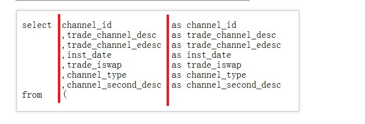
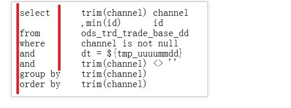
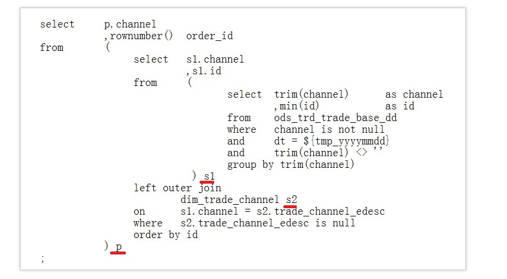

# 编码原则：
- 代码功能完善
- 代码编写充分考虑执行速度优先的原则
- 代码中需要添加必要的注释，以增强代码的可读性
- SQL代码中的应用到的SQL关键字 、保留字都需要全大写或全小写，不能大小混合的方式
- 禁止使用select *  操作， 所有操作必须明确指定列名
- 对应括号要求在同一位置上


SQL编码规范

- 代码头部
代码头部添加主题、功能描述、作者和日期等信息，并预留修改日志及标题栏，以便后续添加修改记录。注意每行不超过80个字符，模板如下。
```
-- MaxCompute(ODPS) SQL
--**************************************************************************
-- ** 所属主题: 交易
-- ** 功能描述: 交易退款分析
-- ** 创建者 : 有码
-- ** 创建日期: 20170616 
-- ** 修改日志:
-- ** 修改日期 修改人 修改内容
-- yyyymmdd name comment 
-- 20170831 无码 增加对biz_type=1234交易的判断 
--**************************************************************************
```
- 字段排列要求
    
   - SELECT语句选择的字段按照每行1个字段的方式编排
   - 首个选择的字段与SELECT之间隔1个缩进量
   - 换行缩进2个缩进量后，添加逗号再输入其它字段名
   - 2个字段之间的逗号分隔符紧跟在第2个字段的前面。
   - AS语句应与相应的字段在同一行，多个字段的AS建议尽量对齐在同一列上



- INSERT子句排列要求
INSERT子句写在同一行，请勿换行

- SELECT子句排列要求
SELECT语句中所用到的from、where、group by、having、order by、join和union等子句，需要遵循如下要求
    - 换行编写。
    - 与相应的SELECT语句左对齐编排
    - 子句首个单词后添加2个缩进量，再编写后续的代码
    - WHERE子句下的逻辑判断符and、or等，与WHERE左对齐编排
    - 超过2个缩进量长度的子句加1个空格后，再编写后续代码，例如order by和group by等



- 表别名定义约定
    - 一旦在SELECT语句中给操作表定义了别名，在整个语句中对此表的引用都必须以别名替代，所以需要给所有的表添加别名
    - 表别名采用简单字符命名，建议按a、b、c、d…的顺序进行命名，并避免使用关键字
    - 多层次的嵌套子查询别名之前要体现层次关系，SQL语句的别名需要分层命名，从第1层次至第4层次，分别用P（Part） 、S（Segment）、 U（Unit） 和D（Detail）表示。您也可以用a、b、c、d来表示第1层次到第4层次
    - 对于同一层次的多个子句，在字母后加1、2、3、4……区分，并根据情况对表别名添加注释

    

