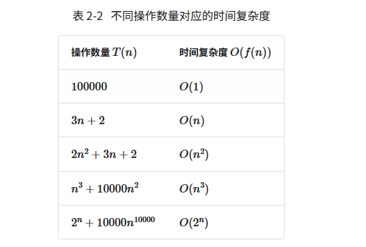
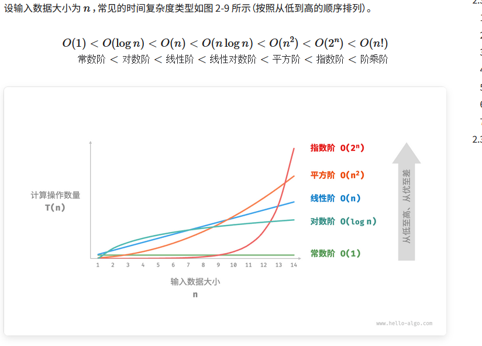
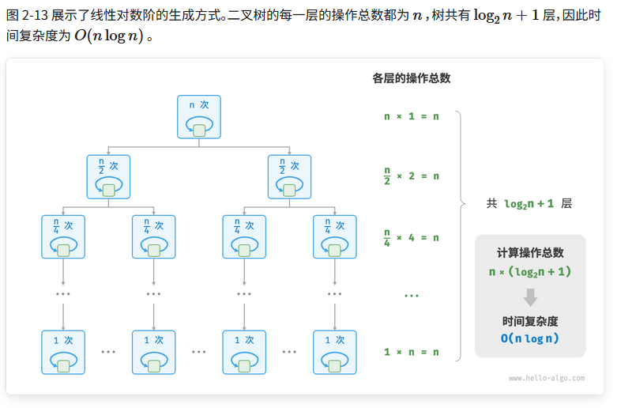
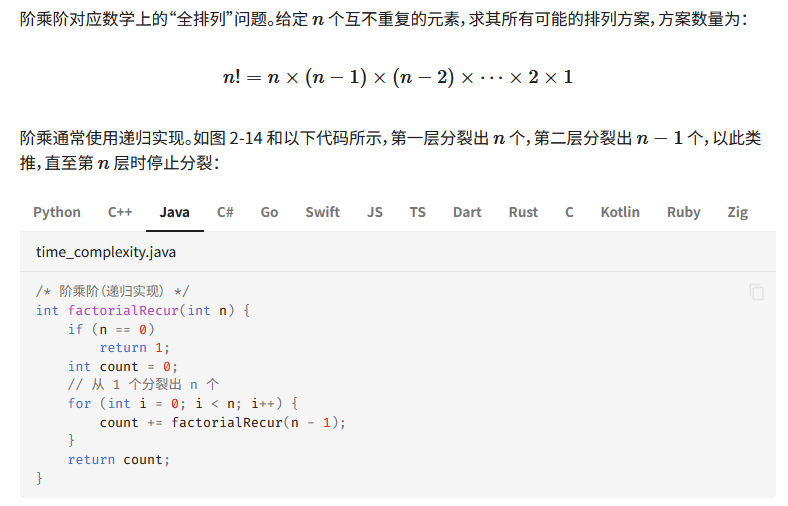

# 函数渐近上界
给定一个输入大小为$n$的函数：

```java
void algorithm(int n) {
    int a = 1;  // +1
    a = a + 1;  // +1
    a = a * 2;  // +1
    // 循环 n 次
    for (int i = 0; i < n; i++) { // +1（每轮都执行 i ++）
        System.out.println(0);    // +1
    }
}
```
设算法的操作数量是一个关于输入数据大小$n$的函数，记为 ，则以上函数的操作数量为：
$$
T(n) = 3 + 2n
$$
$T(n)$是一次函数，说明其运行时间的增长趋势是线性的，因此它的时间复杂度是线性阶。

我们将线性阶的时间复杂度记为 $O(n)$，这个数学符号称为大$O$记号（big- notation），表示函数$T(n)$的渐近上界（asymptotic upper bound）。

时间复杂度分析本质上是计算“操作数量$T(n)$”的渐近上界，它具有明确的数学定义。


# 推算方法

## 1. 统计操作数量

针对代码，逐行从上到下计算即可。然而，由于上述$c \cdot f(n)$中的常数项 可以取任意大小，因此操作数量$T(n)$中的各种系数、常数项都可以忽略。根据此原则，可以总结出以下计数简化技巧。

1.忽略$T(n)$中的常数项。因为它们都与 无关，所以对时间复杂度不产生影响。

2.省略所有系数。例如，循环$2n$次、 $5n+1$次等，都可以简化记为$n$ 次，因为$n$ 前面的系数对时间复杂度没有影响。

3. 循环嵌套时使用乘法。总操作数量等于外层循环和内层循环操作数量之积，每一层循环依然可以分别套用第 1. 点和第 2. 点的技巧。

```java
void algorithm(int n) {
    int a = 1;  // +0（技巧 1）
    a = a + n;  // +0（技巧 1）
    // +n（技巧 2）
    for (int i = 0; i < 5 * n + 1; i++) {
        System.out.println(0);
    }
    // +n*n（技巧 3）
    for (int i = 0; i < 2 * n; i++) {
        for (int j = 0; j < n + 1; j++) {
            System.out.println(0);
        }
    }
}

```
函数操作量：
$$
    T(n) = 2n(n+1) + (5n+1)+2    \\

    T(n) = n^{2} + n
$$
## 2. 判断渐近上界

时间复杂度由$T{n}$中最高阶的项来决定。这是因为在 趋于无穷大时，最高阶的项将发挥主导作用，其他项的影响都可以忽略。




# 常见类型




## 1. 常数阶$O(1)$

```java
/* 常数阶 */
int constant(int n) {
    int count = 0;
    int size = 100000;
    for (int i = 0; i < size; i++)
        count++;
    return count;
}

```


## 2. 线性阶$O(n)$

```java
/* 线性阶 */
int linear(int n) {
    int count = 0;
    for (int i = 0; i < n; i++)
        count++;
    return count;
}
```

$$

T(n) =  n \\
O(n) = n

$$

## 3.平方阶$O(n^2)$

```java

/* 平方阶 */
int quadratic(int n) {
    int count = 0;
    // 循环次数与数据大小 n 成平方关系
    for (int i = 0; i < n; i++) {
        for (int j = 0; j < n; j++) {
            count++;
        }
    }
    return count;
}

```

因为内循环不受外循环的影响
$$

T(n) =  n * n    \\  
O(n) = n^2

$$

以冒泡排序为例，外层循环执行$n-1$次，内层循环执行 $n-1$、$n-2$、$...$、$2$、 $1$次，平均为 $n/2$次，因此时间复杂度为 $O((n-1)n/2) = O(n^2)$


## 4.指数阶$O(2^n)$

```java
/* 指数阶（循环实现） */
int exponential(int n) {
    int count = 0, base = 1;
    // 细胞每轮一分为二，形成数列 1, 2, 4, 8, ..., 2^(n-1)
    for (int i = 0; i < n; i++) {
        for (int j = 0; j < base; j++) {
            count++;
        }
        base *= 2;
    }
    // count = 1 + 2 + 4 + 8 + .. + 2^(n-1) = 2^n - 1
    return count;
}
```

推导：内层的循环受外层循环的影响，列出执行次数如下：
count = 1 + 2 + 4 + 8 + .. + 2^(n-1) = 2^n - 1

- 当$n =1$时  
$$
 1= 2^1 -1 = 1
$$


- 假设 $n = k$ 的时候成立
$$
1 + 2 + 4 + 8 + .. + 2^(k-1) = 2^k - 1
$$

- 归纳 $n = k + 1$

$$
1 + 2 + 4 + 8 + .. + 2^(k-1) + 2^k \\
1 + 2 + 4 + 8 + .. + 2^(k-1)  = 2^k -1 \\
2^k -1 + 2^k =  2^(k+1) -1
$$

因为$T(n) = 2^(n+1) -1$,所以$O(2^n)$


## 5.对数阶$O(\log n)$

与指数阶相反，对数阶反映了“每轮缩减到一半”的情况。设输入数据大小为$n$ ，由于每轮缩减到一半，因此循环次数是$\log_2 n$ ，即 的反函数。

```java

/* 对数阶（循环实现） */
int logarithmic(int n) {
    int count = 0;
    while (n > 1) {
        n = n / 2;
        count++;
    }
    return count;
}

```
推导如下 ： 在循环的过程中每次

## 6.线性对数阶$O(n \log n)$

线性对数阶常出现于嵌套循环中，两层循环的时间复杂度分别为 $O(\log n)$和 $O(n)$。相关代码如下:
```java
/* 线性对数阶 */
int linearLogRecur(int n) {
    if (n <= 1)
        return 1;
    int count = linearLogRecur(n / 2) + linearLogRecur(n / 2);
    for (int i = 0; i < n; i++) {
        count++;
    }
    return count;
}
```



## 7.阶乘阶$O(n!)$


