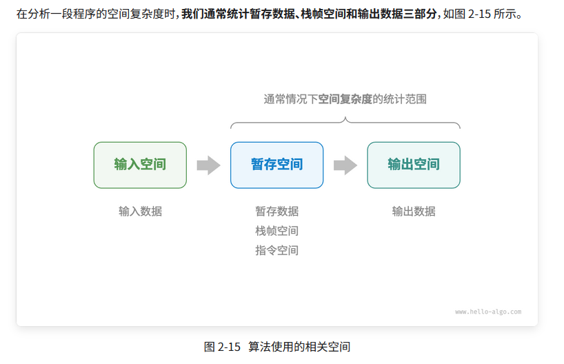
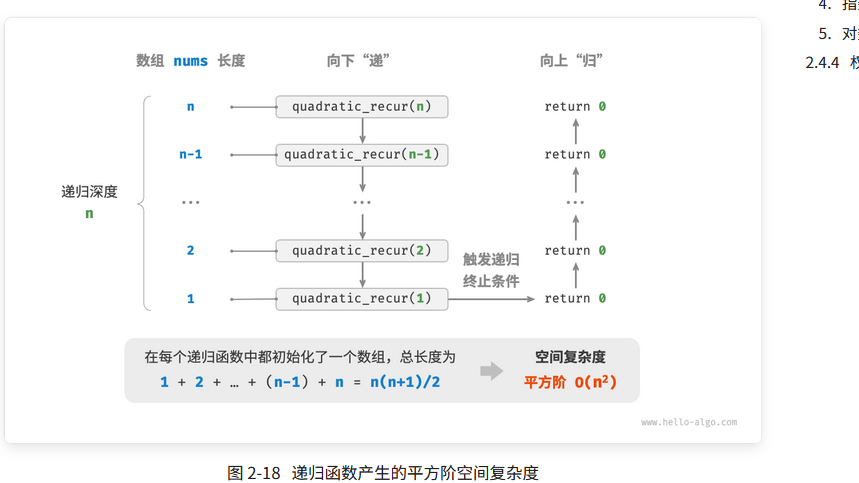
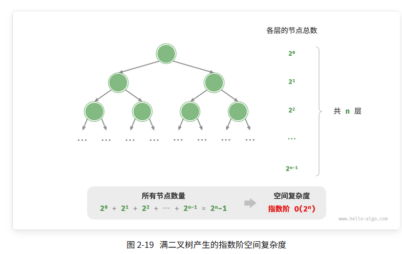

# 空间复杂度

空间复杂度（space complexity）用于衡量算法占用内存空间随着数据量变大时的增长趋势。这个概念与时间复杂度非常类似，只需将“运行时间”替换为“占用内存空间”。

# 算法相关空间
算法在幸运星的过程中使用的内存空间主要包括以下几种。
- 输入空间：用于存储算法的输入数据。
- 暂存空间：用于在存储算法在运行过程中的变量、对象、函数上下文等数据。
    - 暂存数据：用于保存算法运行过程中的各种常量、变量、对象等。
    - 栈帧空间：用于保存调用函数的上下文数据。系统在每次调用函数时都会在栈顶部创建一个栈帧，函数返回后，栈帧空间会被释放。
    - 指令空间：用于保存编译后的程序指令，在实际统计中通常忽略不计。
- 用于存储算法的输出数据




# 常见类型

## 1.常数阶$O(1)$
需要注意的是，在循环中初始化变量或调用函数而占用的内存，在进入下一循环后就会被释放，因此不会累积占用空间，空间复杂度仍为 $O(1)$：
```java

/* 函数 */
int function() {
    // 执行某些操作
    return 0;
}

/* 常数阶 */
void constant(int n) {
    // 常量、变量、对象占用 O(1) 空间
    final int a = 0;
    int b = 0;
    int[] nums = new int[10000];
    ListNode node = new ListNode(0);
    // 循环中的变量占用 O(1) 空间
    for (int i = 0; i < n; i++) {
        int c = 0;
    }
    // 循环中的函数占用 O(1) 空间
    for (int i = 0; i < n; i++) {
        function();
    }
}

```
## 2.线性阶$O(n)$
线性阶常见于元素数量与$n$成正比的数组、链表、栈、队列等：
```java
/* 线性阶 */
void linear(int n) {
    // 长度为 n 的数组占用 O(n) 空间
    int[] nums = new int[n];
    // 长度为 n 的列表占用 O(n) 空间
    List<ListNode> nodes = new ArrayList<>();
    for (int i = 0; i < n; i++) {
        nodes.add(new ListNode(i));
    }
    // 长度为 n 的哈希表占用 O(n) 空间
    Map<Integer, String> map = new HashMap<>();
    for (int i = 0; i < n; i++) {
        map.put(i, String.valueOf(i));
    }
}

```
此函数的递归深度为 ，即同时存在$n$个未返回的 linear_recur() 函数，使用$n$大小的栈帧空间：
```java
/* 线性阶（递归实现） */
void linearRecur(int n) {
    System.out.println("递归 n = " + n);
    if (n == 1)
        return;
    linearRecur(n - 1);
}
```



## 3.平方阶$O(n^2)$
平方阶常见于矩阵和图，元素数量与$n$成平方关系：
```java
/* 平方阶 */
void quadratic(int n) {
    // 矩阵占用 O(n^2) 空间
    int[][] numMatrix = new int[n][n];
    // 二维列表占用 O(n^2) 空间
    List<List<Integer>> numList = new ArrayList<>();
    for (int i = 0; i < n; i++) {
        List<Integer> tmp = new ArrayList<>();
        for (int j = 0; j < n; j++) {
            tmp.add(0);
        }
        numList.add(tmp);
    }
}
```

## 指数阶$O(2^n)$
指数阶常见于二叉树。观察图 2-19 ，层数为 $n$的“满二叉树”的节点数量为 $2^n-1$，占用$O(2^n)$ 空间
```java
/* 指数阶（建立满二叉树） */
TreeNode buildTree(int n) {
    if (n == 0)
        return null;
    TreeNode root = new TreeNode(0);
    root.left = buildTree(n - 1);
    root.right = buildTree(n - 1);
    return root;
}
```



## 对数阶$O(\log n)$

对数阶常见于分治算法。例如归并排序，输入长度为 $n$的数组，每轮递归将数组从中点处划分为两半，形成高度为 $\log n$的递归树，使用$O(\log n)$栈帧空间。


# 权衡时间与空间

理想情况下，我们希望算法的时间复杂度和空间复杂度都能达到最优。然而在实际情况中，同时优化时间复杂度和空间复杂度通常非常困难。

降低时间复杂度通常需要以提升空间复杂度为代价，反之亦然。我们将牺牲内存空间来提升算法运行速度的思路称为“以空间换时间”；反之，则称为“以时间换空间”。

选择哪种思路取决于我们更看重哪个方面。在大多数情况下，时间比空间更宝贵，因此“以空间换时间”通常是更常用的策略。当然，在数据量很大的情况下，控制空间复杂度也非常重要。


