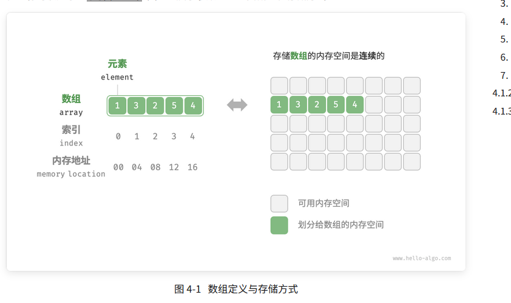
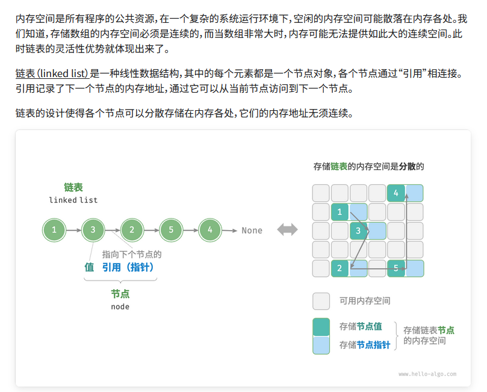

# 数组

##  1. 结构
数组（array）是一种线性数据结构，其将相同类型的元素存储在连续的内存空间中。

## 2.数组的优点与局限性

数组存储在连续的内存空间内，且元素类型相同。这种做法包含丰富的先验信息，系统可以利用这些信息来优化数据结构的操作效率。

- 空间效率高：数组为数据分配了连续的内存块，无须额外的结构开销。
- 支持随机访问：数组允许在$O(1)$时间内访问任何元素。
- 缓存局部性: 当访问数组元素时，计算机不仅会加载它，还会缓存其周围的其他数据，从而借助高速缓存来提升后续操作的执行速度。

连续空间存储是一把双刃剑，其存在以下局限性。

- 插入与删除效率低：当数组中元素较多时，插入与删除操作需要移动大量的元素。
- 长度不可变：数组在初始化后长度就固定了，扩容数组需要将所有数据复制到新数组，开销很大。
- 空间浪费：如果数组分配的大小超过实际所需，那么多余的空间就被浪费了。

# 列表

列表（list）是一个抽象的数据结构概念，它表示元素的有序集合，支持元素访问、修改、添加、删除和遍历等操作，无须使用者考虑容量限制的问题。列表可以基于链表或数组实现。

- 链表天然可以看作一个列表，其支持元素增删查改操作，并且可以灵活动态扩容。
- 数组也支持元素增删查改，但由于其长度不可变，因此只能看作一个具有长度限制的列表。

当使用数组实现列表时，长度不可变的性质会导致列表的实用性降低。这是因为我们通常无法事先确定需要存储多少数据，从而难以选择合适的列表长度。若长度过小，则很可能无法满足使用需求；若长度过大，则会造成内存空间浪费。

为解决此问题，我们可以使用动态数组（dynamic array）来实现列表。它继承了数组的各项优点，并且可以在程序运行过程中进行动态扩容。

实际上，许多编程语言中的标准库提供的列表是基于动态数组实现的，例如 Python 中的 list 、Java 中的 ArrayList 、C++ 中的 vector 和 C# 中的 List 等。在接下来的讨论中，我们将把“列表”和“动态数组”视为等同的概念。

# 链表

# 区别

数组适合查询，链表适合对元素做操作