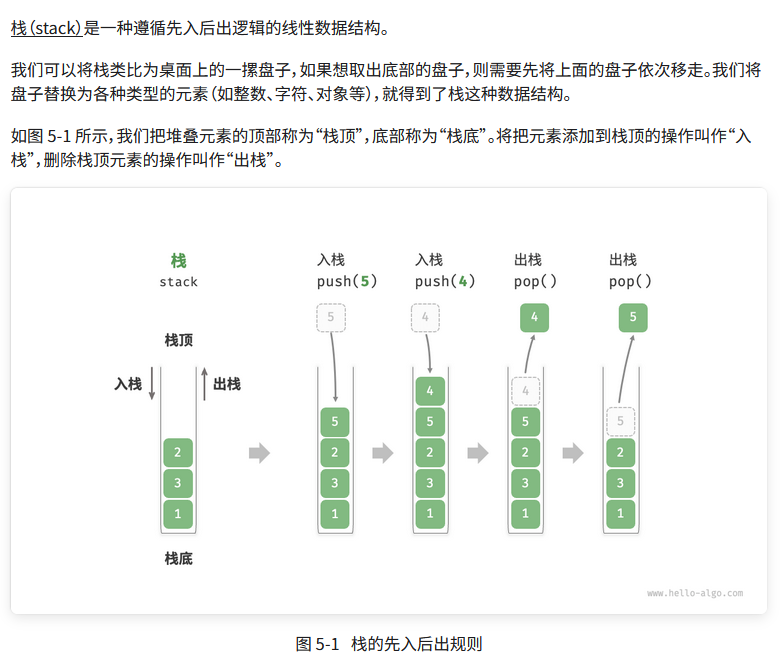
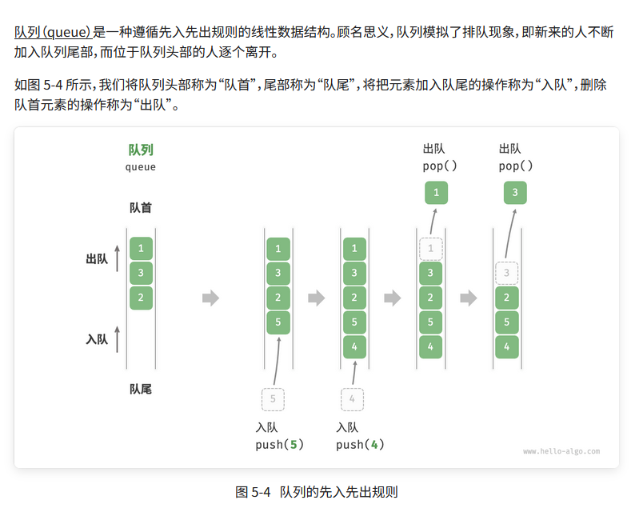
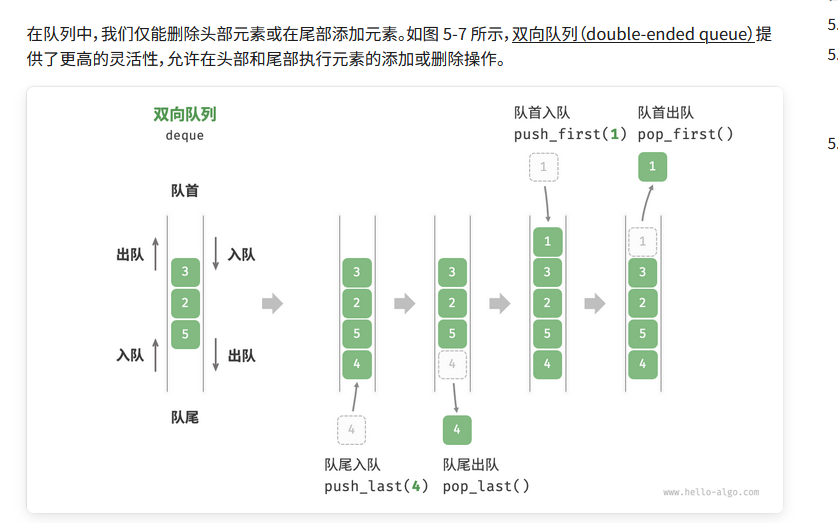
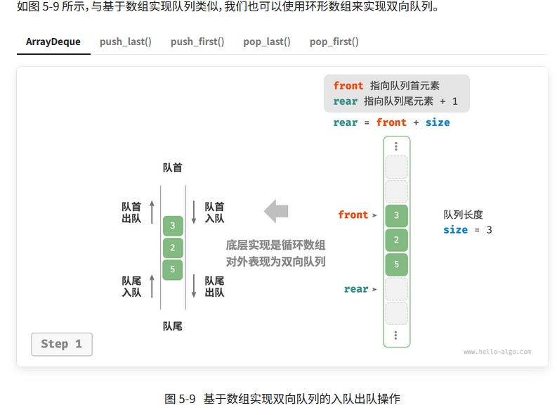

# 栈



```java
/* 初始化栈 */
Stack<Integer> stack = new Stack<>();

/* 元素入栈 */
stack.push(1);
stack.push(3);
stack.push(2);
stack.push(5);
stack.push(4);

/* 访问栈顶元素 */
int peek = stack.peek();

/* 元素出栈 */
int pop = stack.pop();

/* 获取栈的长度 */
int size = stack.size();

/* 判断是否为空 */
boolean isEmpty = stack.isEmpty();

```

## 栈的实现

### 1.基于链表的实现

```java
public class Stack01<T> {

    private Node<T> nodePeet;

    private int stackSize = 0;

    public void push(T data) {
        Node<T> node = new Node<>(data);
        node.next = nodePeet;
        nodePeet = node;
        stackSize++;
    }

    public boolean isEmpty() {
        return stackSize == 0;
    }

    public T peek() {
        if (isEmpty()) {
            throw new IndexOutOfBoundsException();
        }
        return nodePeet.data;
    }

    public T pop() {
        T value = peek();
        nodePeet = nodePeet.next;
        stackSize--;
        return value;
    }

    @Data
    class Node<T> {

        T data;

        Node<T> next;

        public Node(T data) {
            this.data = data;
            next = null;
        }

    }

    public static void main(String[] args) {
        Stack01<Integer> stack01 = new Stack01<>();
        stack01.push(1);
        stack01.push(2);
        stack01.push(3);
        System.out.println(stack01.pop());
        System.out.println(stack01.pop());
        System.out.println(stack01.pop());
    }

}


```

## 2.基于数组的实现
```java

/* 基于数组实现的栈 */
class ArrayStack {
    private ArrayList<Integer> stack;

    public ArrayStack() {
        // 初始化列表（动态数组）
        stack = new ArrayList<>();
    }

    /* 获取栈的长度 */
    public int size() {
        return stack.size();
    }

    /* 判断栈是否为空 */
    public boolean isEmpty() {
        return size() == 0;
    }

    /* 入栈 */
    public void push(int num) {
        stack.add(num);
    }

    /* 出栈 */
    public int pop() {
        if (isEmpty())
            throw new IndexOutOfBoundsException();
        return stack.remove(size() - 1);
    }

    /* 访问栈顶元素 */
    public int peek() {
        if (isEmpty())
            throw new IndexOutOfBoundsException();
        return stack.get(size() - 1);
    }

    /* 将 List 转化为 Array 并返回 */
    public Object[] toArray() {
        return stack.toArray();
    }
}
```

## 对比

支持操作

两种实现都支持栈定义中的各项操作。数组实现额外支持随机访问，但这已超出了栈的定义范畴，因此一般不会用到。

时间效率

在基于数组的实现中，入栈和出栈操作都在预先分配好的连续内存中进行，具有很好的缓存本地性，因此效率较高。然而，如果入栈时超出数组容量，会触发扩容机制，导致该次入栈操作的时间复杂度变为

。

在基于链表的实现中，链表的扩容非常灵活，不存在上述数组扩容时效率降低的问题。但是，入栈操作需要初始化节点对象并修改指针，因此效率相对较低。不过，如果入栈元素本身就是节点对象，那么可以省去初始化步骤，从而提高效率。

综上所述，当入栈与出栈操作的元素是基本数据类型时，例如 int 或 double ，我们可以得出以下结论。

- 基于数组实现的栈在触发扩容时效率会降低，但由于扩容是低频操作，因此平均效率更高。
- 基于链表实现的栈可以提供更加稳定的效率表现。


# 队列



## 1. 基于链表实现

```java
package com.example.demo;

import lombok.Data;

public class LinkedListQueue<T> {


    private Node front;

    private Node rear;

    private int size = 0;

    public LinkedListQueue(){
        front = null;
        rear = null;
    }

    public void push(T data){
        Node node = new Node(data);
        if(front == null){
            front = node;
            rear = node;
        } else {
            rear.next = node;
            rear = node;
        }
        size++;
    }

    public T pop(){
        if(front == null){
            return null;
        }
        Node node = front;
        front = front.next;
        size--;
        return node.data;
    }

    
    @Data
    class Node{
        T data;
        Node next;

        public Node(T data){
            this.data = data;
        }

    }

}

```

## 2 基于数组的实现
在数组中删除首元素的时间复杂度为 $O(n)$，这会导致出队操作效率较低。然而，我们可以采用以下巧妙方法来避免这个问题。

我们可以使用一个变量$front$指向队首元素的索引，并维护一个变量$size$用于记录队列长度。定义 $rear = front + size$ ，这个公式计算出的$rear$指向队尾元素之后的下一个位置。

，当它们到达数组尾部时就无法继续移动了。为了解决此问题，我们可以将数组视为首尾相接的“环形数组”。

对于环形数组，我们需要让$front$  或 $rear$ 在越过数组尾部时，直接回到数组头部继续遍历。这种周期性规律可以通过“取余操作”来实现，代码如下所示：
```java 
package com.example.demo;

public class ArrayQueue {

    private int[] nums;

    private int front;

    private int queueSize;

    public ArrayQueue(int size) {
        this.nums = new int[size];
        this.front = 0;
        this.queueSize = 0;
    }

    /**
     * 获取队列容量
     */
    public int capacity(){
        return nums.length;
    }


    public void push(int i){
        if(queueSize ==  capacity()){
            System.out.println("队列已满");
            return;
        }
        // 计算队尾指针，指向队尾索引 + 1
        // 通过取余操作实现 rear 越过数组尾部后回到头部
        int rear = (front + queueSize) % capacity();
        nums[rear] = i;
        queueSize++;
    }

    public boolean isEmpty(){
        return queueSize == 0;
    }

    public int peek(){
        if(isEmpty()){
            throw new IndexOutOfBoundsException();
        }
        return nums[front];
    }

    public int pop(){
        int data = peek();
        front = (front + 1) % capacity();
        queueSize --;
        return data;
    }


}

```

# 双向队列



## 1. 基于双向链表的实现

单项链表只存了下一个节点，因为不能通过尾节点知道上一个节点，所以删除尾节点很麻烦。所有用双向列表。

```java
package com.example.demo;

public class LinkedListDeque {

    private ListNode front, rear;

    private int queSize =  0 ;


    public LinkedListDeque() {
        front = rear = null;
    }

    public boolean isEmpty(){
        return queSize == 0 ;
    }

    public void push(int num , boolean isFront){
        ListNode node = new ListNode(num);
        if(isEmpty()){
            front = rear = node;
        }else if(isFront){
            front.prev = node;
            node.next = front;
            front = node;
        } else {
            rear.next = node;
            node.prev = rear;
            rear = node;
        }
        queSize++;
    }

    public int pop(boolean isFront){
        if(isEmpty()){
            throw new IndexOutOfBoundsException();
        }
        int val ;
        if(isFront){
            val = front.val;
            ListNode fNext = front.next;
            if(fNext != null){
                fNext.prev = null;
                front.next = null;
            }
            front = fNext;
        } else {
            val = rear.val;
            ListNode rPrev = rear.prev;
            if(rPrev != null){
                rPrev.next = null;
                rear.prev = null;
            }
            rear = rPrev;
        } 
        queSize--;
        return val;
    }

    class ListNode{
        int val;
        ListNode next;
        ListNode prev;
        public ListNode(int val){
            this.val = val;
            next = null;
            prev = null;
        }

    }


}
```

## 2.基于数组的实现



```java

package com.example.demo;

public class ArrayDeque {

    private int[] nums;

    private int front;

    private int queSize;


    public ArrayDeque(int capacity) {
        this.nums = new int[capacity];
        front = queSize = 0;
    }


    public boolean isEmpty(){
        return queSize == 0;
    }

    public int capacity(){
        return nums.length;
    }

    /**
     * 保证 i 为负数的时候，当 i 越过数组头部后，回到尾部
     */
    private int index(int i){
        return (i + capacity()) % capacity();
    }

    public void pushLast(int num){
        if(queSize == capacity()){
            System.out.println("队列已满");
            return;
        }
        int rear=  index(front +queSize);
        nums[rear] = num;
        queSize++;
    }

    public void pushFirst(int num) {
        if (queSize == capacity()) {
            System.out.println("双向队列已满");
            return;
        }
        // 队首指针向左移动一位
        // 通过取余操作实现 front 越过数组头部后回到尾部
        front = index(front - 1);
        // 将 num 添加至队首
        nums[front] = num;
        queSize++;
    }

    public int peekFirst(){
        if(isEmpty()){
            throw new IndexOutOfBoundsException();
        }
        return nums[front];
    }

    public int peekLast(){
        if(isEmpty()){
            throw new IndexOutOfBoundsException();
        }
        int last = index(front + queSize - 1);
        return nums[last];
    }

    public int popFirst(){
        int val = peekFirst();
        front = index(front + 1);
        queSize--;
        return val;
    }

    public int popLast(){
        int val = peekLast();
        queSize --;
        return val;
    }


}

```