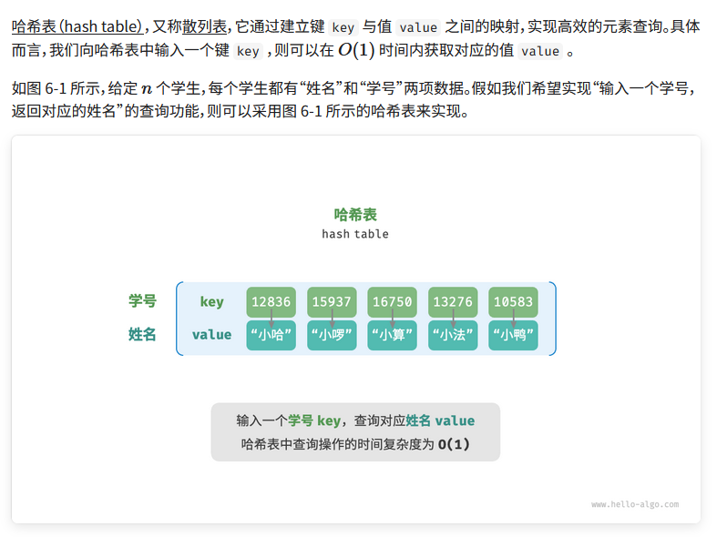
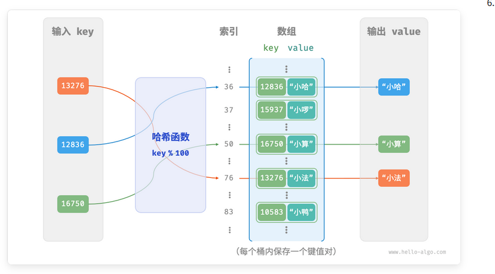
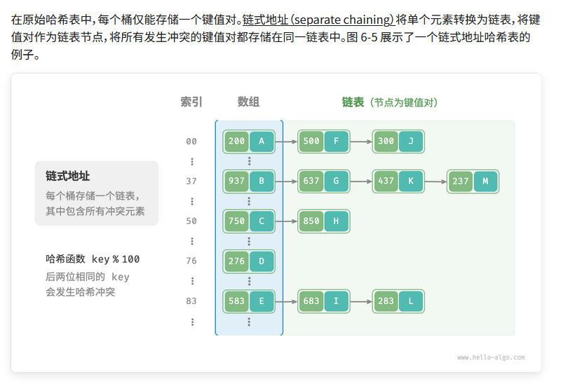

# 哈希表



## 1.哈希表简单实现

我们先考虑最简单的情况，仅用一个数组来实现哈希表。在哈希表中，我们将数组中的每个空位称为桶（bucket），每个桶可存储一个键值对。因此，查询操作就是找到 key 对应的桶，并在桶中获取 value 。

那么，如何基于 key 定位对应的桶呢？这是通过哈希函数（hash function）实现的。哈希函数的作用是将一个较大的输入空间映射到一个较小的输出空间。在哈希表中，输入空间是所有 key ，输出空间是所有桶（数组索引）。换句话说，输入一个 key ，我们可以通过哈希函数得到该 key 对应的键值对在数组中的存储位置。

输入一个 key ，哈希函数的计算过程分为以下两步。 

    1. 通过某种哈希算法 hash() 计算得到哈希值。
    2. 将哈希值对桶数量（数组长度）capacity 取模，从而获取该 key 对应的数组索引 index 。

$$ index = hash(key) \% capacity $$



```java 

public class ArrayHashMap {

    private List<Pair> buckets;

    public ArrayHashMap() {
        buckets = new ArrayList<>();
        for(int i = 0 ; i < 100 ; i++){
            buckets.add(null);
        }
    }

    public int hashFunc(int key){
        int index = key % 100;
        return index;
    }

    public String get(int key){
        int index = hashFunc(key);
        Pair pair = buckets.get(index);
        if(pair == null){
            return null;
        }
        return pair.val;
    }


    public void put(int key, String val){
        Pair pair = new Pair(key, val);
        int index = hashFunc(key);
        buckets.set(index, pair);
    }

    @Data
    class Pair{

        public int key;
        public String val;

        public Pair(int key, String val) {
            this.key = key;
            this.val = val;
        }
    }

}

```

## 2.哈希冲突

通常情况下哈希函数的输入空间远大于输出空间，因此理论上哈希冲突是不可避免的。比如，输入空间为全体整数，输出空间为数组容量大小，则必然有多个整数映射至同一桶索引。

哈希冲突会导致查询结果错误，严重影响哈希表的可用性。为了解决该问题，每当遇到哈希冲突时，我们就进行哈希表扩容，直至冲突消失为止。此方法简单粗暴且有效，但效率太低，因为哈希表扩容需要进行大量的数据搬运与哈希值计算。为了提升效率，我们可以采用以下策略。

    1. 改良哈希表数据结构，使得哈希表可以在出现哈希冲突时正常工作。
    2.仅在必要时，即当哈希冲突比较严重时，才执行扩容操作。
哈希表的结构改良方法主要包括“链式地址”和“开放寻址”。

### 2.1 链式地址



基于链式地址实现的哈希表的操作方法发生了以下变化。
- 查询元素：输入 key ，经过哈希函数得到桶索引，即可访问链表头节点，然后遍历链表并对比 key 以查找目标键值对。
- 添加元素：首先通过哈希函数访问链表头节点，然后将节点（键值对）添加到链表中。
- 删除元素：根据哈希函数的结果访问链表头部，接着遍历链表以查找目标节点并将其删除。


链式地址存在以下局限性。

- 占用空间增大：链表包含节点指针，它相比数组更加耗费内存空间。
- 查询效率降低：因为需要线性遍历链表来查找对应元素。

以下代码给出了链式地址哈希表的简单实现，需要注意两点。

- 使用列表（动态数组）代替链表，从而简化代码。在这种设定下，哈希表（数组）包含多个桶，每个桶都是一个列表。
- 以下实现包含哈希表扩容方法。当负载因子超过$ 2/3$时，我们将哈希表扩容至原先的$2$倍。
```java

```