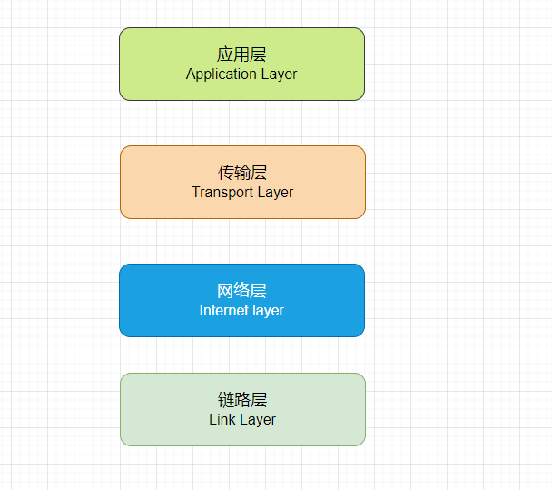

网络传输通常基于``分层模型``，最常见的模型是OSI和TCP/IP模型。

# TCP/IP模型

在TCP/IP模型中，数据包从发送方到接收方需要经过多个层次，每个层次都有其特定的功能和协议。
每一层都依赖于下层提供的功能。

## 应用层

首先应用层依赖传输层提供的传输服务，供两个终端设备上的应用程序之间信息交换的服务。
定义的数据的格式如http，ftp,smtp等。

## 传输层

传输层的主要任务就是负责向两台终端设备进程之间的通信提供通用的数据传输服务。
传输层协议主要有TCP和UDP，TCP提供可靠的数据传输服务，UDP提供不可靠的数据传输服务。

## 网络层

网络层位于链路层之上，主要负责在整个网络中选择路径，将数据从源主机传输到目标主机。
它处理不同网络之间的数据传送.

## 链路层

- 负责将网络层的数据包封装成帧，附加必要的头信息（如 MAC 地址）。
- 提供物理地址寻址，使用硬件地址（如 MAC 地址）。
- 处理链路层协议，例如以太网、Wi-Fi、PPP（点对点协议）等。

