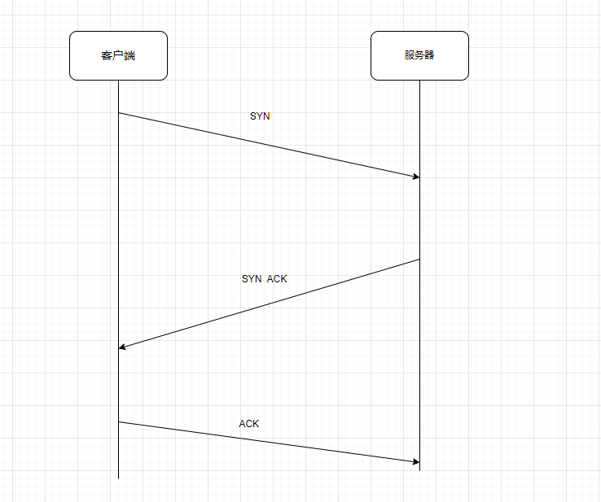
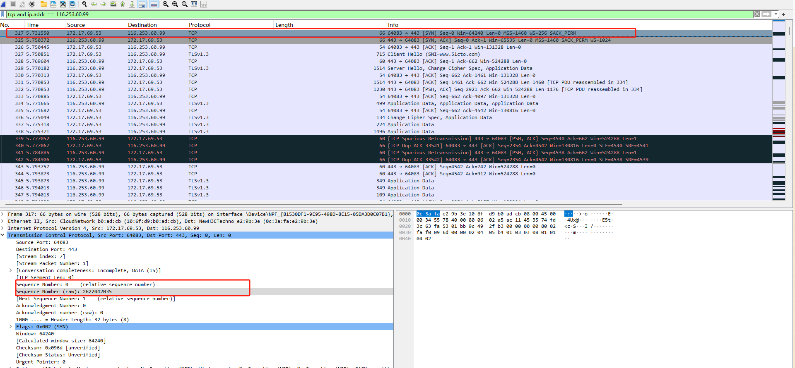
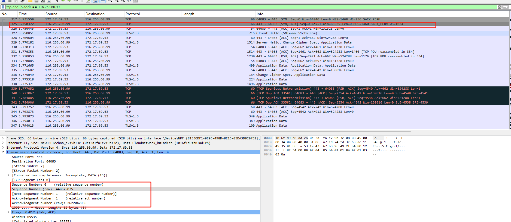
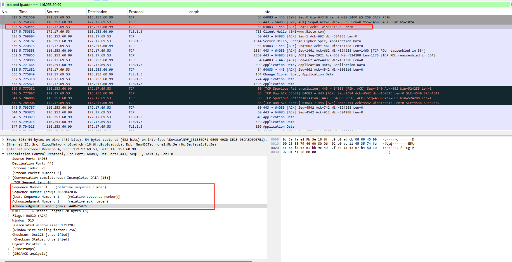

# 名词：

- SYN（synchronization）：同步
- SYN + ACK：同步确认
- ACK（acknowledgement）：确认
- Seq Sequence Number 序号
- Ack Acknowledgment Number 确认号

# 流程

1. 客户端发送SYN请求给服务器 ，携带一个参数Sequence Number
   这个参数是客户端随机生成的

2. 服务器收到SYN请求后，返回一个SYN + ACK响应，携带一个参数Sequence Number，
   这个参数是服务器随机生成的。同时携带一个参数Acknowledgment Number （客户端的 Sequence Number + 1）

3. 客户端收到 SYN + ACK响应后，返回一个ACK响应， 携带一个参数Sequence Number（是服务器的Acknowledgment Number ）
   携带一个参数Acknowledgment Number （是服务器的 Sequence Number + 1）

# 使用wireshark抓包

上图是一个客户端发送给服务器的一个 SYN，

Sequence Number: 0    (relative sequence number) 是相对的Sequence Number

Sequence Number (raw): 2622042035 这个是真实的 Sequence Number

上图是服务器给客户端的一个 SYN + ACK

Sequence Number (raw): 440625075 是服务器随机生成的 （生成的规则是根据，客户端的ip+端口）

Acknowledgment number (raw): 2622042036 是服务对客户端的发送过来的 seq的回答（客户端的 Sequence Number + 1）

上图是客户端发送服务器的一个 ACK

Sequence Number (raw): 2622042036    对应服务器的 Acknowledgment number (raw): 2622042036

Acknowledgment number (raw): 440625076  对应服务器的 Sequence Number (raw): 440625075  + 1

