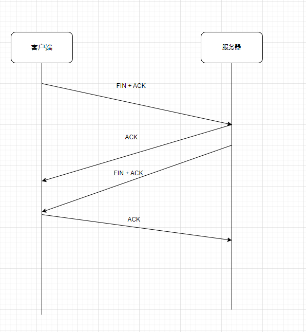
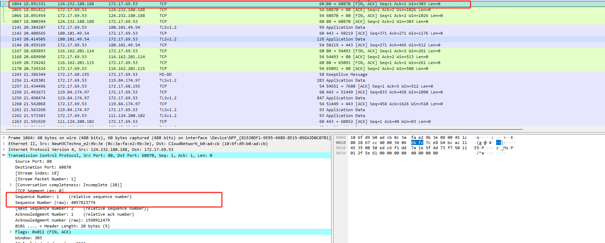
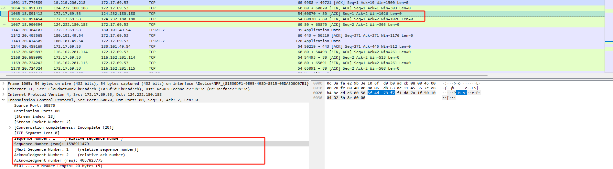
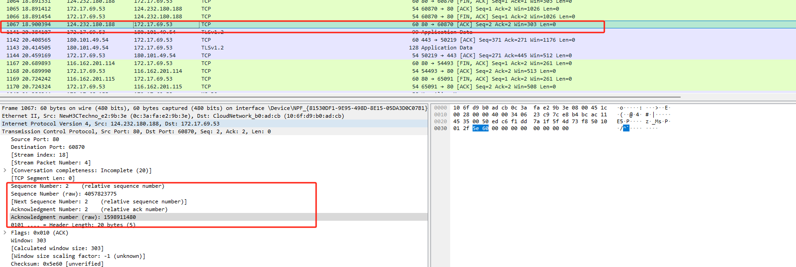

# 名词

- FIN： finish 结束
- ACK： acknowledgment 确认
- Seq Sequence Number 序号
- Ack Acknowledgment Number 确认号

# 流程 
服务端和客户端可以主动发起关闭请求

# wireshark 抓包

服务器给客户端发送FIN + ACK 请求

Sequence Number: 1    (relative sequence number)

Sequence Number (raw): 4057823774  随机生成

客户端响应 ACK \  FIN + ACK

Acknowledgment Number: 2    (relative ack number)

Acknowledgment number (raw): 4057823775  服务器seq  + 1

Sequence Number: 1    (relative sequence number)

Sequence Number (raw): 1598911479 随机生成

服务器发送  ACK

Acknowledgment Number: 2    (relative ack number)

Acknowledgment number (raw): 1598911480   客户端seq+1

Sequence Number: 2    (relative sequence number)

Sequence Number (raw): 4057823775  客户端ack
