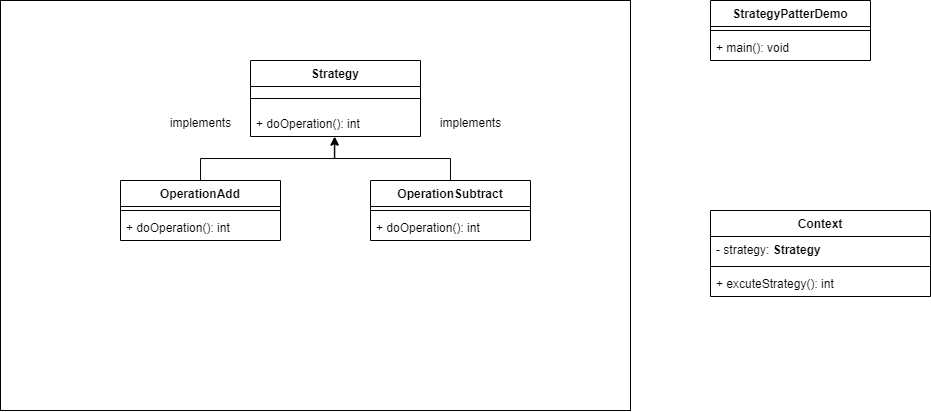

# UML图



1. Strategy 是一个策略抽象接口，定义了一个方法doOperation() 。
2. OperationAdd 实现了Strategy类，并在doOperation中有具体的实现。
3. OperationSubtract 同 OperationAdd
4. Context主要是用来执行Strategy，不关心具体注入了哪个策略。


# 代码


Strategy

```
public interface Strategy {
   public int doOperation(int num1, int num2);
}

```

OperationAdd

```
public class OperationAdd implements Strategy{
   @Override
   public int doOperation(int num1, int num2) {
      return num1 + num2;
   }
}


```


OperationSubtract
```
public class OperationSubtract implements Strategy{
   @Override
   public int doOperation(int num1, int num2) {
      return num1 - num2;
   }
}

```

Content
```

public class Context {
   private Strategy strategy;
 
   public Context(Strategy strategy){
      this.strategy = strategy;
   }
 
   public int executeStrategy(int num1, int num2){
      return strategy.doOperation(num1, num2);
   }
}

```

StrategyPatternDemo

```

public class StrategyPatternDemo {
   public static void main(String[] args) {
      Context context = new Context(new OperationAdd());    
      System.out.println("10 + 5 = " + context.executeStrategy(10, 5));
 
      context = new Context(new OperationSubtract());      
      System.out.println("10 - 5 = " + context.executeStrategy(10, 5));
   }
}


```

策略模式的主旨是对``规则``的封装。如果需要对``业务``的封装使用工程模式。