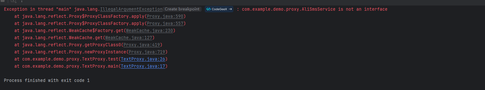
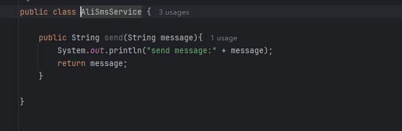
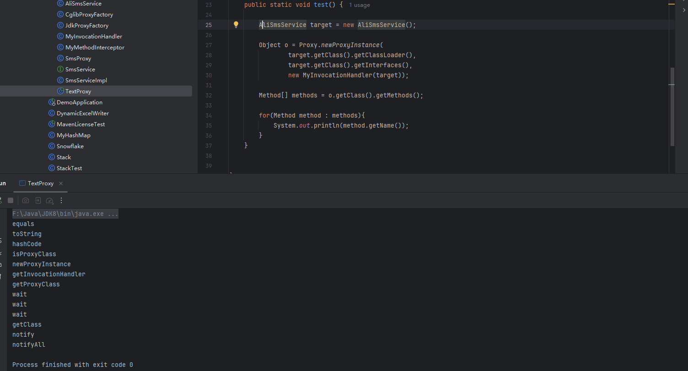

# 代理模式

代理模式是一种比较好理解的设计模式。简单来说就是 我们使用代理对象来代替对真实对象(real object)
的访问，这样就可以在不修改原目标对象的前提下，对这个对象进行一些``控制``和``额外处理``。

## 静态代理

静态代理中，我们对目标对象的每个方法的增强都是手动完成的（后面会具体演示代码），
非常不灵活（比如接口一旦新增加方法，目标对象和代理对象都要进行修改）且麻烦(需要对每个目标类都单独写一个代理类）。
实际应用场景非常非常少，日常开发几乎看不到使用静态代理的场景。

1. 定义发送短信的接口

```java
public interface SmsService {
    String send(String message);
}
```

2. 实现发送短信的接口

```java
public class SmsServiceImpl implements SmsService {
    public String send(String message) {
        System.out.println("send message:" + message);
        return message;
    }
}
```

3. 创建代理类并实现发送短信的接口

```java
public class SmsProxy implements SmsService {

    private final SmsService smsService;

    public SmsProxy(SmsService smsService) {
        this.smsService = smsService;
    }

    @Override
    public String send(String message) {
        //调用方法之前，我们可以添加自己的操作
        System.out.println("before method send()");
        smsService.send(message);
        //调用方法之后，我们同样可以
        System.out.println("after method send()");
        return null;
    }
}
```

4. 实际使用

```java
public class Main {
    public static void main(String[] args) {
        SmsService smsService = new SmsServiceImpl();
        SmsProxy smsProxy = new SmsProxy(smsService);
        smsProxy.send("java");
    }
}
```

运行上述代码之后，控制台打印出：

```
before method send()
send message:java
after method send()
```

理模式的主旨是通过``一个代理对象来控制对另一个对象的访问``。这可以用于``增加功能``（如延迟加载、权限控制、日志记录等），
或在不直接修改原始对象的情况下对其进行操作。代理对象通常会实现与被代理对象相同的接口，并在方法调用时对被代理对象进行操作。

## 动态代理

相比于静态代理来说，动态代理更加灵活。动态代理分为：JDK动态代理和CGLIB动态代理。

### JDK 动态代理机制

在 Java 动态代理机制中 Proxy 类和 InvocationHandler 接口是核心。

Proxy 类中使用频率最高的方法是：newProxyInstance() ，这个方法主要用来生成一个代理对象。

```java
    public static Object newProxyInstance(ClassLoader loader,
                                          Class<?>[] interfaces,
                                          InvocationHandler h)
        throws IllegalArgumentException {

}


```

要实现动态代理的话，还必须需要实现InvocationHandler 来自定义处理逻辑。
当我们的动态代理对象调用一个方法时，这个方法的调用就会被转发到实现InvocationHandler 接口类的 invoke 方法来调用。

```java
public interface InvocationHandler {

    /**
     * 当你使用代理对象调用方法的时候实际会调用到这个方法
     */
    Object invoke(Object proxy, Method method, Object[] args)
            throws Throwable;
}


```

### JDK动态代理类使用步骤

1. 定义一个接口及其实现类；
2. 自定义 InvocationHandler 并重写 invoke 方法，在 invoke 方法中我们会调用原生方法并自定义一些处理逻辑；
3. 通过 Proxy.newProxyInstance 方法创建代理对象；

```java

public interface SmsService {

    void send(String message);

}


```

```java


public class SmsServiceImpl implements SmsService {
    @Override
    public void send(String message) {
        System.out.println("Sending message: " + message);
    }
}


```

```java
public class MyInvocationHandler implements InvocationHandler {
    @Override
    public Object invoke(Object proxy, Method method, Object[] args) throws Throwable {
        System.out.println("Before sending message");
        Object result = method.invoke(proxy, args);// 调用被代理对象的方法
        System.out.println("After sending message");
        return result;
    }
}


```

```java

public class JdkProxyFactory {


    public static Object getProxy(Object target) {
        return Proxy.newProxyInstance(
                target.getClass().getClassLoader(),
                target.getClass().getInterfaces(),
                new MyInvocationHandler(target)
        );
    }


}

public static void main(String[] args) {
    SmsService smsService = (SmsService) JdkProxyFactory.getProxy(new SmsServiceImpl());
    smsService.send("hello world");
}


```

## CGLIB 动态代理

CGLIB(Code Generation Library)是一个基于ASM的字节码生成库，它允许我们在运行时对字节码进行修改和动态生成。
CGLIB 通过继承方式实现代理。很多知名的开源框架都使用到了CGLIB，
例如 Spring 中的 AOP 模块中：如果目标对象实现了接口，则默认采用 JDK 动态代理，否则采用 CGLIB 动态代理。

在 CGLIB 动态代理机制中 MethodInterceptor 接口和 Enhancer 类是核心。
你需要自定义 MethodInterceptor 并重写 intercept 方法，intercept 用于拦截增强被代理类的方法。

```java
public interface MethodInterceptor
        extends Callback {
    // 拦截被代理类中的方法
    public Object intercept(Object obj, java.lang.reflect.Method method, Object[] args, MethodProxy proxy) throws Throwable;
}


```

### 实际使用

```java
public class AliSmsService {

    public String send(String message) {
        System.out.println("send message:" + message);
        return message;
    }

}


public class MyMethodInterceptor implements MethodInterceptor {


    /**
     *
     * @param o                 被代理的对象
     * @param method            被拦截的方法
     * @param objects           方法入参
     * @param methodProxy       用户调用原始方法
     */
    @Override
    public Object intercept(Object o, Method method, Object[] objects, MethodProxy methodProxy) throws Throwable {
        //调用方法之前，我们可以添加自己的操作
        System.out.println("before method " + method.getName());
        Object object = methodProxy.invokeSuper(o, objects);
        //调用方法之后，我们同样可以添加自己的操作
        System.out.println("after method " + method.getName());
        return object;
    }
}

public class CglibProxyFactory {


    public static Object getProxy(Class<?> clazz) {
        // 创建动态代理增强类
        Enhancer enhancer = new Enhancer();
        // 设置类加载器
        enhancer.setClassLoader(clazz.getClassLoader());
        // 设置被代理类
        enhancer.setSuperclass(clazz);
        // 设置方法拦截器
        enhancer.setCallback(new MyMethodInterceptor());
        // 创建代理类
        return enhancer.create();
    }
}

public static void main(String[] args) {
    AliSmsService aliSmsService = (AliSmsService) CglibProxyFactory.getProxy(AliSmsService.class);
    aliSmsService.send("java");

}


```

## JDK动态代理和 CGLIB 动态代理对比

1. JDK 动态代理只能代理实现```接口的类或者直接代理接口```，这个是JDK动态代理的原理决定的，
newProxyInstance 内部会缓存形式先通过字节码生成一个代理类，这个代理类默认已经继承了 Proxy 类，同时实现了我们传入的一堆接口;
由于 Java 是单继承的，所以 JDK 动态代理只能代理接口，接口可以实现多个，但是类只能继承实现一个。

Proxy 中 newProxyInstance() ：

```java
    public static Object newProxyInstance(ClassLoader loader,
                                          Class<?>[] interfaces,
                                          InvocationHandler h)
        throws IllegalArgumentException {

}


```

第二个参数Class<?>[] interfaces 如果我们传入的不是interface就会报错

```java
 public static void test() {

    AliSmsService target = new AliSmsService();

    Object o = Proxy.newProxyInstance(
            target.getClass().getClassLoader(),
            new Class[]{target.getClass()},
            new MyInvocationHandler(target));
}

```


正确调用如下：

```java

   public static void test() {

        AliSmsService target = new AliSmsService();

        Object o = Proxy.newProxyInstance(
                target.getClass().getClassLoader(),
                target.getClass().getInterfaces(),
                new MyInvocationHandler(target));
    }

```
我们是获取 target的所有interface中的方法。这个类自己的方法并不会被代理。





输出了所有的方法没有send方法。

JDK代理生产的代理类大致如下
```java

public class $Proxy extends Proxy implements Foo1, Foo2{
    
}

```

Foo1, Foo2 就是调用JDK代理时传入的接口。

2. CGLIB 动态代理是针对类实现代理，主要是对指定的类生成一个子类，覆盖其中的方法，并覆盖其中方法实现增强，
但是因为采用的是继承，所以该类或方法最好不要声明成 final，对于 final 类和方法，是无法继承的

3. 再spirngboot 中，如果目标对象实现了接口，则默认采用 JDK 动态代理，否则采用 CGLIB 动态代理。