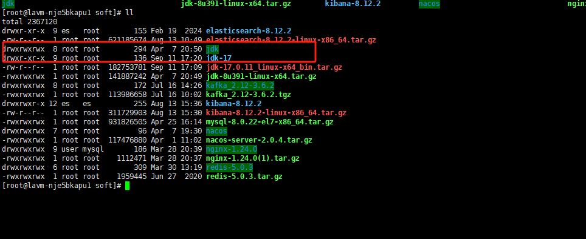
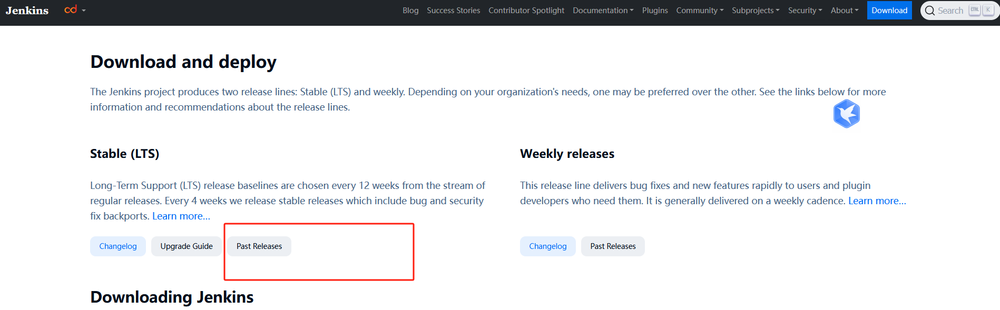
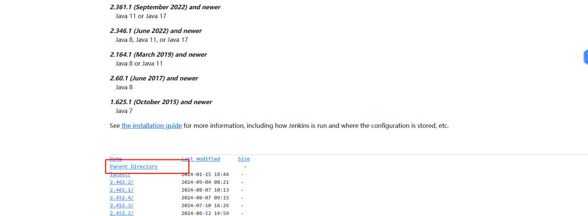
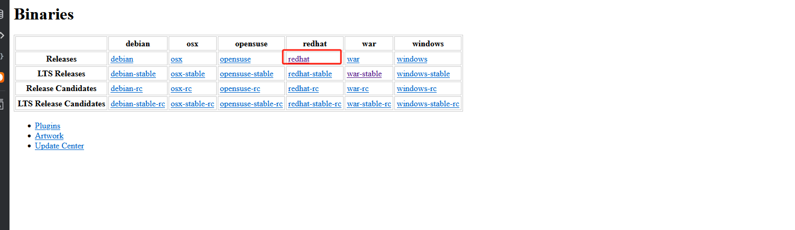
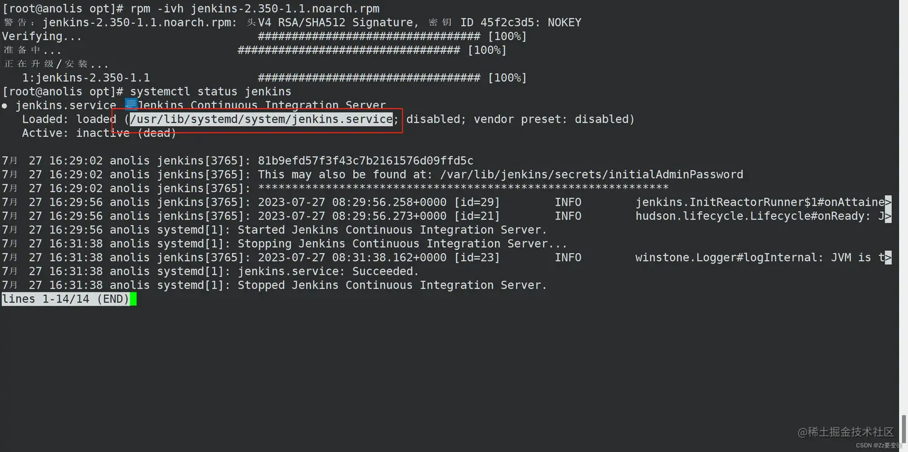
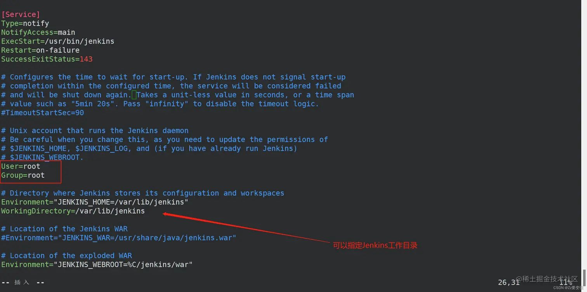
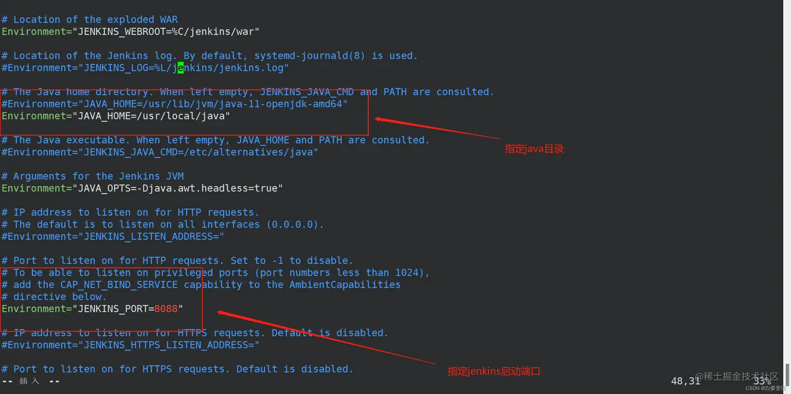

# 前文

Jenkins对JDK的版本要求很高，这篇文档我们安装的Jenkins版本为2.470

# JDK的选择
首先一个linux系统是可以安装多个jdk的，我的系统安装了2个jdk
如果你系统有多个jdk，你的环境变量里面JAVA_HOME指向了哪个jdk，你系统的默认的jdk就是哪个。




# 下载rpm文件







# 安装

## 1.安装命令
```shell
rpm -ivh  jenkins-2.470-1.1.noarch.rpm
```
## 2.查看jenkins服务配置文件
```shell
systemctl status jenkins
```



## 3.修改配置文件
修改3个地方： 用户和组、指定jdk、端口号



重新加载配置文件
```shell

systemctl daemon-reload

```

## 4 启动jenkins
```shell
启动
systemctl start jenkins
停止
systemctl stop jenkins
重启
systemctl restart jenkins
```


## 5 访问
ip+端口


# 卸载
```
1、rpm卸载
rpm -e jenkins

2、检查是否卸载成功
rpm -ql jenkins 

3、彻底删除残留文件：
find / -iname jenkins | xargs -n 1000 rm -rf


```

参考文章：https://juejin.cn/post/7261921491448660025
