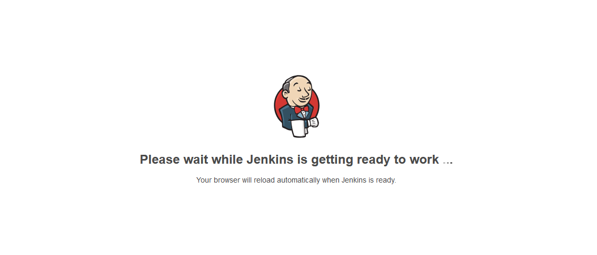

# 文档
https://www.jenkins.io/zh/doc/pipeline/tour/getting-started/

# 版本
https://get.jenkins.io/war-stable/

# 启动 

```shell
java -jar jenkins.war --httpPort=8080
```

# 常见问题

## 1.  Main has been compiled by a more recent version of the Java Runtime (class file version 55.0),this version of the Java Runtime only recognizes class file versions up to 52.0

Jenkins版本和JDK版本不匹配

## 2. 访问出现


官网访问太慢，需要更换源

```shell

find / -name *.UpdateCenter.xml

```
将xml中的<url>标签中的值修改： http://mirrors.tuna.tsinghua.edu.cn/jenkins/updates/update-center.json

