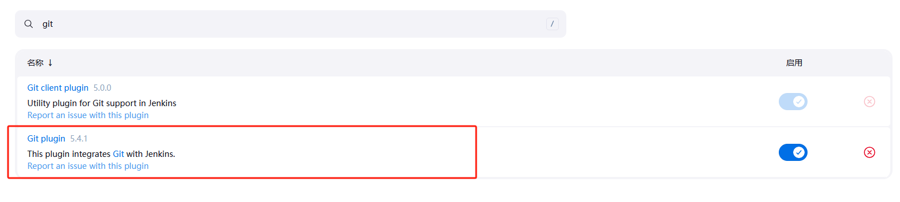

# jenkins插件准备

## 1.安装GIT

## 2.安装集成凭据管理

## 3.安装pipeline stage view（流水线的阶段试图）


# 创建一个简单pipeline流程

1. 新建一个demo项目


2. 写流水线脚本


```
pipeline {
    agent any

    stages {
        stage('获取') {
            steps {
                echo '获取代码成功'
            }
        }
        stage('编译') {
            steps {
                echo '编译代码成功'
            }
        }
        stage('部署') {
            steps {
                echo '部署代码成功'
            }
        }
    }
}


```

3. 执行流水线
