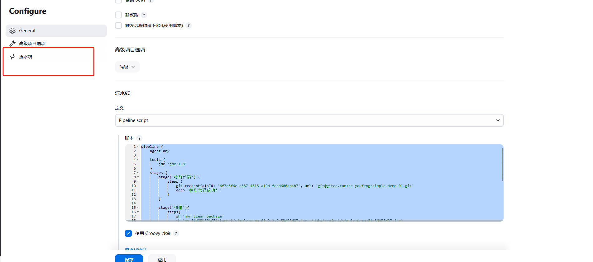

# 一 Jenkins系统配置
需要配置3个环境变量 ：  `JAVA_HOME`、`MAVEN_HOME`、`PATH+EXTRA`
JAVA_HOME: JDK安装路径
MAVEN_HOME: Maven安装路径
PATH+EXTRA: $MAVEN_HOME/bin


# 二 全局工具配置


## 1. 服务器生成ssh密钥，一个`私钥`一个`公钥`

使用命令
```
 ssh-keygen -t rsa -C "example@163.com"


```


## 2. gitee 上面录入`公钥`


##  3. Jenkins上面配置`私钥`

Jenkins获取代码的时候的凭证


# 创建流水线



```pipeline

pipeline {
    agent any

    tools {
        jdk 'jdk-1.8'
    }
    stages {
        stage('拉取代码') {
            steps {
                git credentialsId: '6f7c6f6e-e337-4613-a19d-feed600db4b7', url: 'git@gitee.com:he-youfeng/simple-demo-01.git'
                echo '拉取代码成功！'
            }
        }
        
        stage('构建'){
            steps{
                sh 'mvn clean package'
                sh 'mv ${WORKSPACE}/target/simple-demo-01-?.?.?-SNAPSHOT.jar  /data/project/simple-demo-01-SNAPSHOT.jar'
                echo '构建完成！'
            }
        }
        
        stage('部署') {
            steps {
                sh '''cd /data/project
                    ./stop.sh
                    ./start.sh'''
                echo '部署成功！'
            }
        }
    }
    
}

```
stop.sh

```shell
APP_NAME=simple-demo-01-SNAPSHOT.jar
pid=`ps -ef|grep ${APP_NAME}|grep -v grep|awk '{print $2}'`
# 检查pid变量是否为空
if [ -z "${pid}" ]; then
    echo "Process not running."
else
    echo "Process is running with PID ${pid}."
    kill -9 ${pid}
fi


```

start.sh
```shell
port=9099

check() {
    for i in $(seq 1 30)
    do
        sleep 2
        pid=$(netstat -nlp 2>/dev/null | grep :$1 | awk '{print $7}' | awk -F"/" '{ print $1 }')
        if [ -n "$pid" ]; then
            echo "Good."
            return 0
        fi
    done
    echo "NOT detected. Maybe running failed."
    return 1
}

export JENKINS_NODE_COOKIE=dontKillMe

nohup java -jar /data/project/simple-demo-01-SNAPSHOT.jar --server.port=$port > log.out 2>&1 &

check $port


```


参看文章：https://blog.csdn.net/m0_48420795/article/details/132071416