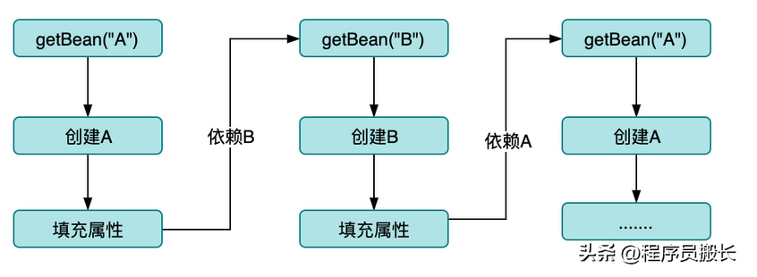
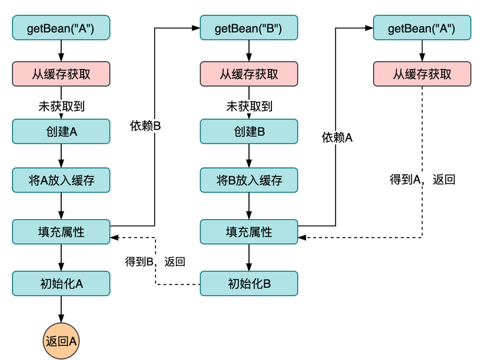
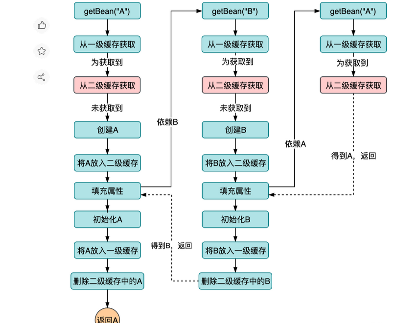
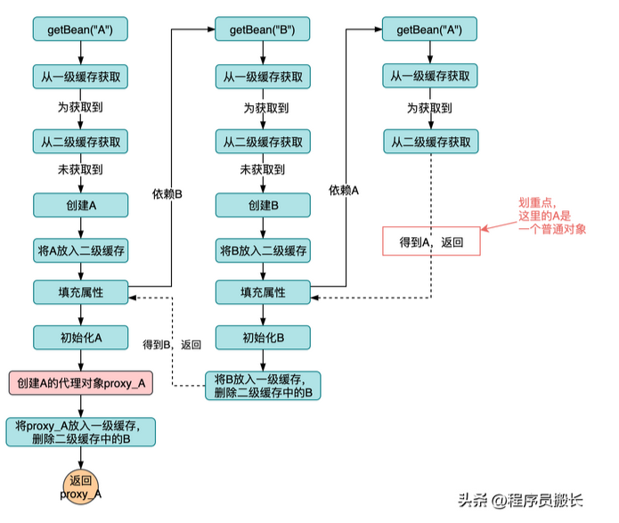

# 什么是Spring
Spring是一个开源的Java框架，主要用来构建企业级的应用程序。

# Spring 的核心特征

## 依赖注入（DI）：

### 1. 通过控制反转（ioc）来管理对象之间的关系。
-  传统的方式是依赖一个对象需要先声明，然后实例出来在赋值属性，这个开发人员一个主动的过程，ioc的思想是，开发人员只需要声明我需要的对象，实例化过程交给ioc容器来处理，从一个主动拉取的过程变成一个被动的注入。

### 2.  @Autowired和@Resouce的区别

- @Autowired是Spring的注解，@Resouce是java的注解
- @Autowired根据类型来装配对象，@Resouce先根据名字，再根据对象。

### 3. spring是怎么解决循环依赖的

- 利用三级缓存来解决的。

A依赖B，B依赖A如果没有缓存的情况下流程如下。




加一级缓存，解决了死循环，但是没有办法保证缓存中的对象是完整的，因为正在创建的和创建完成的都在缓存里面。


二级缓存，如图所示，二级缓存中存储的是正在创建的对象，一级缓存中创建完成的对象。


二级对象只能保证2个对象的循环依赖，但是不能保证代理的对象。因为一级缓存中的A是一个代理对象，而B中的A一个普通对象。


三级缓存最终解决方案。



# 什么是spring boot

spring boot是spring组件一站式解决方案。简省了繁重的配置，让开发者能快速的上手。


# spring boot和spring cloud的区别


## AOP(面向切面编程)
Spring允许开发者定义横切关注点（如事务管理、日志记录等），从而将这些关注点与业务逻辑分离。

### 1. 实战写一个AOP

```java

@Aspect
@Component
public class LoggingAspect {

    @Pointcut("@annotation(LogExecutionTime)")  // 切点定义
    public void logExecutionTime() {}

    @Before("logExecutionTime()")
    public void logBefore(JoinPoint joinPoint) {
        System.out.println("Before method: " + joinPoint.getSignature().getName());
    }

    @After("logExecutionTime()")
    public void logAfter(JoinPoint joinPoint) {
        System.out.println("After method: " + joinPoint.getSignature().getName());
    }
}

```


### 2. AOP的实现原理

AOP是使用动态代理来实现的，有JDK的动态代理、CGLIB动态代理。
- JDK的动态代理，因为JDK代理生成的类是会继承Proxy类，所有JDK代理只能代理```接口的类或者直接代理接口```
- CGLIB动态代理,主要是对指定的类生成一个子类，覆盖其中的方法，并覆盖其中方法实现增强